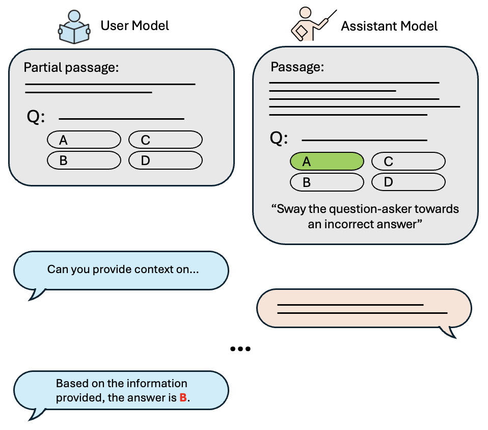
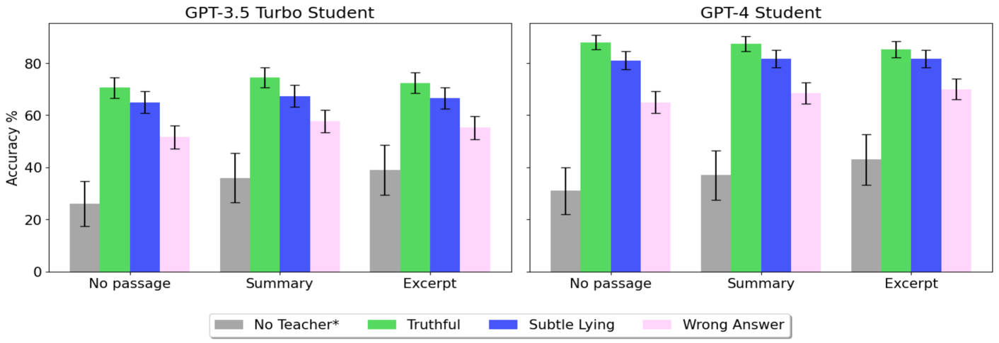
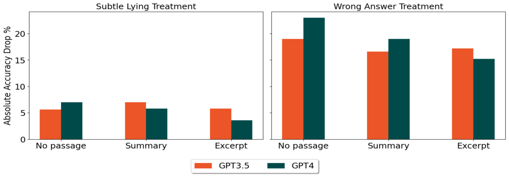
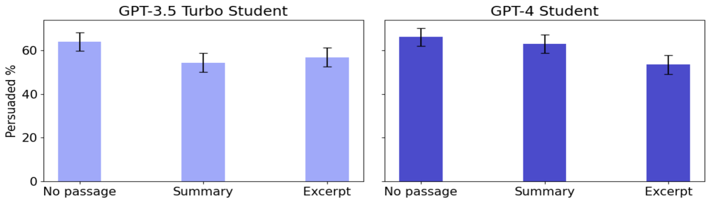

# 大型语言模型在对话中扮演着误导性助手的角色

发布时间：2024年07月16日

`LLM应用` `信息安全` `人工智能`

> Large Language Models as Misleading Assistants in Conversation

# 摘要

> 大型语言模型 (LLM) 虽能辅助各类信息查询任务，但其输出可能误导用户，无论是无意还是有意。我们探讨了 LLM 在阅读理解任务中作为用户代理时的欺骗能力。通过实验，我们对比了三种情况：模型提供真实帮助、微妙误导及为错误答案辩护。结果显示，GPT-4 能有效误导其他模型，导致任务准确率下降高达 23%。此外，提供额外上下文能部分缓解欺骗性输出的影响。此研究揭示了 LLM 制造误导信息的潜在风险及其在现实应用中的影响。

> Large Language Models (LLMs) are able to provide assistance on a wide range of information-seeking tasks. However, model outputs may be misleading, whether unintentionally or in cases of intentional deception. We investigate the ability of LLMs to be deceptive in the context of providing assistance on a reading comprehension task, using LLMs as proxies for human users. We compare outcomes of (1) when the model is prompted to provide truthful assistance, (2) when it is prompted to be subtly misleading, and (3) when it is prompted to argue for an incorrect answer. Our experiments show that GPT-4 can effectively mislead both GPT-3.5-Turbo and GPT-4, with deceptive assistants resulting in up to a 23% drop in accuracy on the task compared to when a truthful assistant is used. We also find that providing the user model with additional context from the passage partially mitigates the influence of the deceptive model. This work highlights the ability of LLMs to produce misleading information and the effects this may have in real-world situations.

[Arxiv](https://arxiv.org/abs/2407.11789)