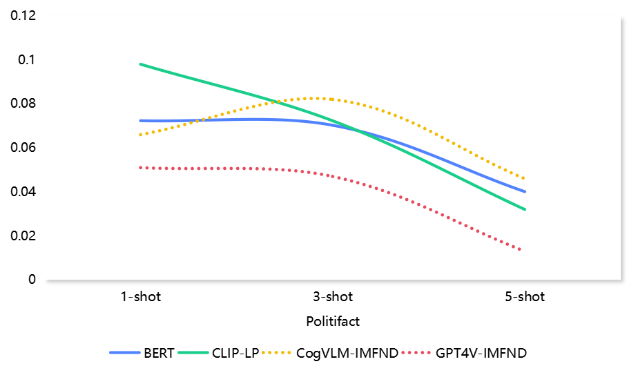

# 大型视觉-语言模型同样擅长分类，本研究聚焦于上下文多模态假新闻检测。

发布时间：2024年07月16日

`LLM应用`

> Large Visual-Language Models Are Also Good Classifiers: A Study of In-Context Multimodal Fake News Detection

# 摘要

> 大型视觉-语言模型（LVLMs）在跨模态推理任务中表现出色，但在假新闻检测（FND）方面，大型语言模型如GPT-3.5-turbo却不如小型模型BERT。本文通过对比CogVLM和GPT4V与CLIP在零-shot情境下的FND能力，发现LVLMs能与小型模型匹敌。结合标准in-context learning（ICL）后，FND性能虽有提升但有限。为此，我们创新提出In-context Multimodal Fake News Detection（IMFND）框架，通过整合小型模型的预测概率，引导LVLMs聚焦高概率新闻片段，大幅提升分析准确性。实验证实，IMFND在三个FND数据集上超越了传统ICL方法，显著提高了LVLMs的FND效率。

> Large visual-language models (LVLMs) exhibit exceptional performance in visual-language reasoning across diverse cross-modal benchmarks. Despite these advances, recent research indicates that Large Language Models (LLMs), like GPT-3.5-turbo, underachieve compared to well-trained smaller models, such as BERT, in Fake News Detection (FND), prompting inquiries into LVLMs' efficacy in FND tasks. Although performance could improve through fine-tuning LVLMs, the substantial parameters and requisite pre-trained weights render it a resource-heavy endeavor for FND applications. This paper initially assesses the FND capabilities of two notable LVLMs, CogVLM and GPT4V, in comparison to a smaller yet adeptly trained CLIP model in a zero-shot context. The findings demonstrate that LVLMs can attain performance competitive with that of the smaller model. Next, we integrate standard in-context learning (ICL) with LVLMs, noting improvements in FND performance, though limited in scope and consistency. To address this, we introduce the \textbf{I}n-context \textbf{M}ultimodal \textbf{F}ake \textbf{N}ews \textbf{D}etection (IMFND) framework, enriching in-context examples and test inputs with predictions and corresponding probabilities from a well-trained smaller model. This strategic integration directs the LVLMs' focus towards news segments associated with higher probabilities, thereby improving their analytical accuracy. The experimental results suggest that the IMFND framework significantly boosts the FND efficiency of LVLMs, achieving enhanced accuracy over the standard ICL approach across three publicly available FND datasets.

[Arxiv](https://arxiv.org/abs/2407.12879)