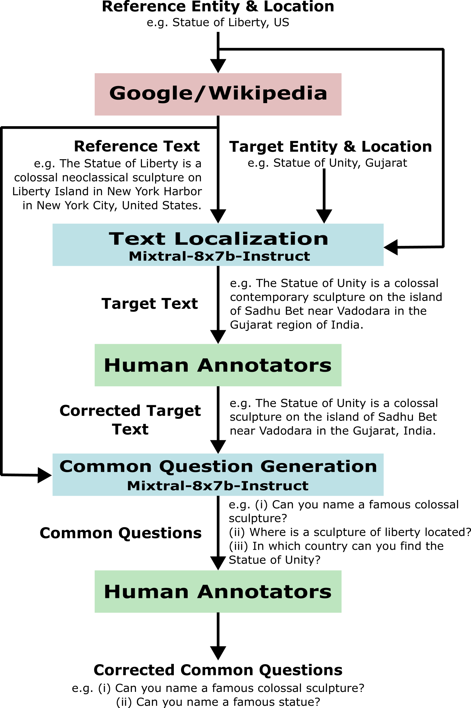
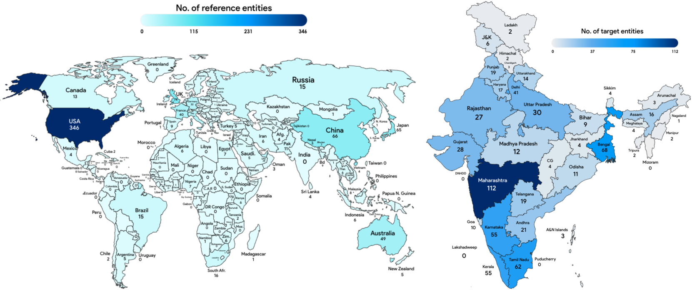
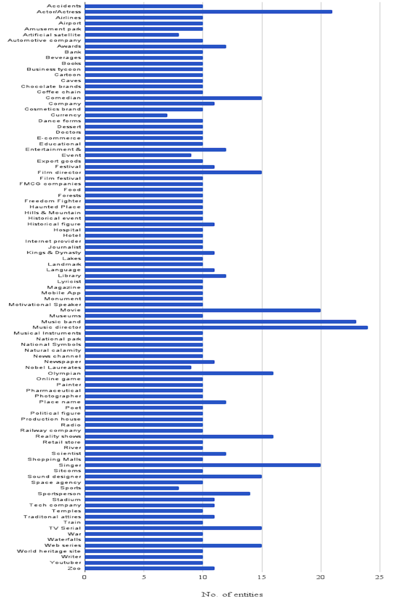

# LoFTI：将本地化与事实性迁移至印度各地区

发布时间：2024年07月16日

`LLM应用` `人工智能` `地理信息系统`

> LoFTI: Localization and Factuality Transfer to Indian Locales

# 摘要

> 大型语言模型 (LLM) 通过训练从互联网爬取的大型数据集，积累了丰富的世界知识。然而，这些数据集往往偏向英语国家，导致 LLM 在处理需要特定地区信息的查询时，可能产生偏见或不准确响应。为此，我们推出了一个名为 LoFTI 的新基准，专门用于评估 LLM 的本地化和事实文本转移能力。LoFTI 包含全球源位置和印度目标位置（涵盖国家、州、城市等不同层次）实体的事实陈述，广泛覆盖各类实体。我们利用 LoFTI 评估了 Mixtral、GPT-4 及两种基于 Mixtral 的方法，结果显示，尽管 LoFTI 是一个高质量的评估工具，所有模型，包括 GPT-4，在处理不同层次的本地化信息时，表现均有所偏差。

> Large language models (LLMs) encode vast amounts of world knowledge acquired via training on large web-scale datasets crawled from the internet. However, these datasets typically exhibit a geographical bias towards English-speaking Western countries. This results in LLMs producing biased or hallucinated responses to queries that require answers localized to other geographical regions. In this work, we introduce a new benchmark named LoFTI (Localization and Factuality Transfer to Indian Locales) that can be used to evaluate an LLM's localization and factual text transfer capabilities. LoFTI consists of factual statements about entities in source and target locations; the source locations are spread across the globe and the target locations are all within India with varying degrees of hyperlocality (country, states, cities). The entities span a wide variety of categories. We use LoFTI to evaluate Mixtral, GPT-4 and two other Mixtral-based approaches well-suited to the task of localized factual transfer. We demonstrate that LoFTI is a high-quality evaluation benchmark and all the models, including GPT-4, produce skewed results across varying levels of hyperlocality.

[Arxiv](https://arxiv.org/abs/2407.11833)