# MINI-LLM：针对大型语言模型的高效内存结构化剪枝方案

发布时间：2024年07月16日

`LLM理论` `人工智能` `计算机硬件`

> MINI-LLM: Memory-Efficient Structured Pruning for Large Language Models

# 摘要

> 随着 LLM 规模的迅猛增长，压缩和加速这些模型的需求日益迫切。尽管先前研究表明梯度在神经网络压缩中具有重要价值，尤其是在中等规模网络的修剪中，但反向传播计算梯度的高内存需求限制了其在 LLM 修剪中的应用。因此，当前 LLM 修剪多依赖于无梯度标准，如权重大小或其与激活的组合。本文中，我们创新性地提出了一种混合修剪标准，巧妙结合大小、激活和梯度，以提升特征图敏感性，实现 LLM 的高效修剪。为解决内存瓶颈，我们仅通过前向传递估计梯度，并据此设计了 MINI-LLM 这一内存高效结构化修剪程序，旨在剔除非关键组件。实验证明，MINI-LLM 在 LLaMA、BLOOM 和 OPT 等多种 LLM 上，不仅在分类、多选和生成等下游任务中表现卓越，且 GPU 内存占用与无梯度方法相当。

> As Large Language Models (LLMs) grow dramatically in size, there is an increasing trend in compressing and speeding up these models. Previous studies have highlighted the usefulness of gradients for importance scoring in neural network compressing, especially in pruning medium-size networks. However, the substantial memory requirements involved in calculating gradients with backpropagation impede the utilization of gradients in guiding LLM pruning. As a result, most pruning strategies for LLMs rely on gradient-free criteria, such as weight magnitudes or a mix of magnitudes and activations. In this paper, we devise a hybrid pruning criterion, which appropriately integrates magnitude, activation, and gradient to capitalize on feature map sensitivity for pruning LLMs. To overcome memory requirement barriers, we estimate gradients using only forward passes. Based on this, we propose a Memory-effIcieNt structured prunIng procedure for LLMs (MINI-LLM) to remove no-critical channels and multi-attention heads. Experimental results demonstrate the superior performance of MINI-LLM over existing gradient-free methods on three LLMs: LLaMA, BLOOM, and OPT across various downstream tasks (classification, multiple-choice, and generation), while MINI-LLM maintains a GPU memory footprint akin to gradient-free methods.

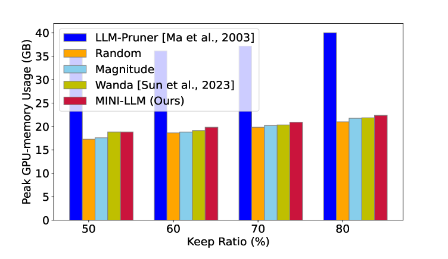

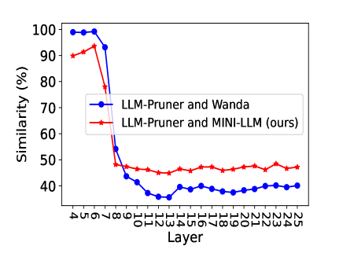

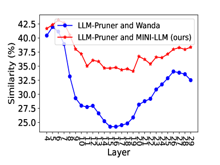

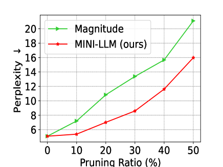

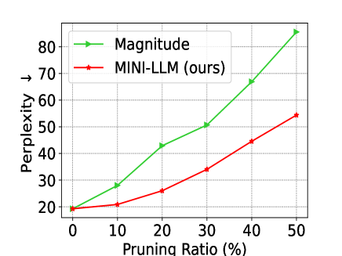

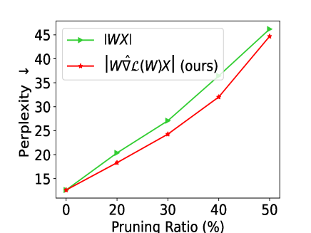

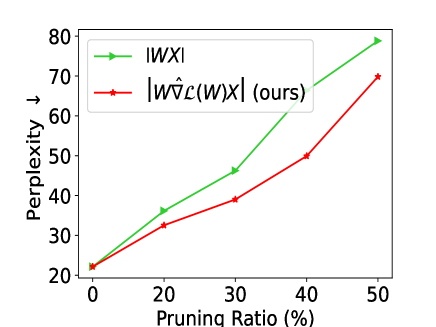

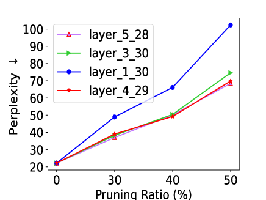

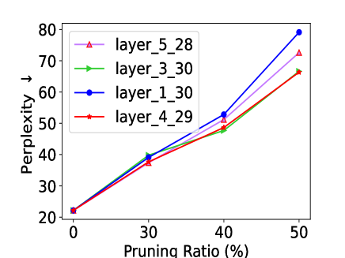

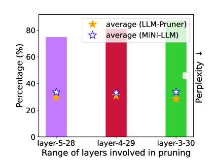

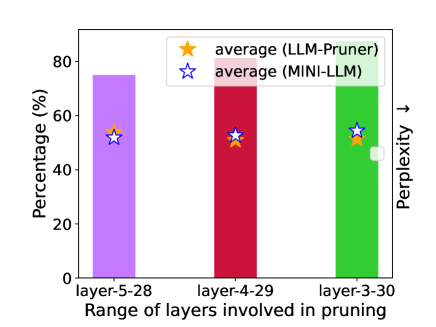

[Arxiv](https://arxiv.org/abs/2407.11681)