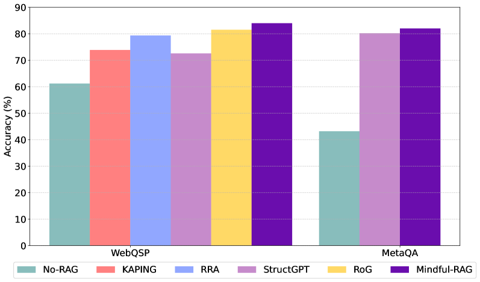

# 《Mindful-RAG》：探究检索增强生成技术中的关键失败点研究

发布时间：2024年07月16日

`RAG` `人工智能` `知识图谱`

> Mindful-RAG: A Study of Points of Failure in Retrieval Augmented Generation

# 摘要

> 大型语言模型虽擅长生成连贯文本，但在处理特定领域和事实问答任务时，面对知识密集型查询仍显力不从心。检索增强生成系统通过引入外部知识源如知识图谱来缓解这一难题，但即便拥有必要事实信息，LLM 仍常难以给出准确答案。我们研究发现，现有基于知识图谱的 RAG 方法存在八大关键失误，主要源于对问题意图的辨识不足及对相关上下文的收集不充分。为此，我们提出 Mindful-RAG 框架，专注于基于意图和上下文对齐的知识检索，旨在精准定位并改善这些失误，从而提升 LLM 响应的准确性与相关性，较现有方法实现显著进步。

> Large Language Models (LLMs) are proficient at generating coherent and contextually relevant text but face challenges when addressing knowledge-intensive queries in domain-specific and factual question-answering tasks. Retrieval-augmented generation (RAG) systems mitigate this by incorporating external knowledge sources, such as structured knowledge graphs (KGs). However, LLMs often struggle to produce accurate answers despite access to KG-extracted information containing necessary facts. Our study investigates this dilemma by analyzing error patterns in existing KG-based RAG methods and identifying eight critical failure points. We observed that these errors predominantly occur due to insufficient focus on discerning the question's intent and adequately gathering relevant context from the knowledge graph facts. Drawing on this analysis, we propose the Mindful-RAG approach, a framework designed for intent-based and contextually aligned knowledge retrieval. This method explicitly targets the identified failures and offers improvements in the correctness and relevance of responses provided by LLMs, representing a significant step forward from existing methods.

[Arxiv](https://arxiv.org/abs/2407.12216)