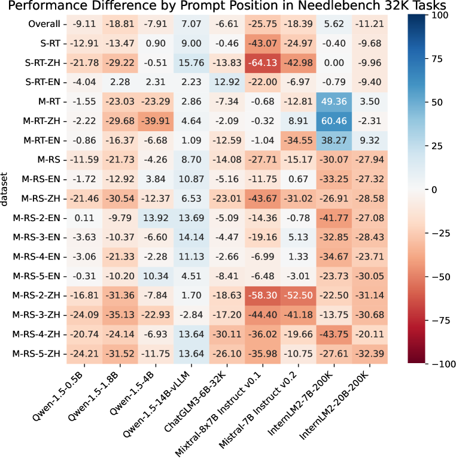
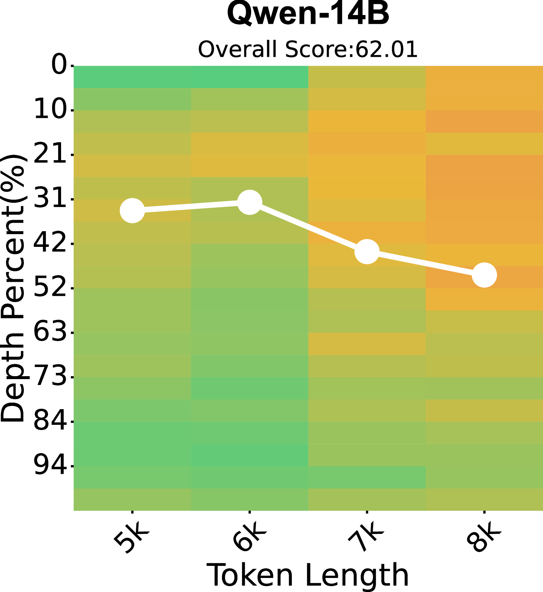
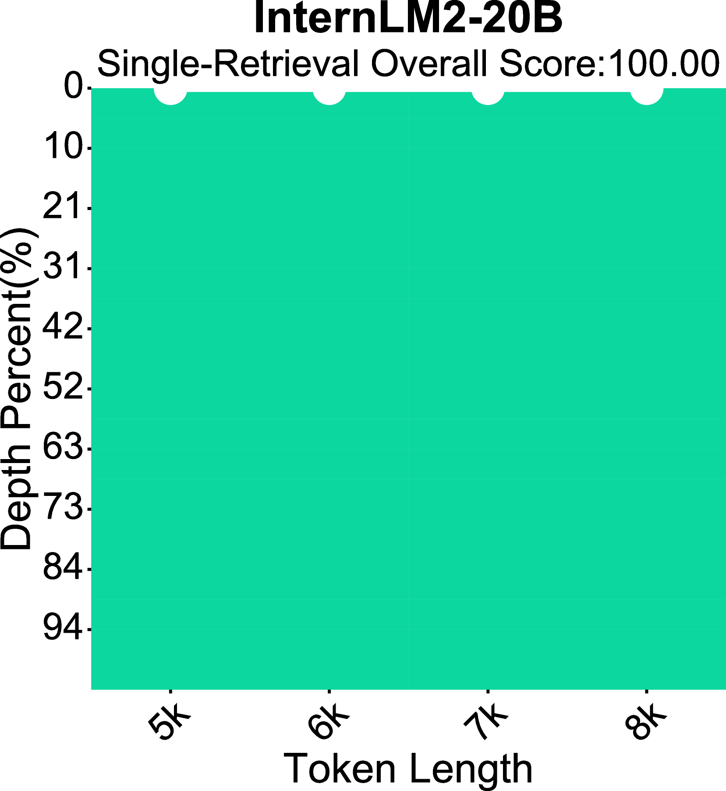
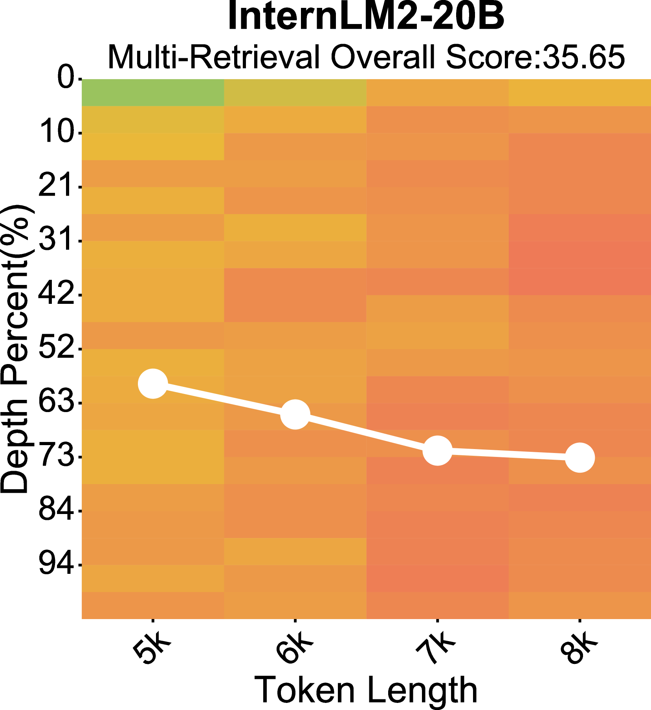

# NeedleBench 挑战：LLM 能否在百万级上下文窗口中同时进行检索与推理？

发布时间：2024年07月16日

`LLM应用` `人工智能`

> NeedleBench: Can LLMs Do Retrieval and Reasoning in 1 Million Context Window?

# 摘要

> 在评估大型语言模型的长上下文能力时，从长文档中提取与用户查询相关的内容至关重要。为此，我们设计了NeedleBench框架，通过一系列渐进式挑战任务，全面测试模型的双语长上下文处理能力，涵盖从4k到1000k及以上不同长度和深度区间，并战略性地在文本不同深度区域插入关键数据点，以严格检验模型的检索与推理能力。我们利用这一框架评估了领先开源模型在双语长文本中识别关键信息并进行有效推理的能力。此外，我们还提出了Ancestral Trace Challenge（ATC），模拟现实世界长上下文任务中可能遇到的复杂逻辑推理挑战，为评估LLM在复杂情境下的表现提供了一种简便方法。研究结果显示，当前LLM在实际长上下文应用中仍有较大提升空间，特别是在应对复杂逻辑推理挑战方面。所有相关代码和资源已公开在OpenCompass平台：https://github.com/open-compass/opencompass。

> In evaluating the long-context capabilities of large language models (LLMs), identifying content relevant to a user's query from original long documents is a crucial prerequisite for any LLM to answer questions based on long text. We present NeedleBench, a framework consisting of a series of progressively more challenging tasks for assessing bilingual long-context capabilities, spanning multiple length intervals (4k, 8k, 32k, 128k, 200k, 1000k, and beyond) and different depth ranges, allowing the strategic insertion of critical data points in different text depth zones to rigorously test the retrieval and reasoning capabilities of models in diverse contexts. We use the NeedleBench framework to assess how well the leading open-source models can identify key information relevant to the question and apply that information to reasoning in bilingual long texts. Furthermore, we propose the Ancestral Trace Challenge (ATC) to mimic the complexity of logical reasoning challenges that are likely to be present in real-world long-context tasks, providing a simple method for evaluating LLMs in dealing with complex long-context situations. Our results suggest that current LLMs have significant room for improvement in practical long-context applications, as they struggle with the complexity of logical reasoning challenges that are likely to be present in real-world long-context tasks. All codes and resources are available at OpenCompass: https://github.com/open-compass/opencompass.

[Arxiv](https://arxiv.org/abs/2407.11963)