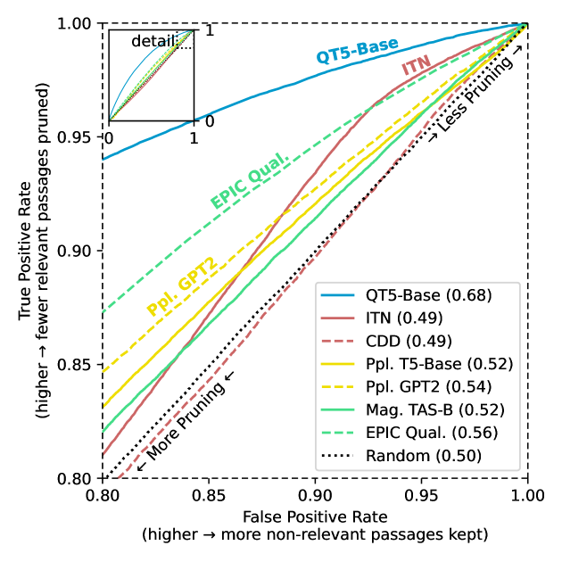
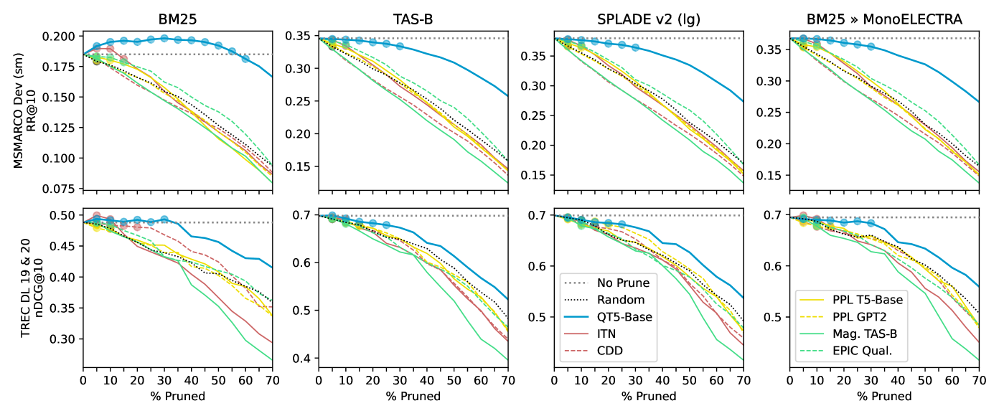
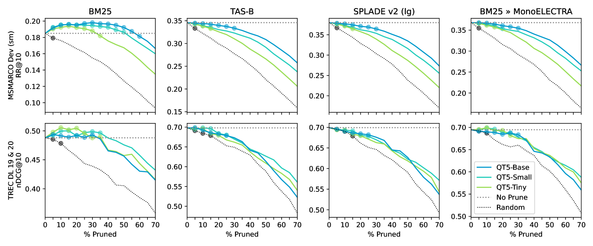
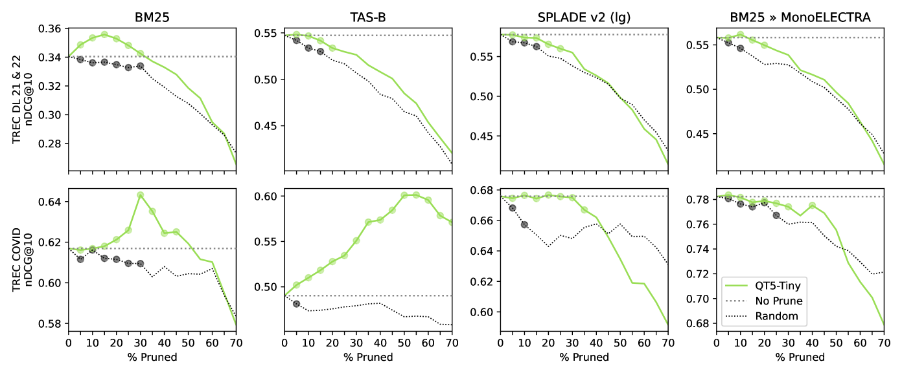

# 神经段落质量评估助力静态剪枝

发布时间：2024年07月16日

`LLM应用` `搜索引擎` `信息技术`

> Neural Passage Quality Estimation for Static Pruning

# 摘要

> 神经网络，尤其是那些基于大型预训练语言模型的，已经从多方面提升了搜索引擎的性能。其中最显著的是，它们能够评估文本或文档与用户查询的相关性。在本研究中，我们转向一个新的方向，探讨神经网络是否能有效预测文档中的哪些段落与任何查询都可能不相关。我们将这种与查询无关的段落相关性评估称为“段落质量”。我们发现，通过我们创新的段落质量评估方法，可以在保持同等有效性的前提下，大幅精简段落语料库；我们的最佳方法能在不同检索系统中稳定地减少超过25%的段落。这种大幅度的精简不仅降低了神经搜索引擎的运营成本，包括计算资源、电力消耗和碳排放，还优化了查询处理和索引构建过程。这一研究为未来开发更先进的神经网络索引策略奠定了基础。

> Neural networks -- especially those that use large, pre-trained language models -- have improved search engines in various ways. Most prominently, they can estimate the relevance of a passage or document to a user's query. In this work, we depart from this direction by exploring whether neural networks can effectively predict which of a document's passages are unlikely to be relevant to any query submitted to the search engine. We refer to this query-agnostic estimation of passage relevance as a passage's quality. We find that our novel methods for estimating passage quality allow passage corpora to be pruned considerably while maintaining statistically equivalent effectiveness; our best methods can consistently prune >25% of passages in a corpora, across various retrieval pipelines. Such substantial pruning reduces the operating costs of neural search engines in terms of computing resources, power usage, and carbon footprint -- both when processing queries (thanks to a smaller index size) and when indexing (lightweight models can prune low-quality passages prior to the costly dense or learned sparse encoding step). This work sets the stage for developing more advanced neural "learning-what-to-index" methods.

[Arxiv](https://arxiv.org/abs/2407.12170)