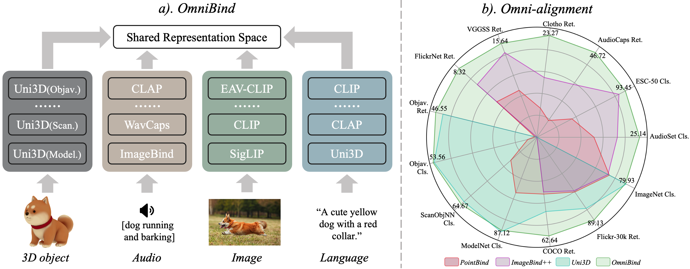
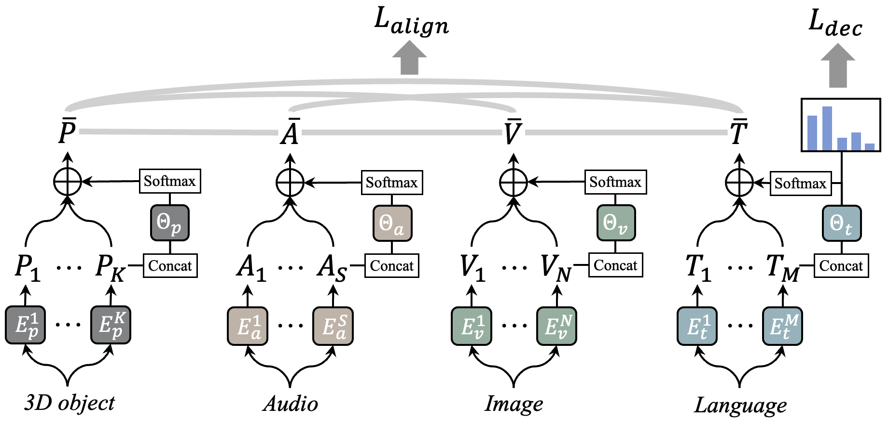
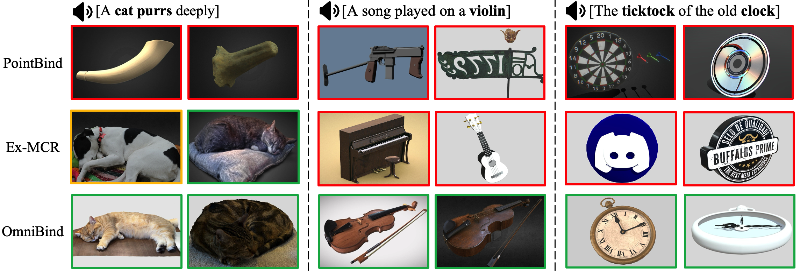
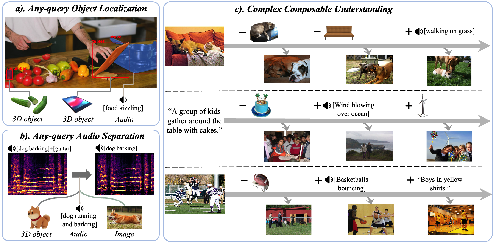
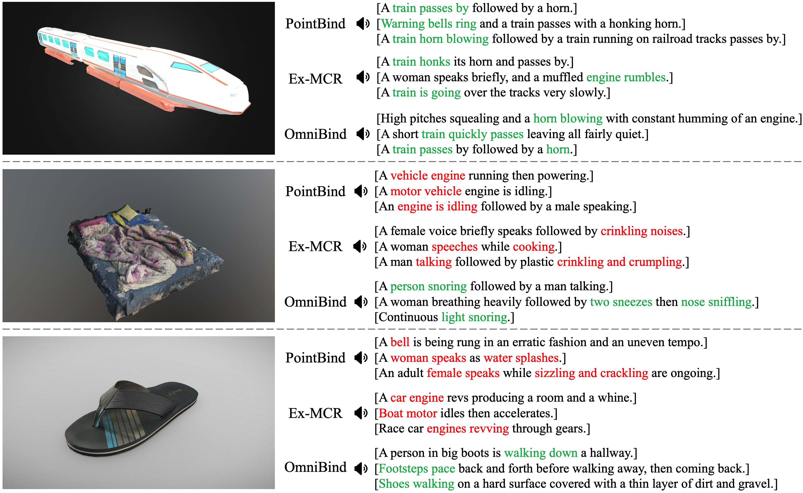
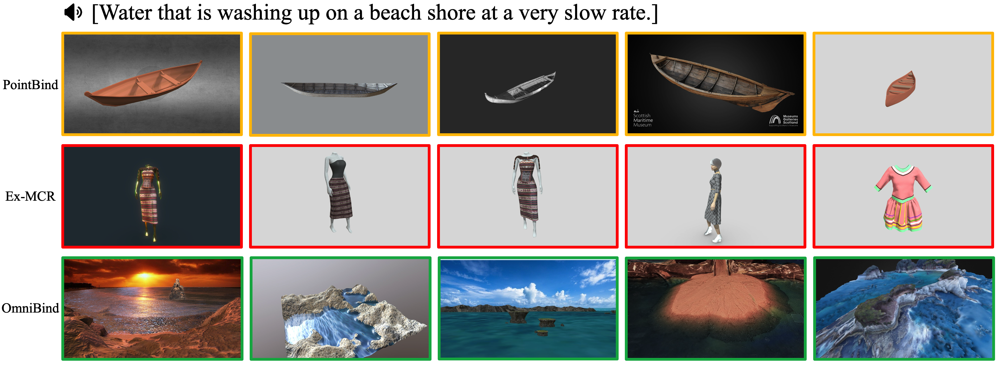
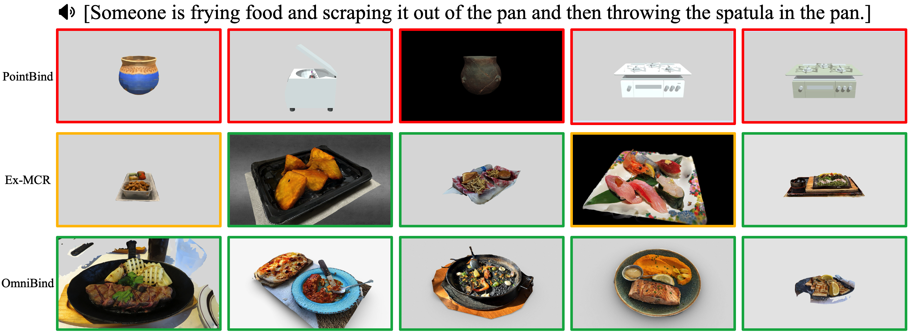
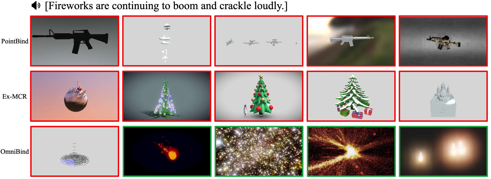
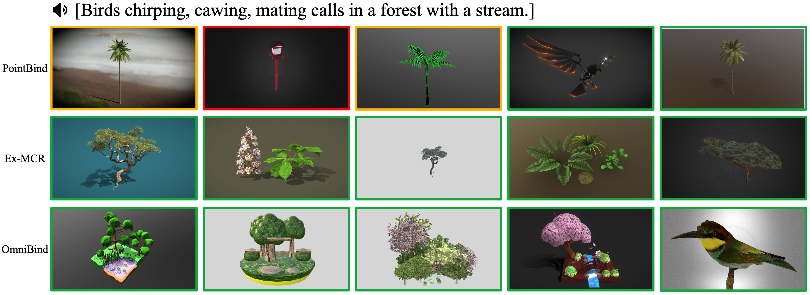
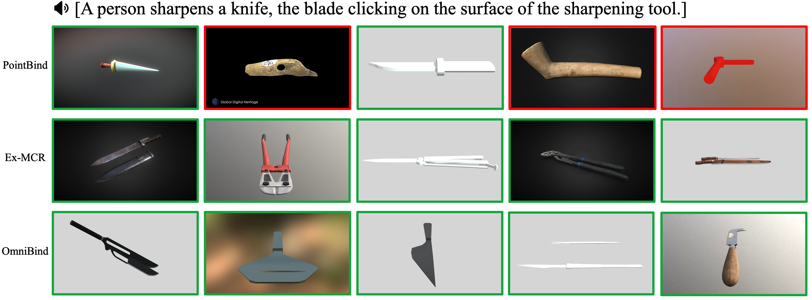

# OmniBind：借助绑定空间实现的全模态大规模表示

发布时间：2024年07月16日

`LLM应用` `人机交互` `多模态技术`

> OmniBind: Large-scale Omni Multimodal Representation via Binding Spaces

# 摘要

> 近期，多模态人机交互技术如GPT-4o和Gemini展现出广阔的应用前景。鉴于多模态联合表示在信息处理中的核心地位，构建高质量的全能联合表示模型成为提升多模态信息处理能力的关键。为此，我们推出了OmniBind，一系列参数规模从70亿至300亿的多模态联合表示模型，涵盖3D、音频、图像及语言等多种输入形式。面对多模态数据配对的稀缺性，我们创新性地采用预训练模型空间的重新映射与绑定策略，而非从零开始训练，从而间接扩展模型参数与数据规模，实现“规模化”升级。为高效融合多模态空间，我们通过学习路由器动态调整各空间权重，确保跨模态整体对齐与语言表示的独立性。得益于轻量级网络的应用，OmniBind在训练效率上表现卓越，仅需非配对单模态数据，即可在单个8-4090节点上于约三天内完成最大300亿模型的训练。大量实验验证了OmniBind作为全能表示模型的出色性能与广泛适用性，预示其在任意查询、多模态理解等多样化应用领域的巨大潜力。

> Recently, human-computer interaction with various modalities has shown promising applications, like GPT-4o and Gemini. Given the foundational role of multimodal joint representation in understanding and generation pipelines, high-quality omni joint representations would be a step toward co-processing more diverse multimodal information. In this work, we present OmniBind, large-scale multimodal joint representation models ranging in scale from 7 billion to 30 billion parameters, which support 3D, audio, image, and language inputs. Due to the scarcity of data pairs across all modalities, instead of training large models from scratch, we propose remapping and binding the spaces of various pre-trained specialist models together. This approach enables "scaling up" by indirectly increasing the model parameters and the amount of seen data. To effectively integrate various spaces, we dynamically assign weights to different spaces by learning routers with two objectives: cross-modal overall alignment and language representation decoupling. Notably, since binding and routing spaces both only require lightweight networks, OmniBind is extremely training-efficient. Learning the largest 30B model requires merely unpaired unimodal data and approximately 3 days on a single 8-4090 node. Extensive experiments demonstrate the versatility and superiority of OmniBind as an omni representation model, highlighting its great potential for diverse applications, such as any-query and composable multimodal understanding.

[Arxiv](https://arxiv.org/abs/2407.11895)