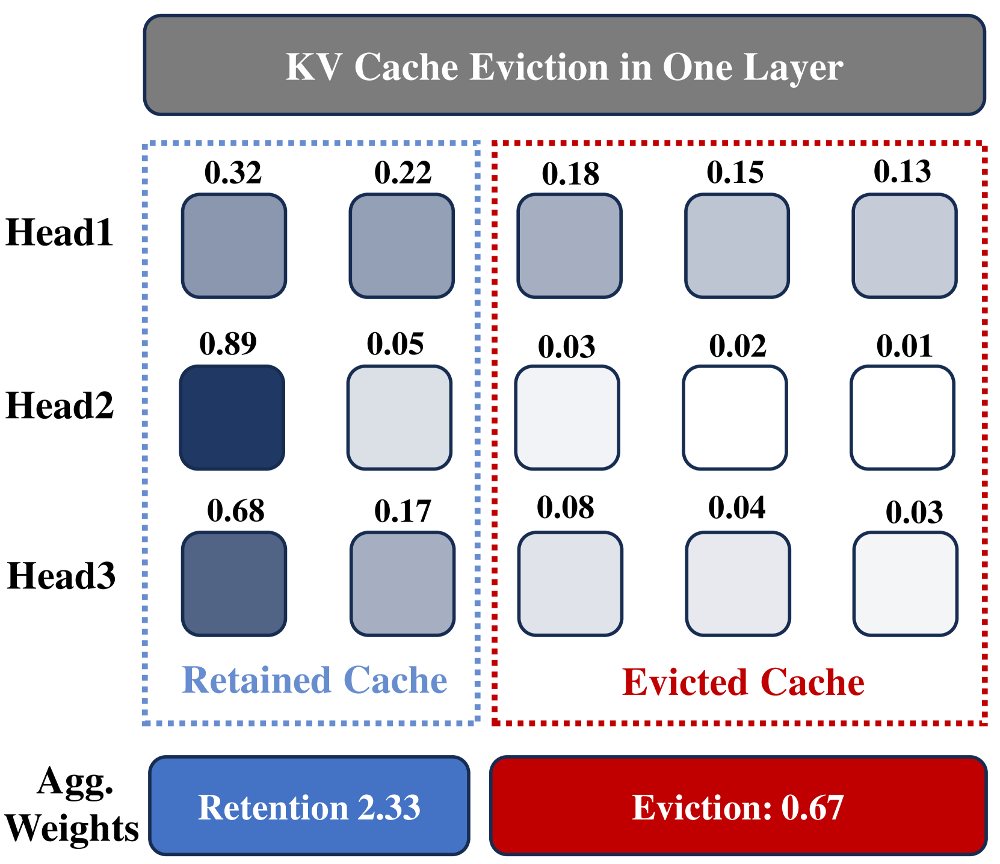
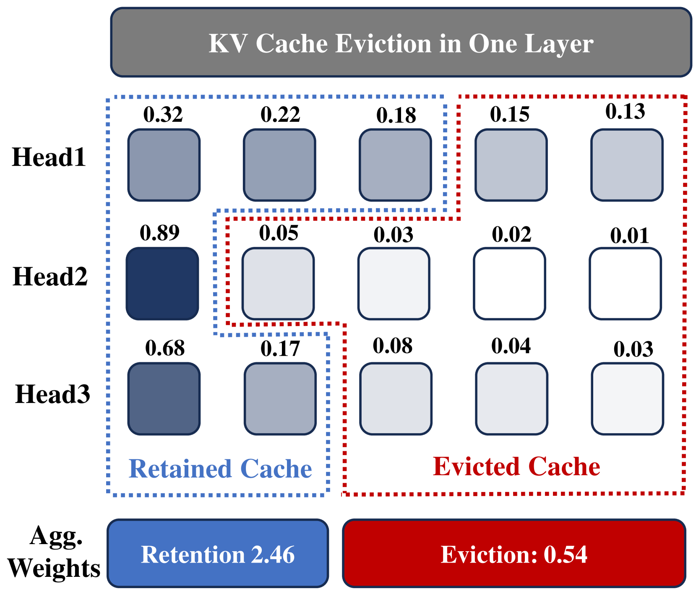
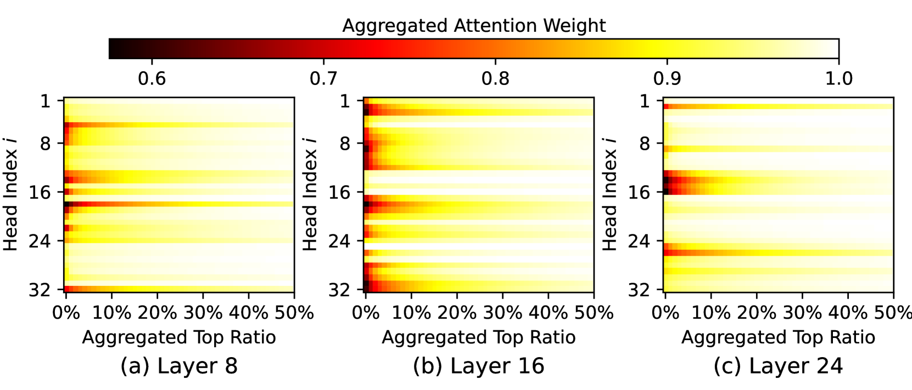
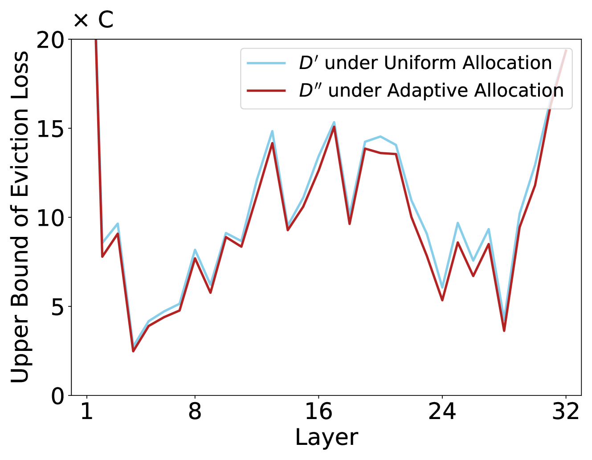
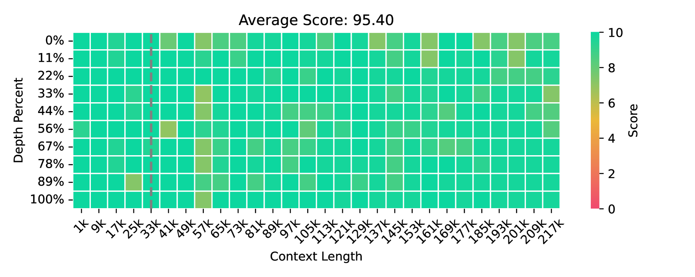
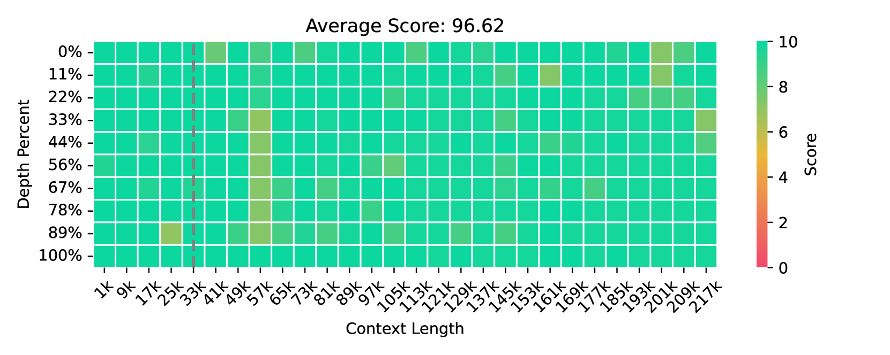
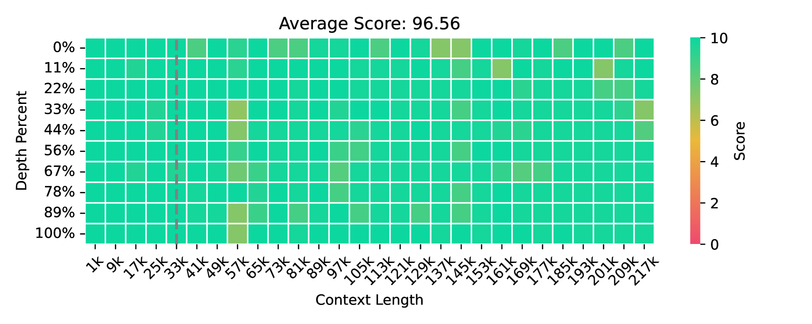
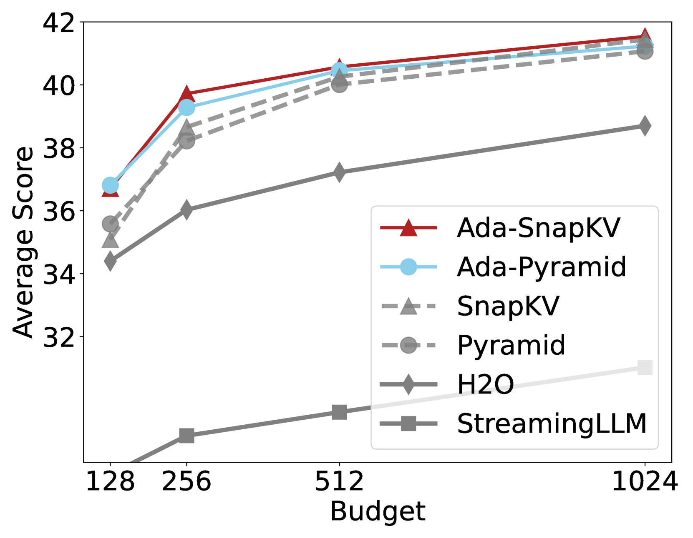
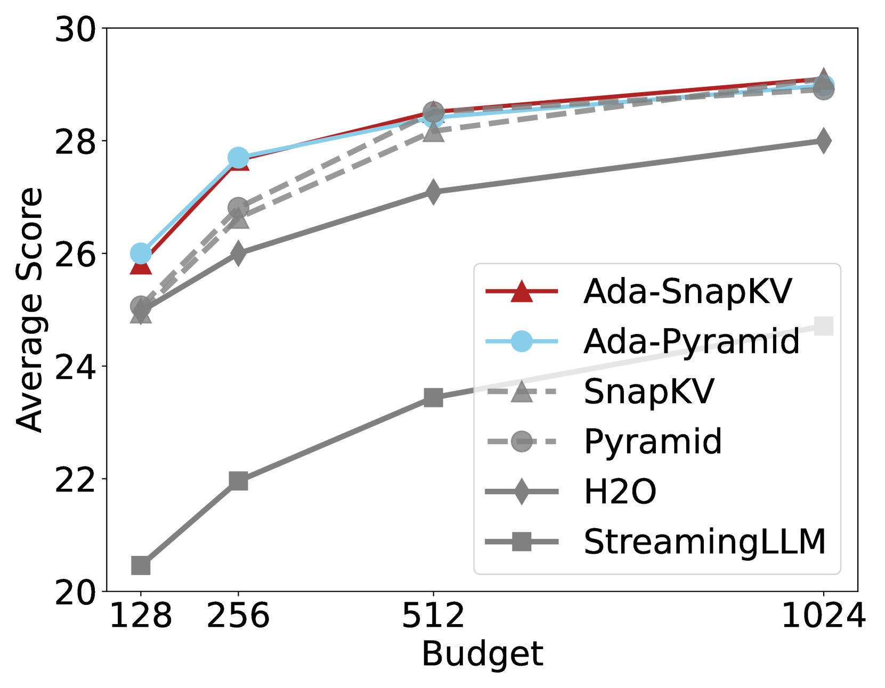
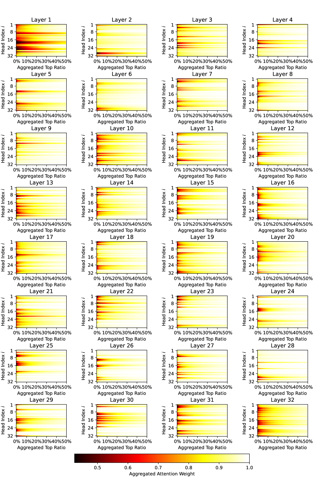

# 优化LLM中的KV缓存驱逐策略：通过自适应分配提升预算利用效率

发布时间：2024年07月16日

`LLM理论` `人工智能` `计算机科学`

> Optimizing KV Cache Eviction in LLMs: Adaptive Allocation for Enhanced Budget Utilization

# 摘要

> 大型语言模型虽在多领域表现卓越，但长序列推理所需的庞大KV缓存限制了其效率。为解决这一问题，我们重新审视了现有策略，发现它们旨在特定预算下最小化驱逐损失上限。然而，当前的均匀预算分配方法在驱逐后常损害生成质量。为此，我们提出了一种简单有效的自适应分配算法，不仅理论上限优于传统方法，还能更好地适应自注意力机制，实际降低了损失上限。结合两种前沿技术，我们开发了Ada-SnapKV和Ada-Pyramid，经16个数据集和Needle-in-a-Haystack测试验证，它们显著提升了性能，刷新了行业标杆。

> Large Language Models have excelled in various fields but encounter efficiency limitations due to the extensive KV cache required for long sequences inference. Many efforts try to evict non-critical cache elements during runtime, thereby reducing cache size within a given memory budget while preserving generation quality. Our reexamination of their underlying principles discerns that prevailing strategies essentially aim to minimize an upper bound of eviction loss within a specific budget allocation. However, we observe that the current practice of uniformly allocating budgets across different attention heads during the eviction procedure tends to degrade the quality of generation posten-eviction. In light of these findings, we propose a simple yet effective adaptive allocation algorithm that not only theoretically ensures its loss upper bound does not exceed that of previous uniform allocation methods, but also effectively aligns with the characteristics of the self-attention mechanism, thus practically reducing the upper bound. Further, integrating this algorithm with two of the most advanced methods yields Ada-SnapKV and Ada-Pyramid. Extensive experimental validation across 16 datasets and the Needle-in-a-Haystack test confirm that Ada-SnapKV and Ada-Pyramid achieve further enhancements, establishing new benchmarks in state-of-the-art performance.

[Arxiv](https://arxiv.org/abs/2407.11550)