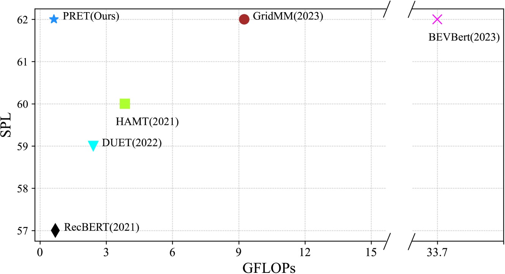
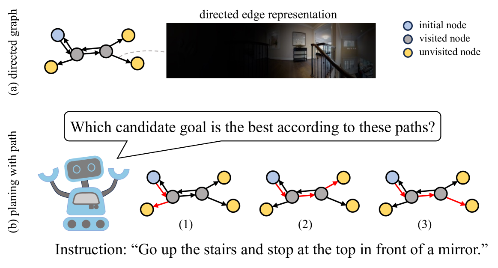
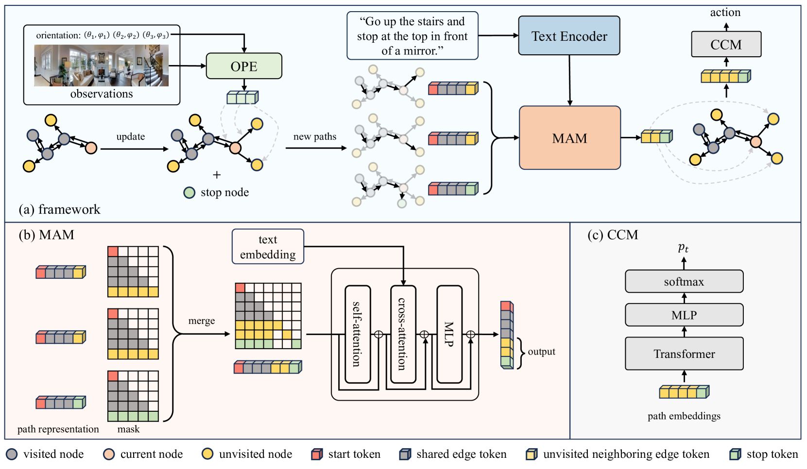
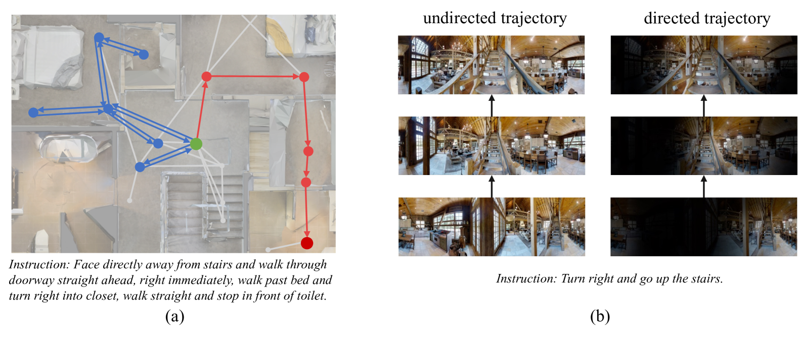

# PRET：通过定向忠诚轨迹规划视觉与语言导航

发布时间：2024年07月16日

`Agent` `机器人` `自动驾驶`

> PRET: Planning with Directed Fidelity Trajectory for Vision and Language Navigation

# 摘要

> 视觉与语言导航任务要求代理根据自然语言指令进行导航。近期方法通过在拓扑图上预测子目标来实现长期规划，但使用GCN类模型进行高级预测时计算成本高昂。我们提出一种新方法，通过分析指令与定向路径的对齐来优化导航规划，确保从起点到目标位置的路径无绕行。该策略不仅提升了模型效率，还保持了高性能。我们利用有向图来描绘探索区域，并定义轨迹为一系列有向边特征，这些特征从全景图中提取。导航时，我们评估指令与轨迹的对齐度，以选择最佳导航目标。在RxR数据集上，我们的方法超越了BEVBert，在R2R数据集上也表现出色，且显著降低了计算负担。代码已公开：https://github.com/iSEE-Laboratory/VLN-PRET。

> Vision and language navigation is a task that requires an agent to navigate according to a natural language instruction. Recent methods predict sub-goals on constructed topology map at each step to enable long-term action planning. However, they suffer from high computational cost when attempting to support such high-level predictions with GCN-like models. In this work, we propose an alternative method that facilitates navigation planning by considering the alignment between instructions and directed fidelity trajectories, which refers to a path from the initial node to the candidate locations on a directed graph without detours. This planning strategy leads to an efficient model while achieving strong performance. Specifically, we introduce a directed graph to illustrate the explored area of the environment, emphasizing directionality. Then, we firstly define the trajectory representation as a sequence of directed edge features, which are extracted from the panorama based on the corresponding orientation. Ultimately, we assess and compare the alignment between instruction and different trajectories during navigation to determine the next navigation target. Our method outperforms previous SOTA method BEVBert on RxR dataset and is comparable on R2R dataset while largely reducing the computational cost. Code is available: https://github.com/iSEE-Laboratory/VLN-PRET.

[Arxiv](https://arxiv.org/abs/2407.11487)