# PipeInfer：通过异步流水线推测技术，加速大型语言模型的推理过程。

发布时间：2024年07月16日

`LLM应用` `计算机科学` `人工智能`

> PipeInfer: Accelerating LLM Inference using Asynchronous Pipelined Speculation

# 摘要

> 近期，大型语言模型在跨集群推理方面的研究备受关注，众多加速技术借鉴了CPU的推测执行机制。这些技术虽缓解了内存带宽瓶颈，却也增加了推理延迟，需依赖高推测接受率来提升性能。然而，任务间接受率的不一致性可能导致性能下降。此外，流水线并行设计依赖大量用户请求以维持高效利用。为此，我们推出了PipeInfer，一种流水线推测加速技术，旨在降低单请求场景下的令牌间延迟，提升系统利用率，并增强对低推测接受率和低带宽环境的适应性。PipeInfer在生成速度上实现了2.15倍的提升，得益于连续异步推测和早期推理取消两大创新：前者通过并行执行单令牌推理与推测任务来优化延迟和速度，后者则通过跳过无效推理阶段来进一步提速。

> Inference of Large Language Models (LLMs) across computer clusters has become a focal point of research in recent times, with many acceleration techniques taking inspiration from CPU speculative execution. These techniques reduce bottlenecks associated with memory bandwidth, but also increase end-to-end latency per inference run, requiring high speculation acceptance rates to improve performance. Combined with a variable rate of acceptance across tasks, speculative inference techniques can result in reduced performance. Additionally, pipeline-parallel designs require many user requests to maintain maximum utilization. As a remedy, we propose PipeInfer, a pipelined speculative acceleration technique to reduce inter-token latency and improve system utilization for single-request scenarios while also improving tolerance to low speculation acceptance rates and low-bandwidth interconnects. PipeInfer exhibits up to a 2.15$\times$ improvement in generation speed over standard speculative inference. PipeInfer achieves its improvement through Continuous Asynchronous Speculation and Early Inference Cancellation, the former improving latency and generation speed by running single-token inference simultaneously with several speculative runs, while the latter improves speed and latency by skipping the computation of invalidated runs, even in the middle of inference.

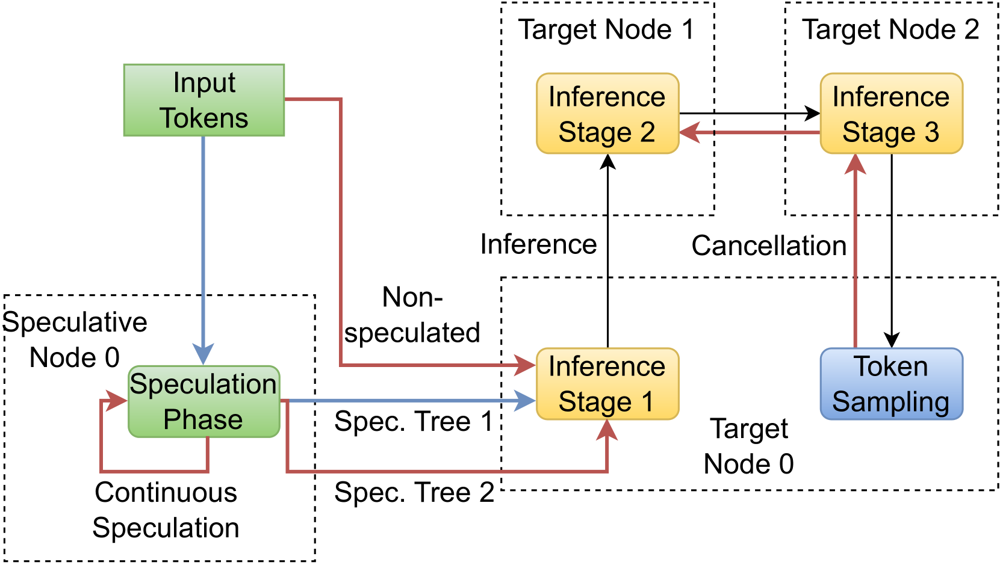

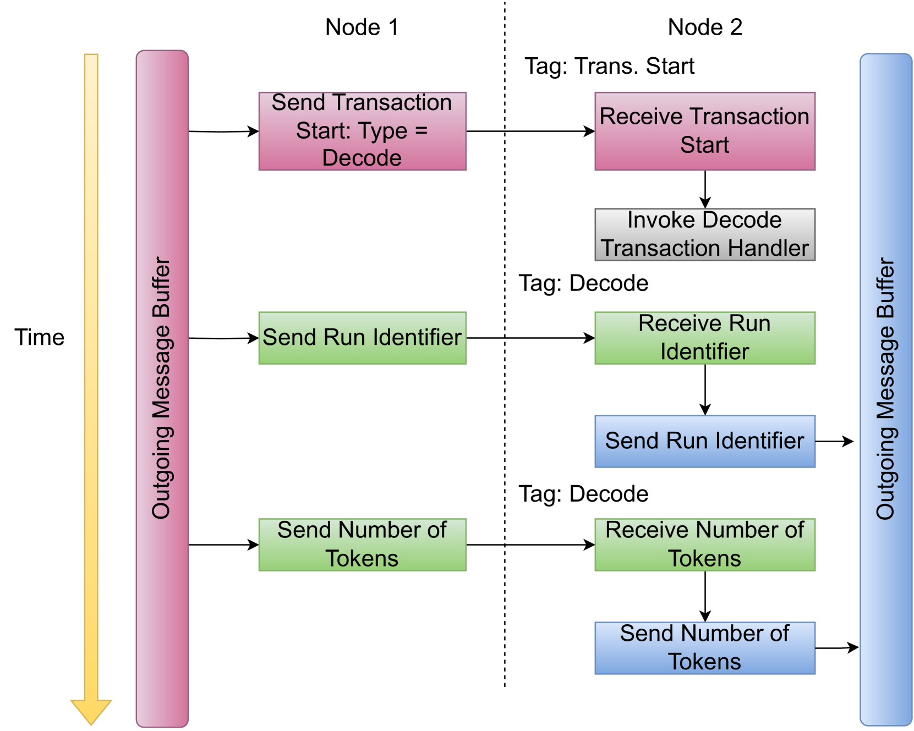

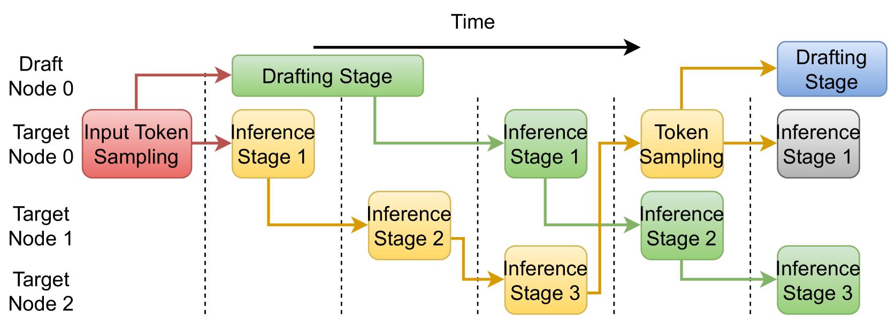

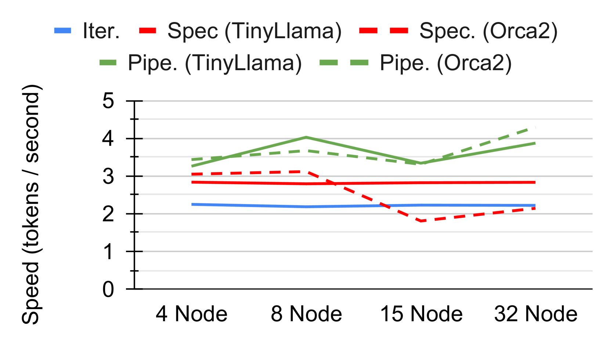

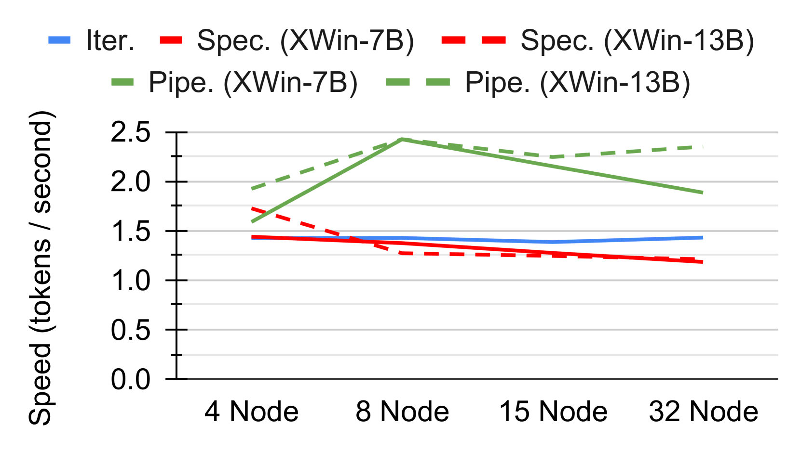

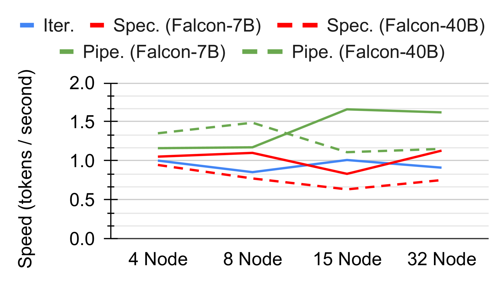

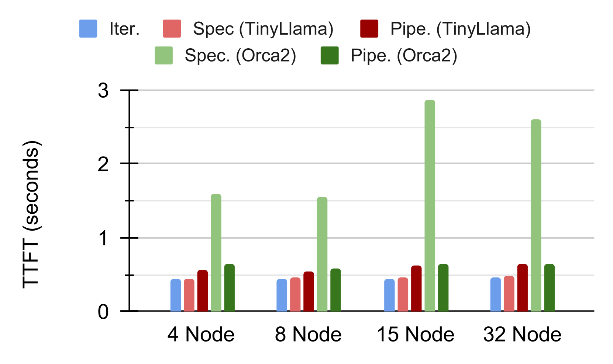

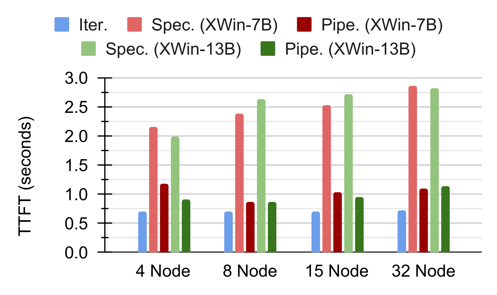

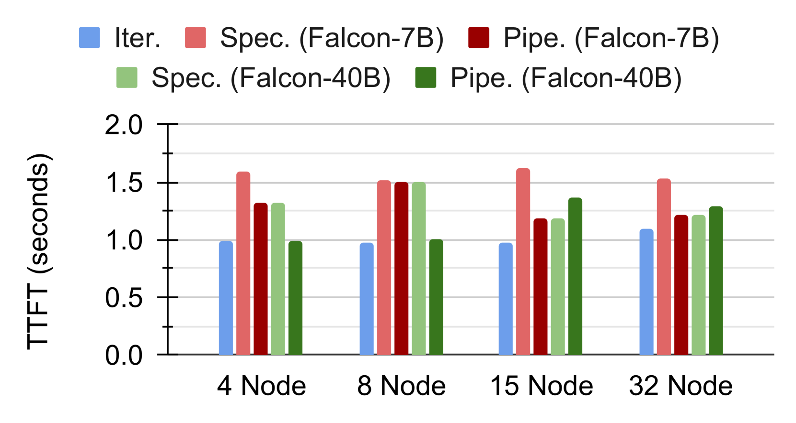

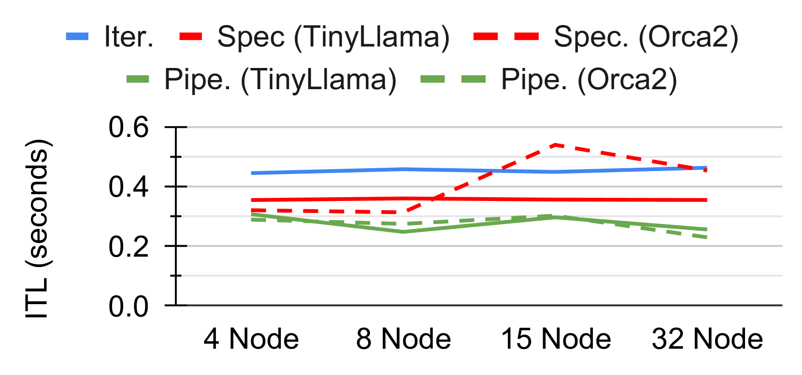

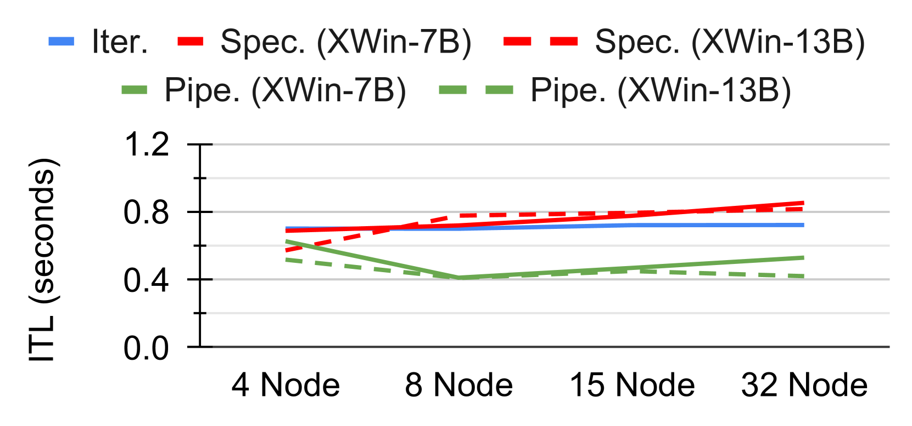

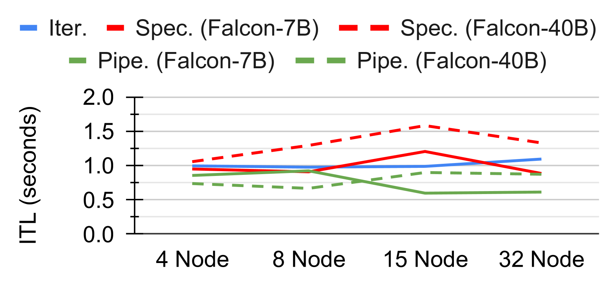

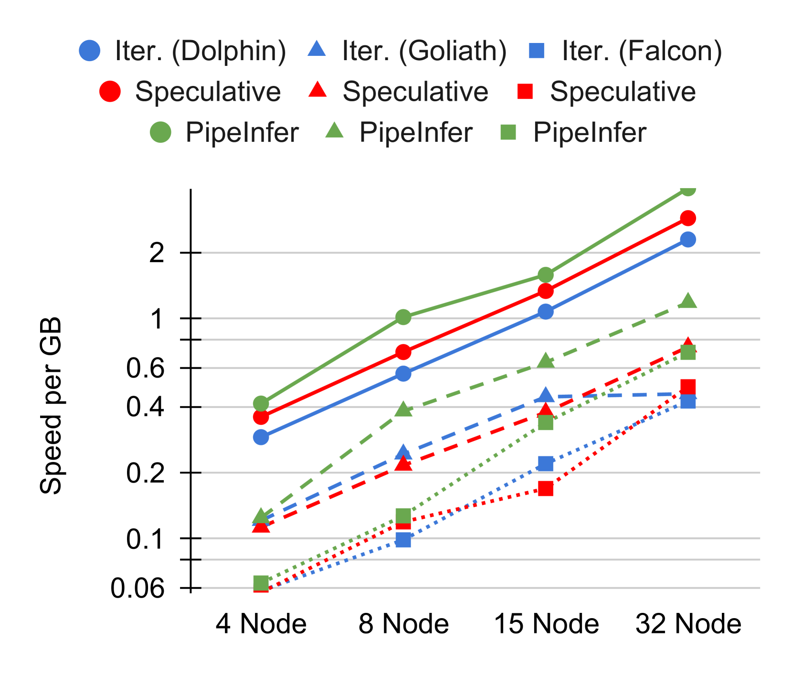

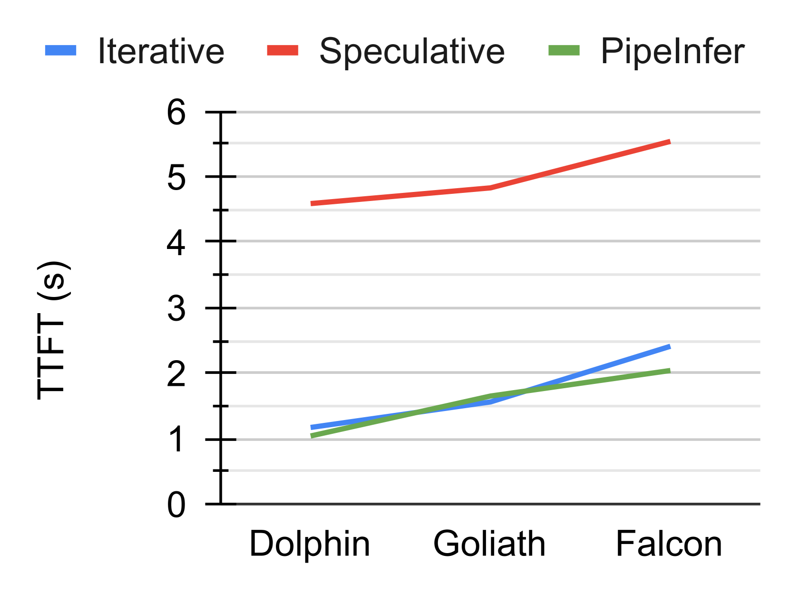

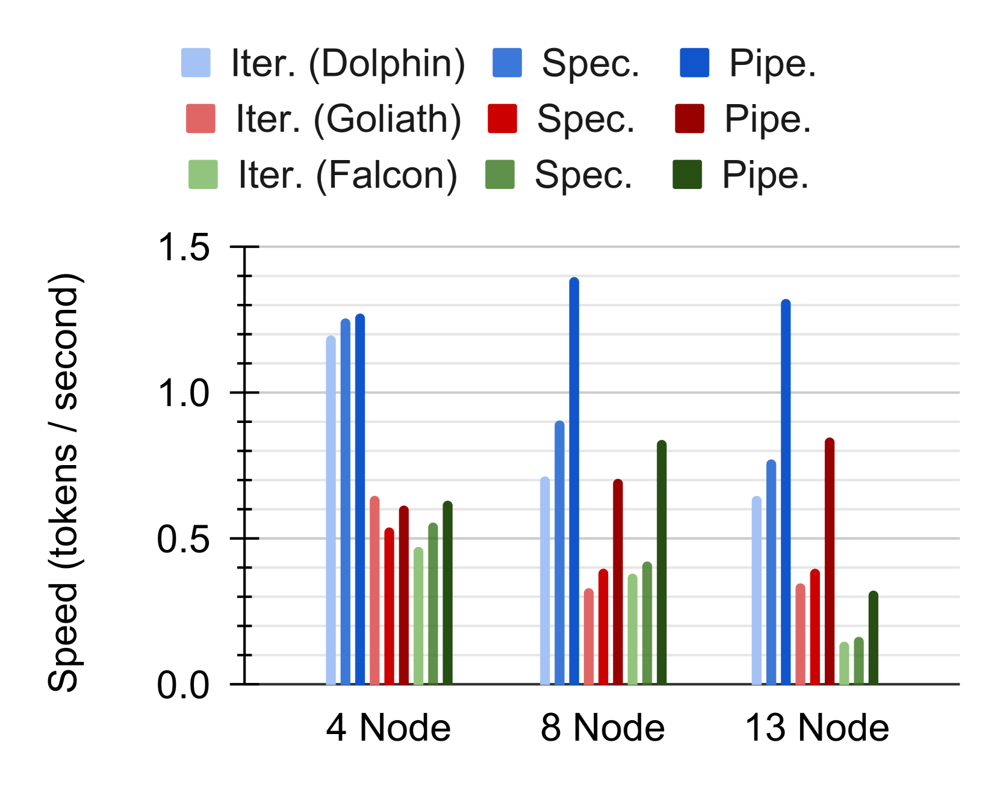

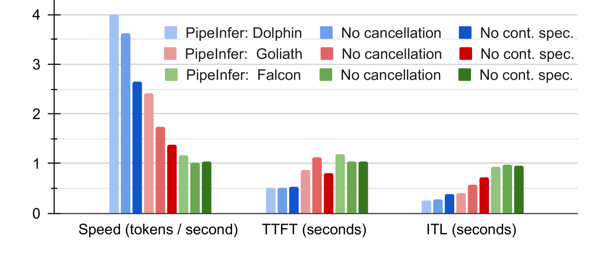

[Arxiv](https://arxiv.org/abs/2407.11798)