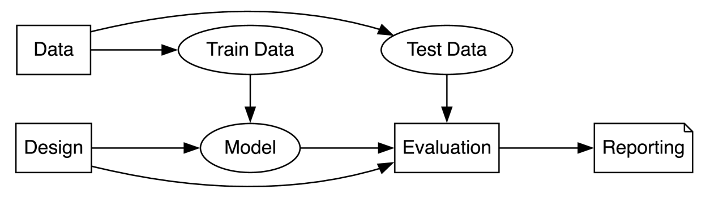
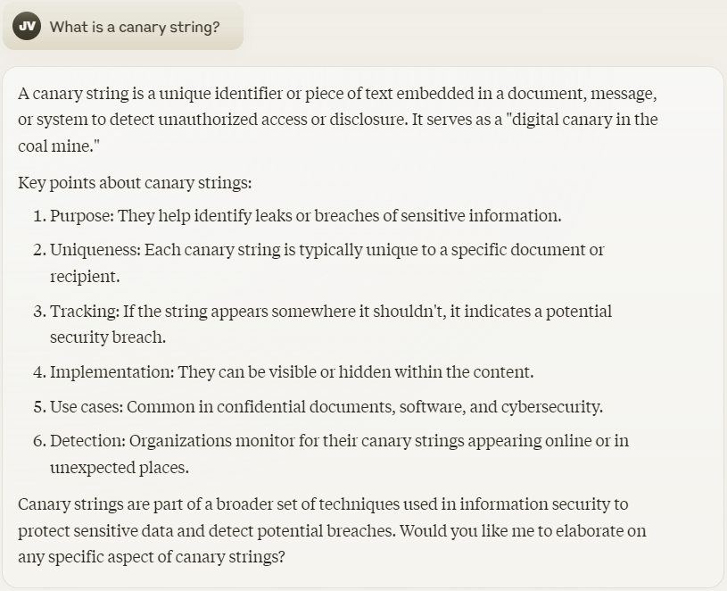

# 机器学习领域存在一些值得质疑的做法。

发布时间：2024年07月16日

`LLM理论` `人工智能` `研究方法论`

> Questionable practices in machine learning

# 摘要

> 评估现代ML模型颇具挑战。为了在特定指标上取得领先成果，研究者和企业常采取可疑的研究手段（QRPs），虽未触及欺诈，但仍属不当。我们列举了43种此类手段，它们可能削弱研究成果的可信度，并尽可能提供实例。我们特别关注大型语言模型（LLMs）在公开基准上的表现评估。此外，我们还探讨了“不可复现的研究实践”，这些决策使得他人难以或无法复现、拓展或审查先前的研究成果。

> Evaluating modern ML models is hard. The strong incentive for researchers and companies to report a state-of-the-art result on some metric often leads to questionable research practices (QRPs): bad practices which fall short of outright research fraud. We describe 43 such practices which can undermine reported results, giving examples where possible. Our list emphasises the evaluation of large language models (LLMs) on public benchmarks. We also discuss "irreproducible research practices", i.e. decisions that make it difficult or impossible for other researchers to reproduce, build on or audit previous research.

[Arxiv](https://arxiv.org/abs/2407.12220)