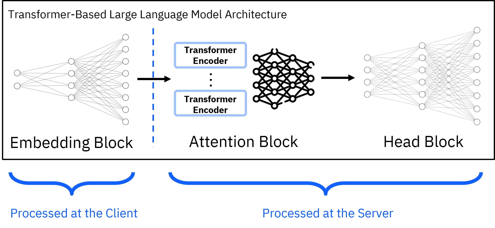
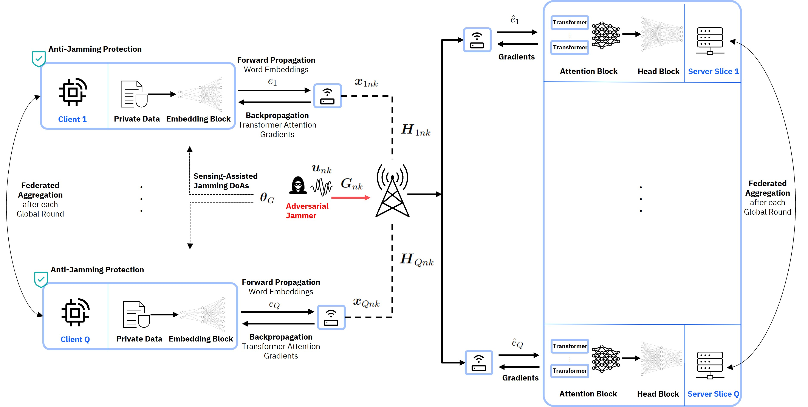
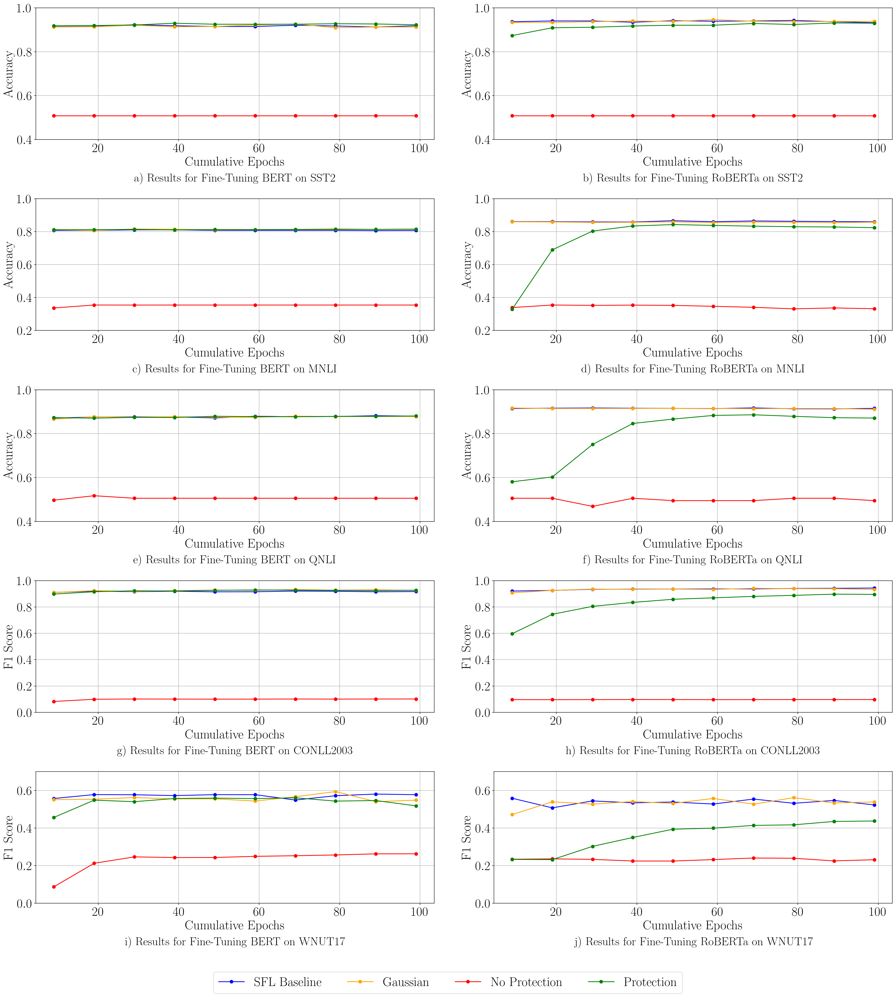
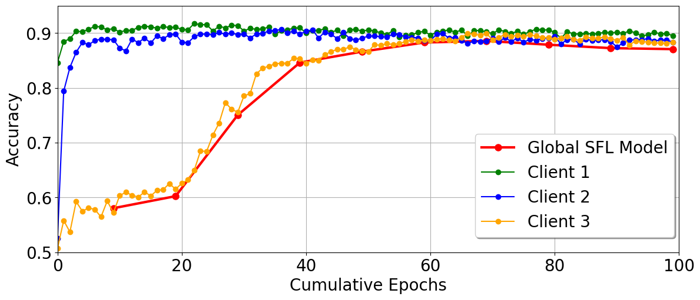
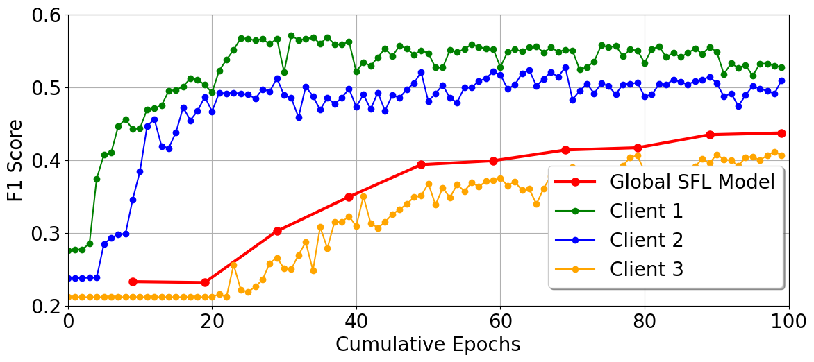
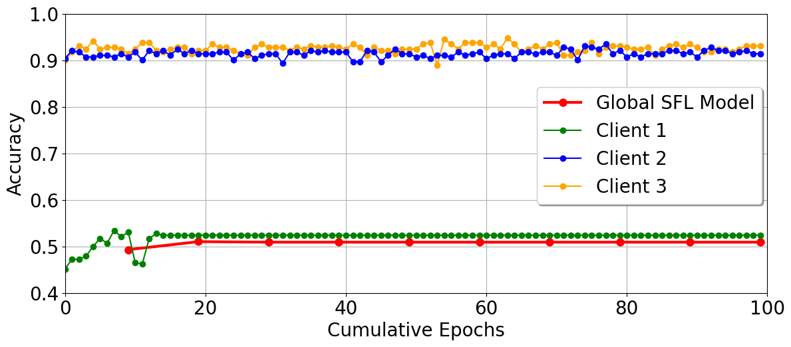
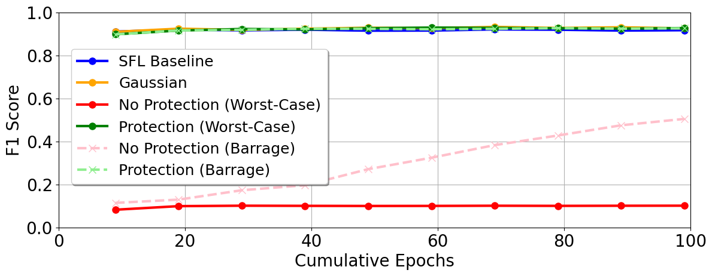
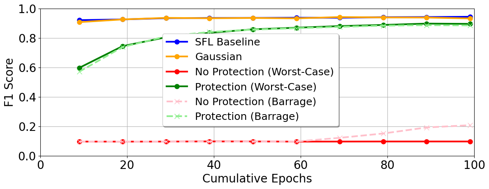

# R-SFLLM：为大型语言模型设计的分割联邦学习抗干扰框架

发布时间：2024年07月16日

`LLM应用` `无线通信` `机器学习`

> R-SFLLM: Jamming Resilient Framework for Split Federated Learning with Large Language Models

# 摘要

> Split federated learning (SFL) 是一种高效的分布式机器学习范式，其中大型模型的组件被外包至远程服务器。然而，SFL 在无线信道部署时面临一个重大挑战：传输的模型参数易受干扰，可能危及学习过程。本文深入分析了干扰对 LLM 词嵌入的影响，并开发了一个物理层框架 R-SFLLM，以增强无线网络中的 SFL 弹性。通过实验证明，R-SFLLM 在 NLP 任务中表现优异，并引入对抗训练组件，显著提升 LLM 对扰动参数的抵抗力。研究还指出，最坏情况的干扰会导致最坏的模型结果，强调了开发抗干扰 SFL 协议的必要性。

> Split federated learning (SFL) is a compute-efficient paradigm in distributed machine learning (ML), where components of large ML models are outsourced to remote servers. A significant challenge in SFL, particularly when deployed over wireless channels, is the susceptibility of transmitted model parameters to adversarial jamming that could jeopardize the learning process. This is particularly pronounced for word embedding parameters in large language models (LLMs), which are crucial for language understanding. In this paper, rigorous insights are provided into the influence of jamming LLM word embeddings in SFL by deriving an expression for the ML training loss divergence and showing that it is upper-bounded by the mean squared error (MSE). Based on this analysis, a physical layer framework is developed for resilient SFL with LLMs (R-SFLLM) over wireless networks. R-SFLLM leverages wireless sensing data to gather information on the jamming directions-of-arrival (DoAs) for the purpose of devising a novel, sensing-assisted anti-jamming strategy while jointly optimizing beamforming, user scheduling, and resource allocation. Extensive experiments using BERT and RoBERTa models demonstrate R-SFLLM's effectiveness, achieving close-to-baseline performance across various natural language processing (NLP) tasks and datasets. The proposed methodology further introduces an adversarial training component, where controlled noise exposure significantly enhances the LLM's resilience to perturbed parameters during training. The results show that more noise-sensitive models, such as RoBERTa, benefit from this feature, especially when resource allocation is unfair. It is also shown that worst-case jamming in particular translates into worst-case model outcomes, thereby necessitating the need for jamming-resilient SFL protocols.

[Arxiv](https://arxiv.org/abs/2407.11654)