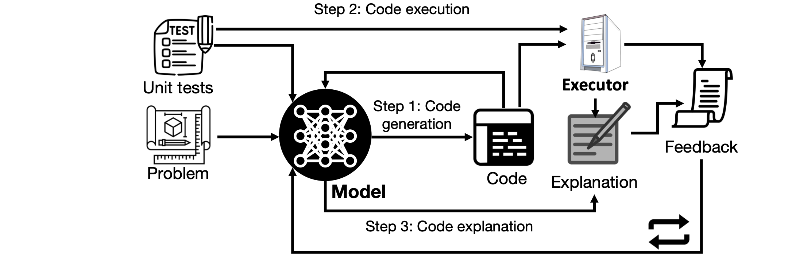
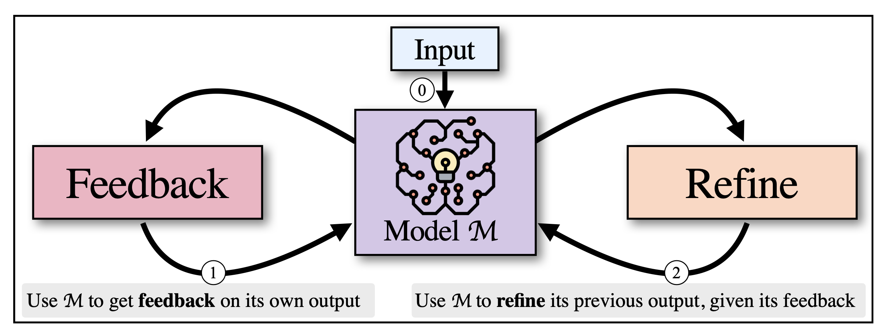

# 大型语言模型推理研究综述

发布时间：2024年07月16日

`LLM理论` `人工智能`

> Reasoning with Large Language Models, a Survey

# 摘要

> 将语言模型扩展至数十亿参数，开启了上下文学习的新纪元，使得模型能够对未经专门训练的任务进行指令调整和少样本学习，从而在翻译、摘要和问答等语言任务上取得显著突破。不仅如此，近期思维链提示学习的进步更展示了LLMs在“系统2”推理能力上的强大潜力，引发了关于LLMs能否进行推理的讨论。这一探索始于LLMs是否能解决小学数学应用题的疑问。本文深入探讨了基于提示的推理与LLMs领域的迅猛发展，提出了一套分类法，涵盖了多步骤推理的生成、评估与控制方式。我们详细剖析了核心方法与待解难题，并勾勒出近期的研究蓝图。最后，我们探讨了推理与基于提示学习之间的联系，以及推理、序列决策过程与强化学习之间的相互关系。我们发现，通过巧妙运用提示，推理过程的自改进、自我反思及部分元认知能力得以实现。然而，真正的自我改进与自我推理，即从LLMs辅助的推理转向LLMs自主的推理，仍是未来探索的方向。

> Scaling up language models to billions of parameters has opened up possibilities for in-context learning, allowing instruction tuning and few-shot learning on tasks that the model was not specifically trained for. This has achieved breakthrough performance on language tasks such as translation, summarization, and question-answering. Furthermore, in addition to these associative "System 1" tasks, recent advances in Chain-of-thought prompt learning have demonstrated strong "System 2" reasoning abilities, answering a question in the field of artificial general intelligence whether LLMs can reason. The field started with the question whether LLMs can solve grade school math word problems. This paper reviews the rapidly expanding field of prompt-based reasoning with LLMs. Our taxonomy identifies different ways to generate, evaluate, and control multi-step reasoning. We provide an in-depth coverage of core approaches and open problems, and we propose a research agenda for the near future. Finally, we highlight the relation between reasoning and prompt-based learning, and we discuss the relation between reasoning, sequential decision processes, and reinforcement learning. We find that self-improvement, self-reflection, and some metacognitive abilities of the reasoning processes are possible through the judicious use of prompts. True self-improvement and self-reasoning, to go from reasoning with LLMs to reasoning by LLMs, remains future work.

[Arxiv](https://arxiv.org/abs/2407.11511)