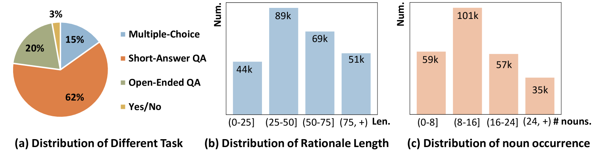

# 通过反射性指令调整，我们旨在减轻大型视觉-语言模型中的幻觉问题。

发布时间：2024年07月16日

`LLM应用` `人工智能` `计算机视觉`

> Reflective Instruction Tuning: Mitigating Hallucinations in Large Vision-Language Models

# 摘要

> 大型视觉-语言模型 (LVLMs) 在多种视觉-语言任务上表现出色，但仍易产生与视觉内容或指令不符的幻觉输出。尽管有多种缓解策略，但常忽视训练中细粒度推理监督的缺失。为此，我们提出反思指令调优，将原理学习融入视觉指令调优，不同于仅从响应中学习，我们的方法要求模型预测响应正确或错误的原理，深化对细粒度推理的理解，提升推理能力。为此，我们创建了 REVERIE 数据集，包含 115k 推理指令，每个指令都附有正确和混淆响应及详细原理注释。实验表明，使用 REVERIE 的反思指令调优显著提升了模型性能，证明了从原理中反思的有效性。项目详情见 https://zjr2000.github.io/projects/reverie。

> Large vision-language models (LVLMs) have shown promising performance on a variety of vision-language tasks. However, they remain susceptible to hallucinations, generating outputs misaligned with visual content or instructions. While various mitigation strategies have been proposed, they often neglect a key contributor to hallucinations: lack of fine-grained reasoning supervision during training. Without intermediate reasoning steps, models may establish superficial shortcuts between instructions and responses, failing to internalize the inherent reasoning logic. To address this challenge, we propose reflective instruction tuning, which integrates rationale learning into visual instruction tuning. Unlike previous methods that learning from responses only, our approach entails the model predicting rationales justifying why responses are correct or incorrect. This fosters a deeper engagement with the fine-grained reasoning underlying each response, thus enhancing the model's reasoning proficiency. To facilitate this approach, we propose REVERIE, the first large-scale instruction-tuning dataset with ReflEctiVE RatIonalE annotations. REVERIE comprises 115k machine-generated reasoning instructions, each meticulously annotated with a corresponding pair of correct and confusing responses, alongside comprehensive rationales elucidating the justification behind the correctness or erroneousness of each response. Experimental results on multiple LVLM benchmarks reveal that reflective instruction tuning with the REVERIE dataset yields noticeable performance gain over the baseline model, demonstrating the effectiveness of reflecting from the rationales. Project page is at https://zjr2000.github.io/projects/reverie.

[Arxiv](https://arxiv.org/abs/2407.11422)