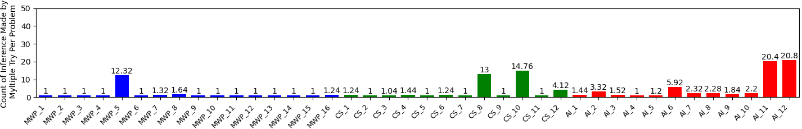

# 超越自然语言的可靠推理

发布时间：2024年07月16日

`LLM应用` `人工智能`

> Reliable Reasoning Beyond Natural Language

# 摘要

> 尽管 LLMs 语言能力出众，但在可靠与灵活的推理上常显不足。为此，我们创新性地采用神经符号方法，引导 LLMs 将问题信息转化为逻辑代码，并借助 Prolog 进行精确的演绎推理。这一策略大幅提升了 LLMs 在 GSM8k 和 BIG-bench 的 Navigate 数据集上的表现。同时，我们推出了非线性推理 (NLR) 数据集，包含 55 个独特问题，旨在挑战 LLMs 的预测模式，并强调复杂推理与基础算术的结合。实证显示，Prolog 的引入使 LLMs 在 NLR 数据集上表现卓越，超越了包括 GPT4 在内的顶尖模型仅凭文本的解决能力。

> Despite their linguistic competence, Large Language models (LLMs) often exhibit limitations in their ability to reason reliably and flexibly. To address this, we propose a neurosymbolic approach that prompts LLMs to extract and encode all relevant information from a problem statement as logical code statements, and then use a logic programming language (Prolog) to conduct the iterative computations of explicit deductive reasoning. Our approach significantly enhances the performance of LLMs on the standard mathematical reasoning benchmark, GSM8k, and the Navigate dataset from the BIG-bench dataset. Additionally, we introduce a novel dataset, the Non-Linear Reasoning (NLR) dataset, consisting of 55 unique word problems that target the shortcomings of the next token prediction paradigm of LLMs and require complex non-linear reasoning but only basic arithmetic skills to solve. Our findings demonstrate that the integration of Prolog enables LLMs to achieve high performance on the NLR dataset, which even the most advanced language models (including GPT4) fail to solve using text only.

[Arxiv](https://arxiv.org/abs/2407.11373)