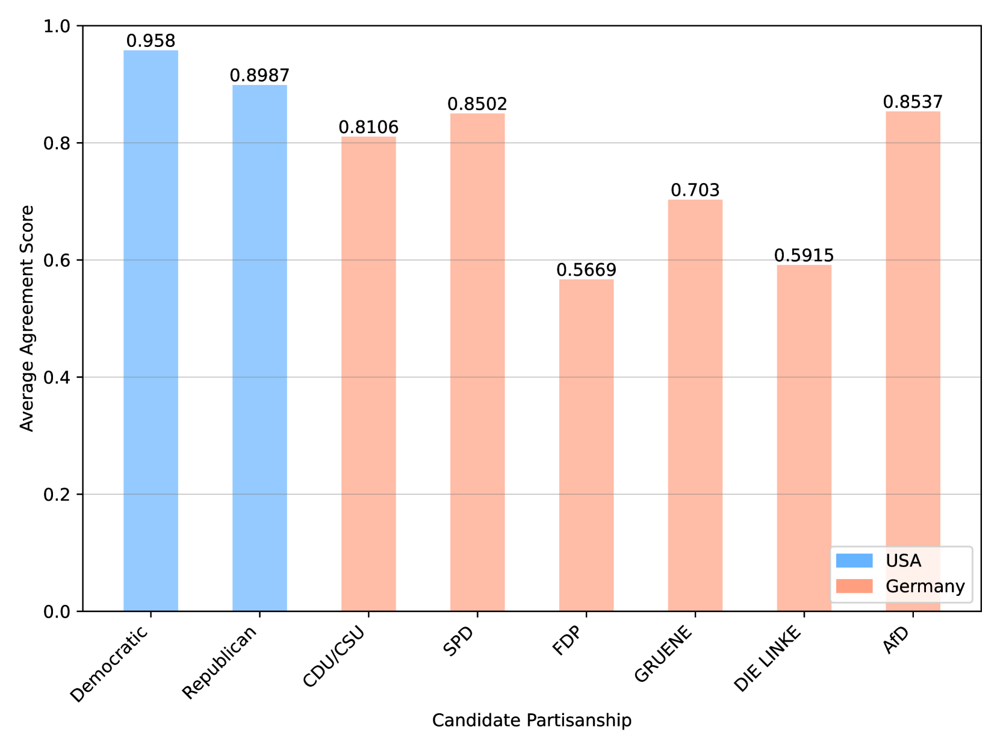

# 大型语言模型在模拟政治样本时，存在表示偏差问题。

发布时间：2024年07月16日

`LLM应用` `社会科学`

> Representation Bias in Political Sample Simulations with Large Language Models

# 摘要

> 本研究致力于揭示并量化大型语言模型在模拟政治样本时的偏差，尤其聚焦于投票选择与公众意见。通过GPT-3.5-Turbo模型，结合美国、德国的选举研究数据以及中国相关数据集，我们模拟了投票行为与公众意见。此方法揭示了三种代表性偏差：语言、人口群体及政治体制的差异。结果显示，投票选择的模拟效果优于公众意见，英语国家的模拟更为准确，两党制系统的表现优于多党制，民主环境下的效果强于威权体制。这些发现有助于深化我们对AI在计算社会科学应用中偏差的认识，并推动相关策略的开发，以减少偏差。

> This study seeks to identify and quantify biases in simulating political samples with Large Language Models, specifically focusing on vote choice and public opinion. Using the GPT-3.5-Turbo model, we leverage data from the American National Election Studies, German Longitudinal Election Study, Zuobiao Dataset, and China Family Panel Studies to simulate voting behaviors and public opinions. This methodology enables us to examine three types of representation bias: disparities based on the the country's language, demographic groups, and political regime types. The findings reveal that simulation performance is generally better for vote choice than for public opinions, more accurate in English-speaking countries, more effective in bipartisan systems than in multi-partisan systems, and stronger in democratic settings than in authoritarian regimes. These results contribute to enhancing our understanding and developing strategies to mitigate biases in AI applications within the field of computational social science.

[Arxiv](https://arxiv.org/abs/2407.11409)