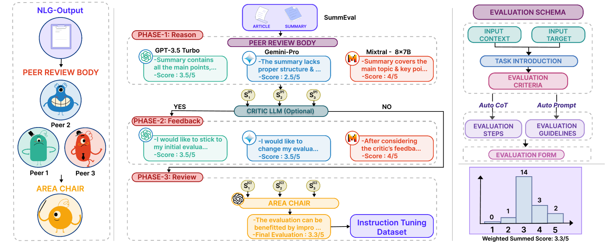
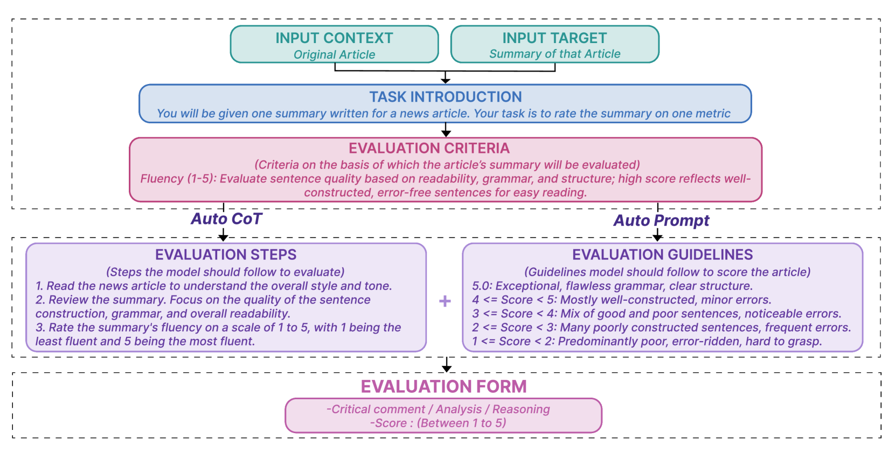
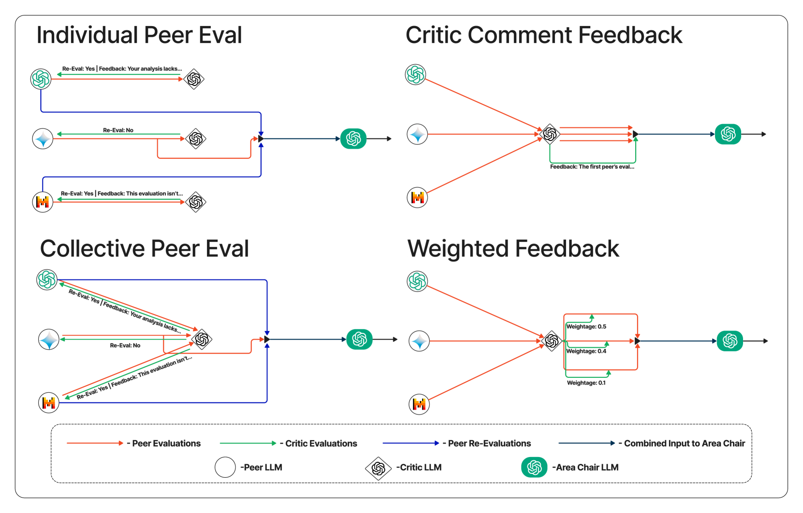

# ReFeR：一个创新的 NLG 评估与推理框架

发布时间：2024年07月16日

`LLM应用` `人工智能`

> Review-Feedback-Reason (ReFeR): A Novel Framework for NLG Evaluation and Reasoning

# 摘要

> 评估大型语言模型（LLM）生成的自然语言输出质量面临挑战。传统方法要么依赖耗时的人工评估，要么使用与人类判断相关性低的自动指标。我们提出ReFeR框架，通过LLM代理进行NLG评估。在多个NLG任务上测试，ReFeR不仅将评估准确性提升约20%，还提供建设性反馈，增强集体推理。这些反馈用于优化小型模型如Mistral-7B，使其评估更贴近人类判断，性能接近GPT-3.5。在三个推理基准测试中，我们的方法超越了众多顶尖技术，平均推理能力分别优于GPT-3.5 Turbo 11.67%和GPT-4 1%。

> Assessing the quality of Natural Language Generation (NLG) outputs, such as those produced by large language models (LLMs), poses significant challenges. Traditional approaches involve either resource-intensive human evaluations or automatic metrics, which often exhibit a low correlation with human judgment. In this study, we propose Review-Feedback-Reason (ReFeR), a novel evaluation framework for NLG using LLM agents. We rigorously test ReFeR using two pre-existing benchmark datasets on diverse NLG tasks. The proposed framework not only enhances the accuracy of NLG evaluation, surpassing previous benchmarks by $\sim$20\%, but also generates constructive feedback and significantly improves collective reasoning. This feedback is then leveraged for the creation of instruction-tuning datasets, which, when used to fine-tune smaller models like Mistral-7B, makes them extremely good evaluators, yielding a better correlation with human evaluations and performance nearly on par with GPT-3.5. We highlight the effectiveness of our methodology through its application on three reasoning benchmarks, where it outperforms most of the state-of-the-art methods, and also outperforms the reasoning capabilities of models like GPT-3.5 Turbo by $\sim$11.67\% and GPT-4 by $\sim$1\% on an average.

[Arxiv](https://arxiv.org/abs/2407.12877)