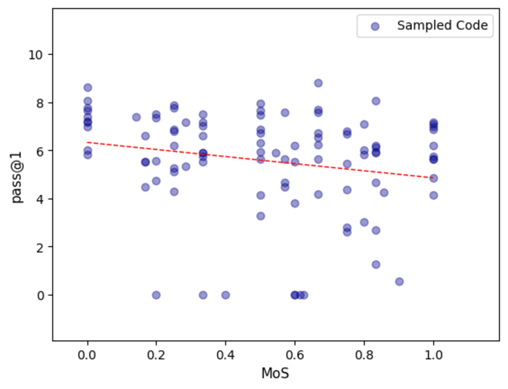

# 重审模块化追求对代码生成的影响

发布时间：2024年07月16日

`LLM理论` `软件开发` `人工智能`

> Revisiting the Impact of Pursuing Modularity for Code Generation

# 摘要

> 模块化编程，通过整合小而独立的组件构建程序，一直是软件开发的理想选择。但随着基于LLM的代码生成工具兴起，这种传统方法是否依然有效？我们通过创新量化指标评估了模块化对代码生成的影响，结果出人意料：模块化并非提升模型性能的关键。此外，我们还探究了LLM为何对模块化与非模块化代码无明显偏好的原因。

> Modular programming, which aims to construct the final program by integrating smaller, independent building blocks, has been regarded as a desirable practice in software development. However, with the rise of recent code generation agents built upon large language models (LLMs), a question emerges: is this traditional practice equally effective for these new tools? In this work, we assess the impact of modularity in code generation by introducing a novel metric for its quantitative measurement. Surprisingly, unlike conventional wisdom on the topic, we find that modularity is not a core factor for improving the performance of code generation models. We also explore potential explanations for why LLMs do not exhibit a preference for modular code compared to non-modular code.

[Arxiv](https://arxiv.org/abs/2407.11406)