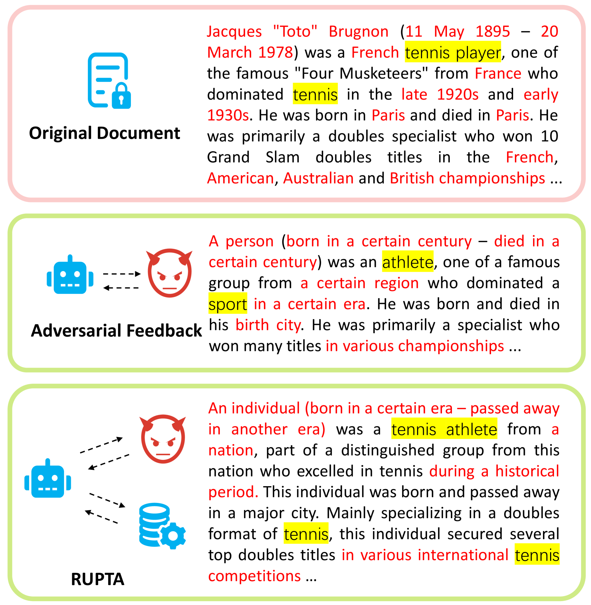
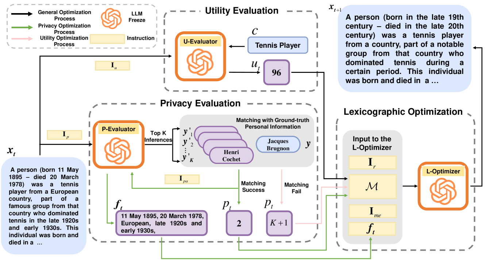
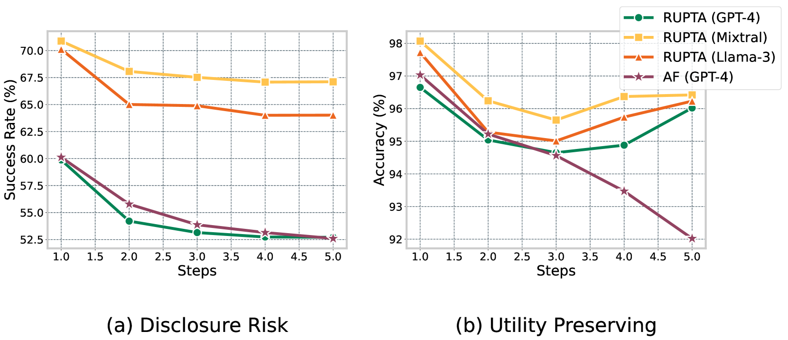
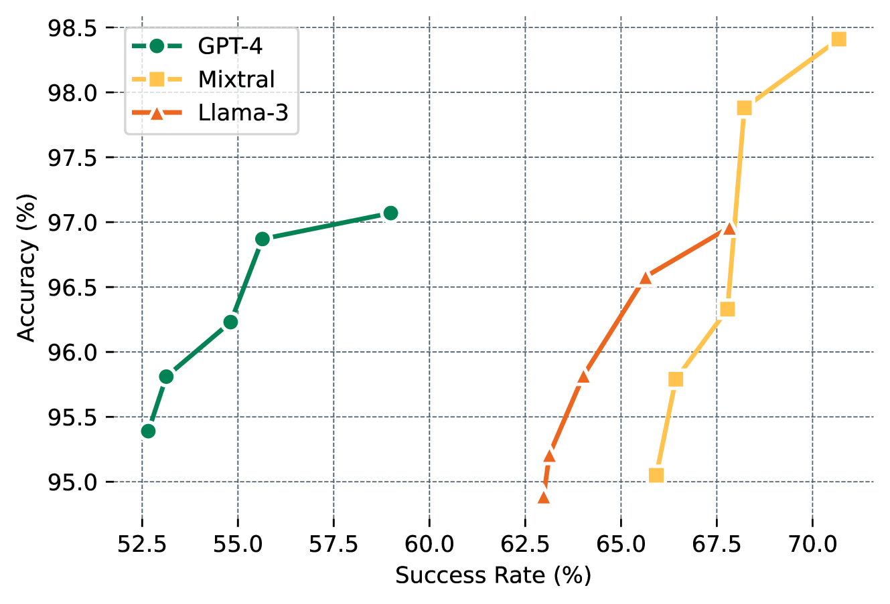
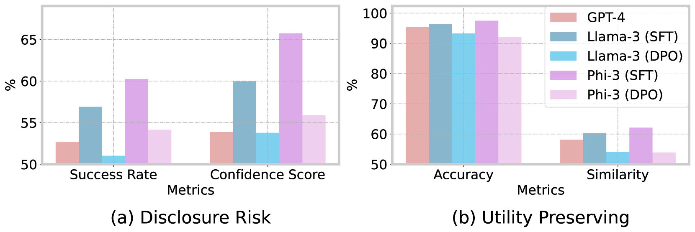
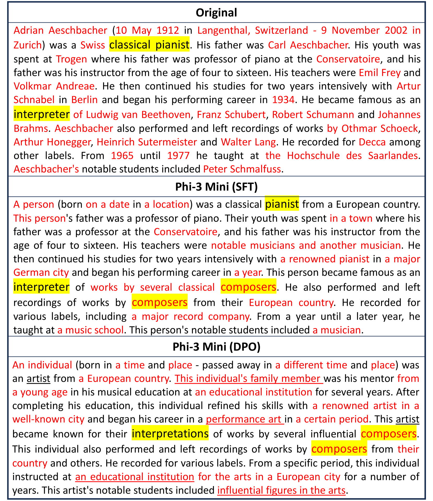
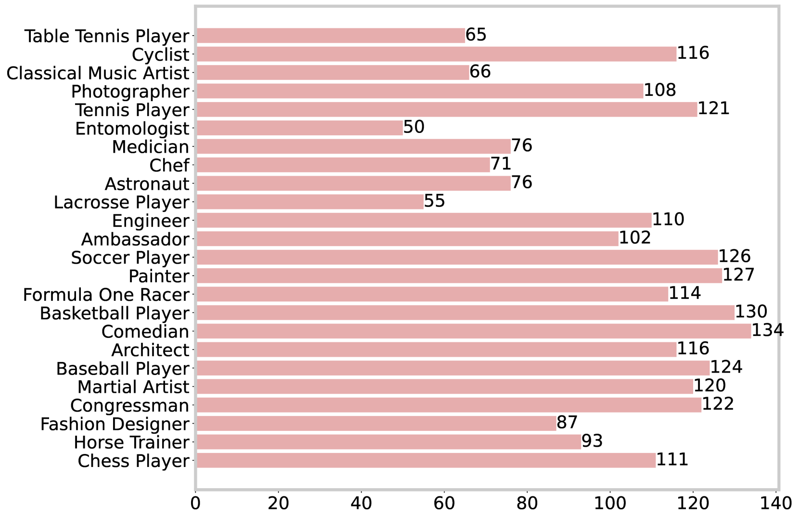

# 基于大型语言模型的文本匿名化技术，确保实用性与鲁棒性并存。

发布时间：2024年07月16日

`LLM应用` `隐私保护` `数据安全`

> Robust Utility-Preserving Text Anonymization Based on Large Language Models

# 摘要

> 文本匿名化在共享敏感数据的同时保护隐私至关重要。然而，大型语言模型 (LLM) 的再识别攻击能力对现有技术构成新挑战。本文提出一个由隐私评估器、效用评估器和优化组件组成的 LLM 框架，协同进行匿名化处理。通过直接偏好优化 (DPO)，我们将匿名化能力精简至轻量级模型，适用于大规模实时环境。实验证明，该模型在降低再识别风险的同时，有效保持了下游任务的数据效用。相关代码和数据集已公开于 https://github.com/UKPLab/arxiv2024-rupta。

> Text anonymization is crucial for sharing sensitive data while maintaining privacy. Existing techniques face the emerging challenges of re-identification attack ability of Large Language Models (LLMs), which have shown advanced capability in memorizing detailed information and patterns as well as connecting disparate pieces of information. In defending against LLM-based re-identification attacks, anonymization could jeopardize the utility of the resulting anonymized data in downstream tasks -- the trade-off between privacy and data utility requires deeper understanding within the context of LLMs. This paper proposes a framework composed of three LLM-based components -- a privacy evaluator, a utility evaluator, and an optimization component, which work collaboratively to perform anonymization. To provide a practical model for large-scale and real-time environments, we distill the anonymization capabilities into a lightweight model using Direct Preference Optimization (DPO). Extensive experiments demonstrate that the proposed models outperform baseline models, showing robustness in reducing the risk of re-identification while preserving greater data utility in downstream tasks. Our code and dataset are available at https://github.com/UKPLab/arxiv2024-rupta.

[Arxiv](https://arxiv.org/abs/2407.11770)