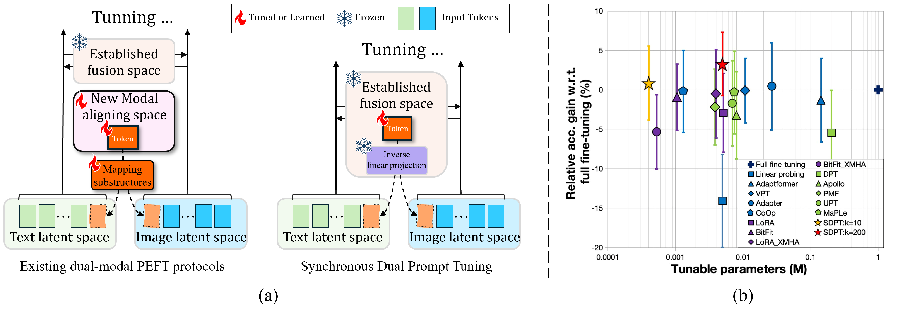
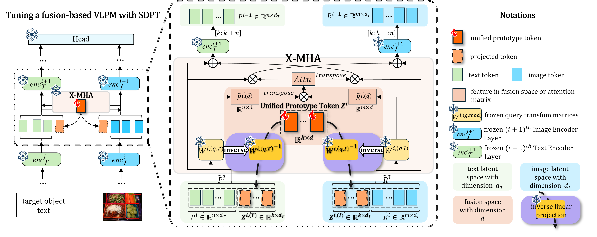
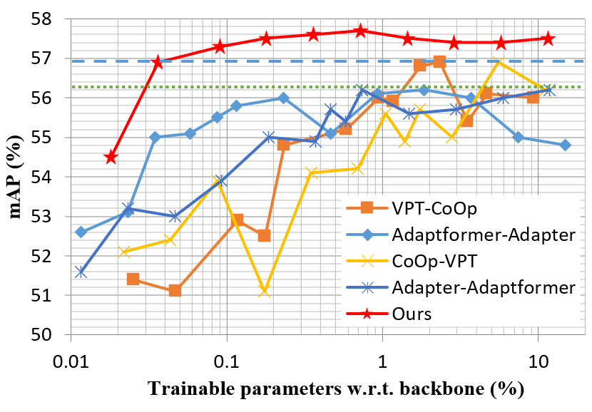

# SDPT：为融合型视觉-语言预训练模型设计的同步双提示调优技术

发布时间：2024年07月16日

`LLM应用` `计算机视觉`

> SDPT: Synchronous Dual Prompt Tuning for Fusion-based Visual-Language Pre-trained Models

# 摘要

> 提示调优方法在大型预训练模型上的参数高效微调方面取得了显著成功，但在基于双模态融合的视觉-语言预训练模型（如GLIP）上的应用遇到了挑战。现有的提示调优方法未能有效解决不同模态中标记的模态映射和对齐问题，导致迁移泛化效果不佳。为此，我们提出了同步双提示调优（SDPT），在已建立的模态对齐空间中初始化一组可学习的统一原型标记，以表示文本和图像模态对齐的语义，用于下游任务。此外，SDPT通过无需训练的逆线性投影，将统一原型标记的信息嵌入到不同模态的输入空间中，使得统一原型标记能够同步表示两种模态，并使SDPT能够在不同模态提示之间共享文本和图像的统一语义，用于下游任务。实验结果显示，SDPT帮助基于融合的VLPMs在各种场景下仅用0.04%的模型参数进行训练，就能取得优于其他单模态或双模态方法的成果。代码将在https://github.com/wuyongjianCODE/SDPT发布。

> Prompt tuning methods have achieved remarkable success in parameter-efficient fine-tuning on large pre-trained models. However, their application to dual-modal fusion-based visual-language pre-trained models (VLPMs), such as GLIP, has encountered issues. Existing prompt tuning methods have not effectively addressed the modal mapping and aligning problem for tokens in different modalities, leading to poor transfer generalization. To address this issue, we propose Synchronous Dual Prompt Tuning (SDPT). SDPT initializes a single set of learnable unified prototype tokens in the established modal aligning space to represent the aligned semantics of text and image modalities for downstream tasks. Furthermore, SDPT establishes inverse linear projections that require no training to embed the information of unified prototype tokens into the input space of different modalities. The inverse linear projections allow the unified prototype token to synchronously represent the two modalities and enable SDPT to share the unified semantics of text and image for downstream tasks across different modal prompts. Experimental results demonstrate that SDPT assists fusion-based VLPMs to achieve superior outcomes with only 0.04\% of model parameters for training across various scenarios, outperforming other single- or dual-modal methods. The code will be released at https://github.com/wuyongjianCODE/SDPT.

[Arxiv](https://arxiv.org/abs/2407.11414)