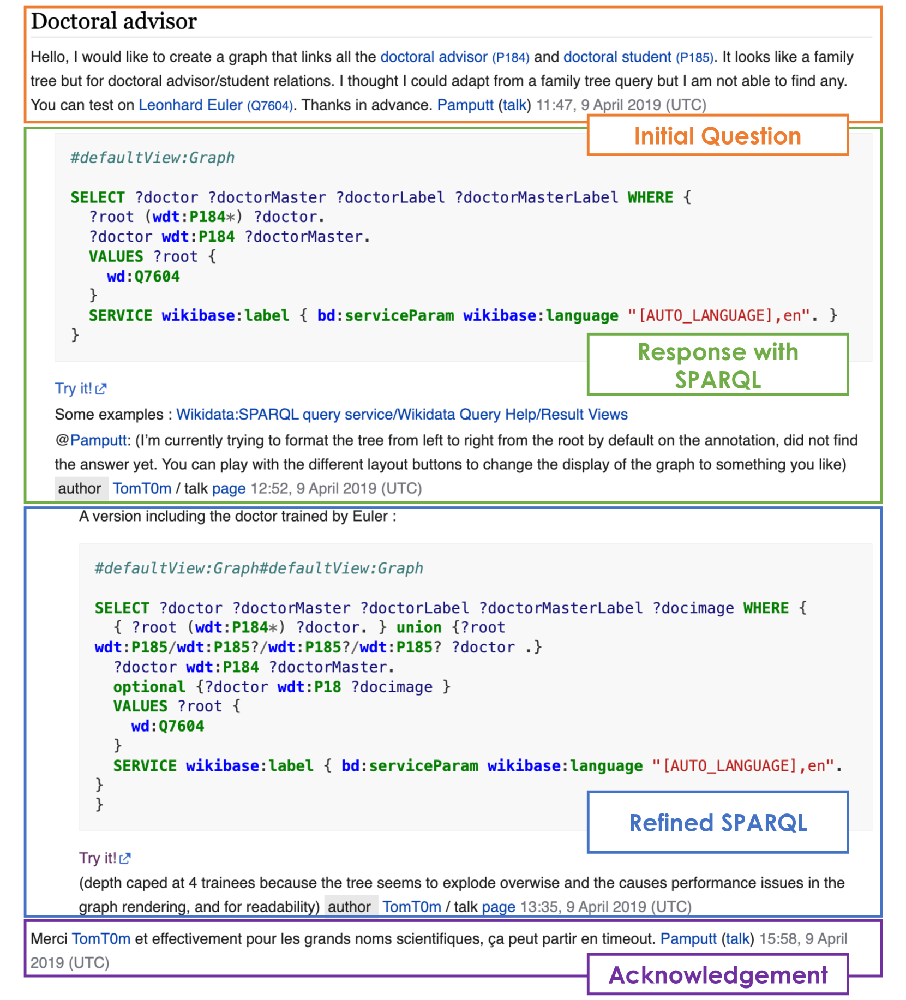
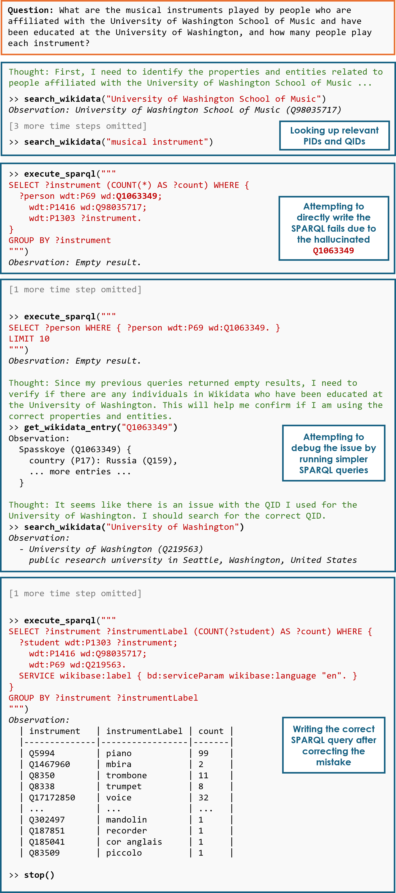

# SPINACH：利用 SPARQL 技术，为解决复杂现实问题提供信息导航

发布时间：2024年07月16日

`Agent` `知识库问答` `人工智能`

> SPINACH: SPARQL-Based Information Navigation for Challenging Real-World Questions

# 摘要

> 近期，大型语言模型 (LLM) 的整合为知识库问答 (KBQA) 任务带来了显著进步。然而，我们认为现有 KBQA 数据集因问题简单、逻辑形式合成生成或基于小型知识库模式，未能充分体现 KBQA 任务的复杂性。为此，我们推出了 SPINACH 数据集，该数据集从 Wikidata 的“请求查询”论坛中精选专家注释，包含 320 对去上下文的问题与 SPARQL 查询。SPINACH 数据集的复杂度远超现有数据集，它要求 KBQA 系统能够不依赖训练数据学习知识库模式，而是动态探索并推理大型且常不完整的模式。  此外，我们引入了 SPINACH 代理，这是一种模拟人类专家编写 SPARQL 查询的新型 KBQA 方法。实验表明，SPINACH 代理在 KBQA 任务中表现卓越，分别在 QALD-7、QALD-9 Plus 和 QALD-10 数据集上以 30.1%、27.0% 和 10.0% 的 F1 成绩刷新了记录，并在 WikiWebQuestions 上与顶尖的微调 LLaMA 模型仅差 1.6%。在新推出的 SPINACH 数据集上，SPINACH 代理在 F1 成绩上超越了所有基线，包括基于 GPT-4 的最佳 KBQA 代理，领先幅度达 38.1%。

> Recent work integrating Large Language Models (LLMs) has led to significant improvements in the Knowledge Base Question Answering (KBQA) task. However, we posit that existing KBQA datasets that either have simple questions, use synthetically generated logical forms, or are based on small knowledge base (KB) schemas, do not capture the true complexity of KBQA tasks.
  To address this, we introduce the SPINACH dataset, an expert-annotated KBQA dataset collected from forum discussions on Wikidata's "Request a Query" forum with 320 decontextualized question-SPARQL pairs. Much more complex than existing datasets, SPINACH calls for strong KBQA systems that do not rely on training data to learn the KB schema, but can dynamically explore large and often incomplete schemas and reason about them.
  Along with the dataset, we introduce the SPINACH agent, a new KBQA approach that mimics how a human expert would write SPARQLs for such challenging questions. Experiments on existing datasets show SPINACH's capability in KBQA, achieving a new state of the art on the QALD-7, QALD-9 Plus and QALD-10 datasets by 30.1%, 27.0%, and 10.0% in F1, respectively, and coming within 1.6% of the fine-tuned LLaMA SOTA model on WikiWebQuestions. On our new SPINACH dataset, SPINACH agent outperforms all baselines, including the best GPT-4-based KBQA agent, by 38.1% in F1.

[Arxiv](https://arxiv.org/abs/2407.11417)