# 手语翻译的规模化

发布时间：2024年07月16日

`LLM应用` `手语翻译` `人工智能`

> Scaling Sign Language Translation

# 摘要

> 手语翻译（SLT）旨在将视频中的手语信息转换为文本中的口语语言。尽管现有研究取得了进展，但往往局限于特定领域或少数手语，且在开放领域任务上表现不佳。本文通过扩大预训练数据规模、模型尺寸及翻译方向，推动了SLT技术的进步。我们利用多语言YouTube SLT数据、平行文本语料库及通过机器翻译增强的SLT数据进行大规模预训练。在编码器-解码器架构下，我们通过特定任务提示整合了多种预训练任务，并采用预训练的（m/By）T5模型初始化SLT模型。实验结果表明，数据与模型的扩展、跨语言跨模态迁移对提升翻译质量至关重要，并验证了零-shot SLT的可行性。我们对预训练模型在涵盖五种手语的五个开放领域基准上进行微调，实验结果显著优于传统基线，大幅超越了业界领先水平。

> Sign language translation (SLT) addresses the problem of translating information from a sign language in video to a spoken language in text. Existing studies, while showing progress, are often limited to narrow domains and/or few sign languages and struggle with open-domain tasks. In this paper, we push forward the frontier of SLT by scaling pretraining data, model size, and number of translation directions. We perform large-scale SLT pretraining on different data including 1) noisy multilingual YouTube SLT data, 2) parallel text corpora, and 3) SLT data augmented by translating video captions to other languages with off-the-shelf machine translation models. We unify different pretraining tasks with task-specific prompts under the encoder-decoder architecture, and initialize the SLT model with pretrained (m/By)T5 models across model sizes. SLT pretraining results on How2Sign and FLEURS-ASL#0 (ASL to 42 spoken languages) demonstrate the significance of data/model scaling and cross-lingual cross-modal transfer, as well as the feasibility of zero-shot SLT. We finetune the pretrained SLT models on 5 downstream open-domain SLT benchmarks covering 5 sign languages. Experiments show substantial quality improvements over the vanilla baselines, surpassing the previous state-of-the-art (SOTA) by wide margins.

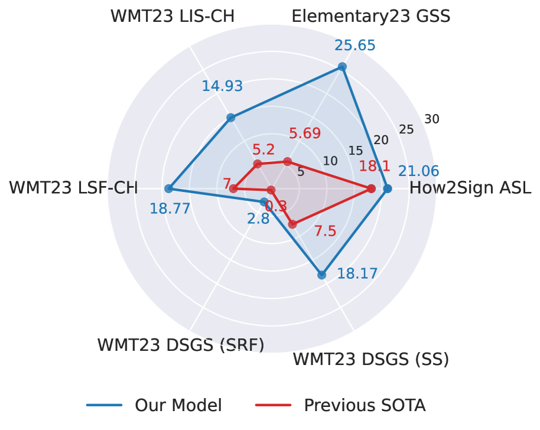

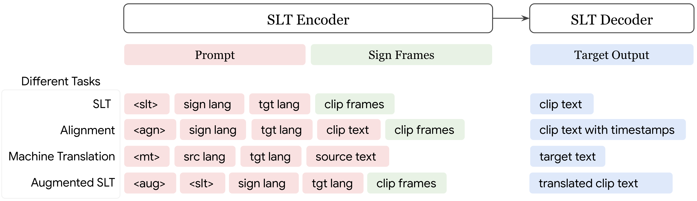

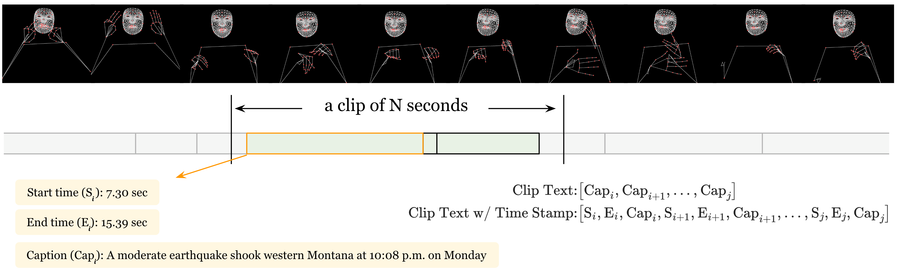

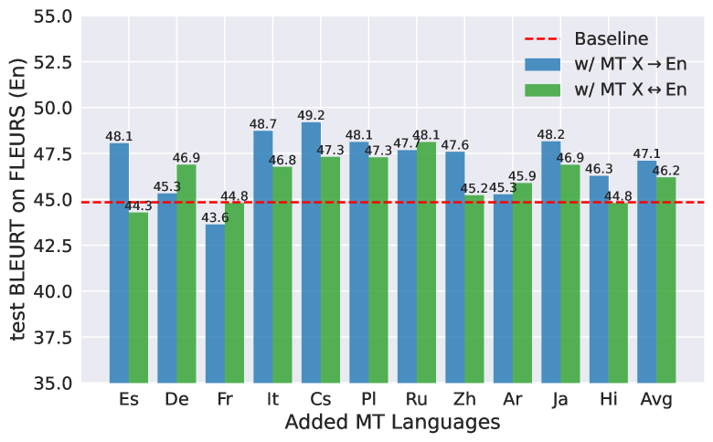

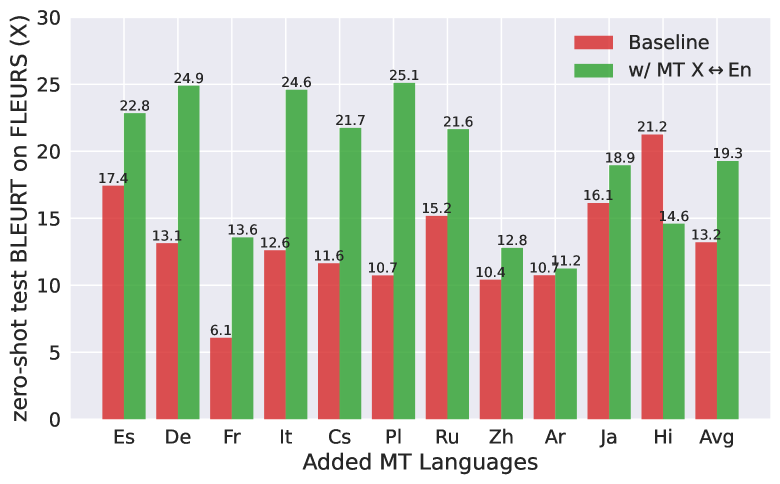

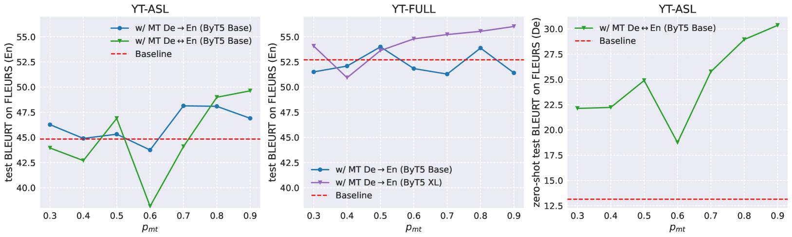

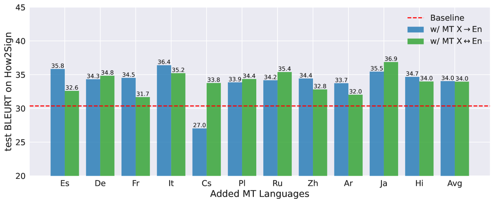

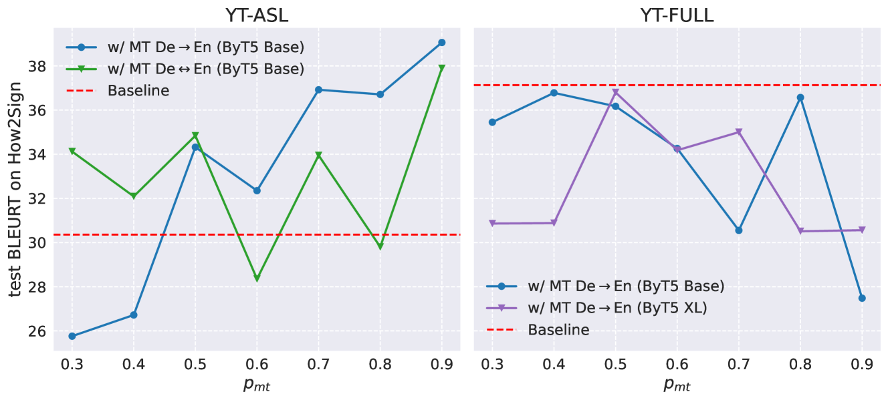

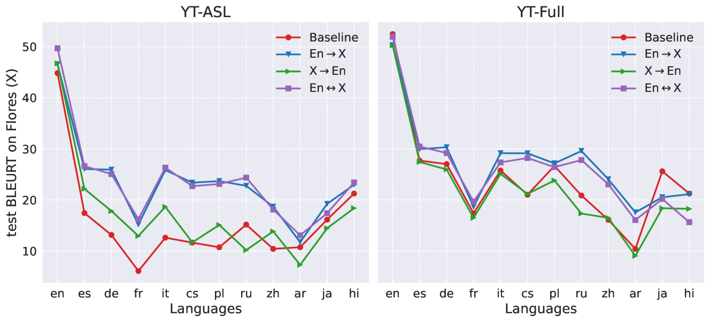

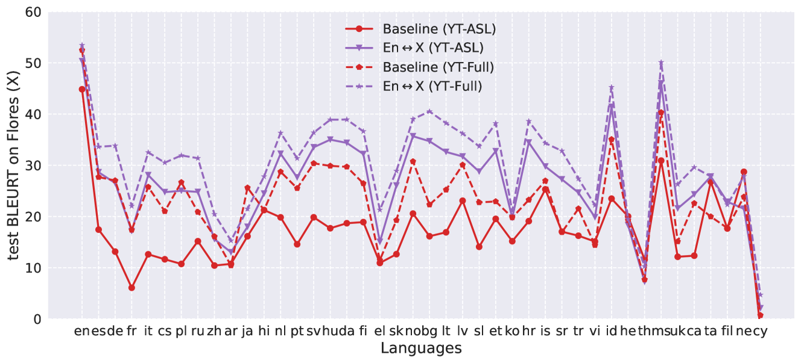

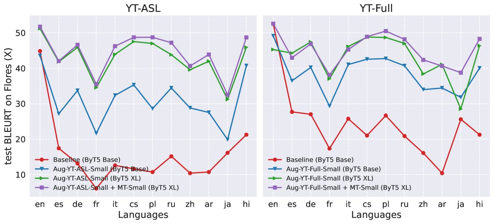

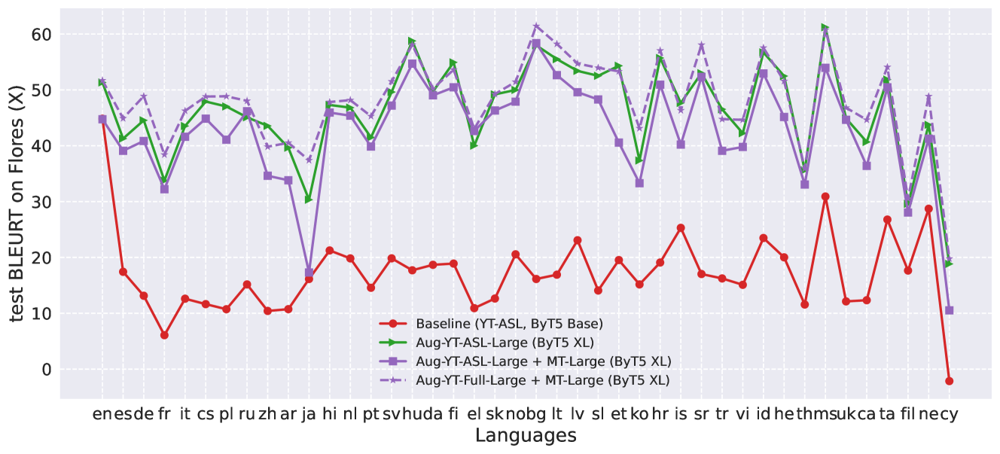

[Arxiv](https://arxiv.org/abs/2407.11855)