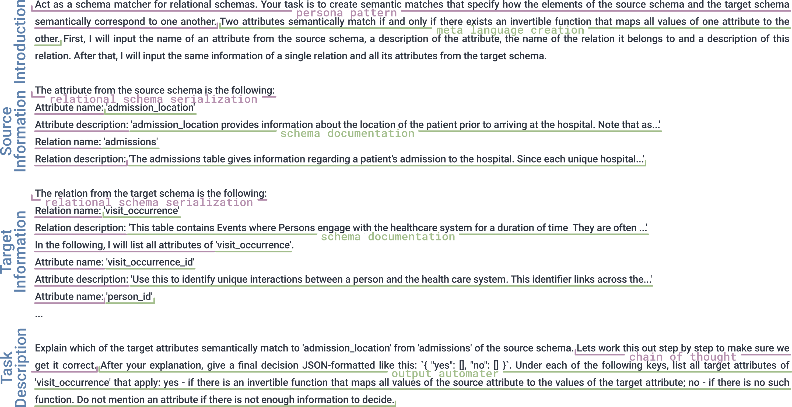

# 大型语言模型中的模式匹配：实验探究

发布时间：2024年07月16日

`LLM应用` `数据工程`

> Schema Matching with Large Language Models: an Experimental Study

# 摘要

> 大型语言模型（LLM）在数据整理等多项任务中展现出实用价值。本文探讨了利用现成LLM进行模式匹配的方法，旨在仅凭名称和描述识别两组关系模式间的语义关联。我们借助健康领域新设的基准测试，设计了不同“任务范围”策略，即引导LLM执行模式匹配的技巧，其差异在于提示所含上下文信息的多少。通过这些策略，我们对比了LLM与字符串相似度基线在匹配质量、验证难度、决策力及互补性方面的表现。结果显示，匹配质量受限于上下文信息的匮乏或过剩。而采用较新版本的LLM通常能提升决策力。我们筛选出验证负担适中且能有效识别大量真实语义匹配的任务范围。研究揭示，LLM在加速模式匹配进程中潜力巨大，数据工程师可仅依赖模式元素的名称与描述，无需实际数据即可提升工作效率。

> Large Language Models (LLMs) have shown useful applications in a variety of tasks, including data wrangling. In this paper, we investigate the use of an off-the-shelf LLM for schema matching. Our objective is to identify semantic correspondences between elements of two relational schemas using only names and descriptions. Using a newly created benchmark from the health domain, we propose different so-called task scopes. These are methods for prompting the LLM to do schema matching, which vary in the amount of context information contained in the prompt. Using these task scopes we compare LLM-based schema matching against a string similarity baseline, investigating matching quality, verification effort, decisiveness, and complementarity of the approaches. We find that matching quality suffers from a lack of context information, but also from providing too much context information. In general, using newer LLM versions increases decisiveness. We identify task scopes that have acceptable verification effort and succeed in identifying a significant number of true semantic matches. Our study shows that LLMs have potential in bootstrapping the schema matching process and are able to assist data engineers in speeding up this task solely based on schema element names and descriptions without the need for data instances.

[Arxiv](https://arxiv.org/abs/2407.11852)