# LLM 在隐藏状态中悄然涌现出离散的状态表示，这一现象虽隐秘却引人深思。

发布时间：2024年07月16日

`LLM理论` `人工智能` `计算机科学`

> States Hidden in Hidden States: LLMs Emerge Discrete State Representations Implicitly

# 摘要

> 大型语言模型 (LLM) 展现出多种新兴能力，其中一些揭示了模型的内部工作机制。本文揭示了一种新颖能力：模型能在不依赖逐步思维链的情况下执行复杂计算。最先进的模型甚至能直接处理长达15个加数的两位数加法。我们推测，模型通过隐式离散状态表示 (IDSRs) 在内部进行符号计算。为验证这一假设，我们设计了一系列实验，从层、数字和序列角度深入研究IDSRs的形成及其在模型中的应用。尽管发现当前开源模型中的IDSRs存在缺陷，导致性能不精确，但我们的研究仍为探索LLM的符号计算能力及其机制开辟了新视角。

> Large Language Models (LLMs) exhibit various emergent abilities. Among these abilities, some might reveal the internal working mechanisms of models. In this paper, we uncover a novel emergent capability in models: the intrinsic ability to perform extended sequences of calculations without relying on chain-of-thought step-by-step solutions. Remarkably, the most advanced models can directly output the results of two-digit number additions with lengths extending up to 15 addends. We hypothesize that the model emerges Implicit Discrete State Representations (IDSRs) within its hidden states and performs symbolic calculations internally. To test this hypothesis, we design a sequence of experiments that look into the hidden states. Specifically, we first confirm that IDSRs exist. Then, we provide interesting observations about the formation of IDSRs from layer, digit, and sequence perspectives. Finally, we confirm that models indeed use IDSRs to produce the final answers. However, we also discover that these state representations are far from lossless in current open-sourced models, leading to inaccuracies in their final performance. Our work presents a novel exploration of LLMs' symbolic calculation abilities and the underlying mechanisms.

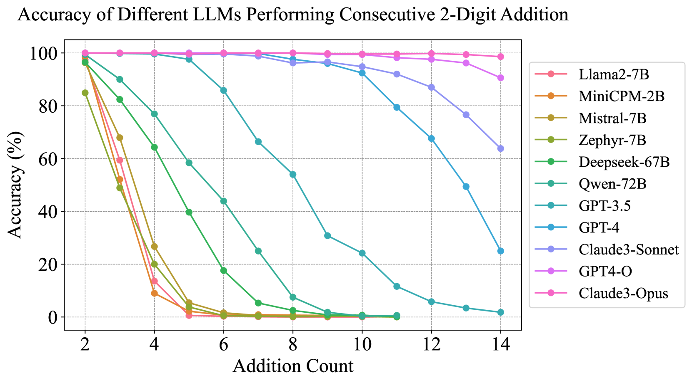

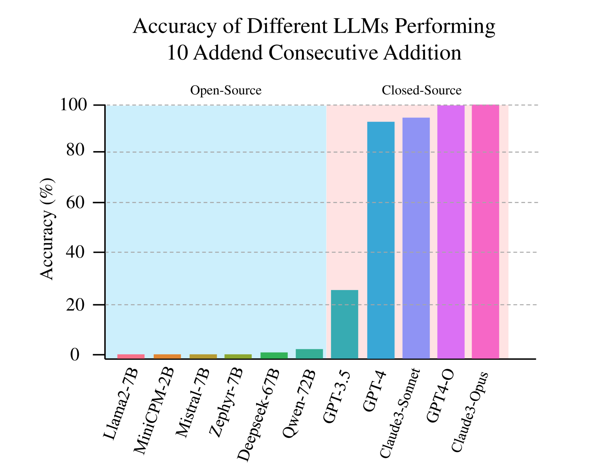

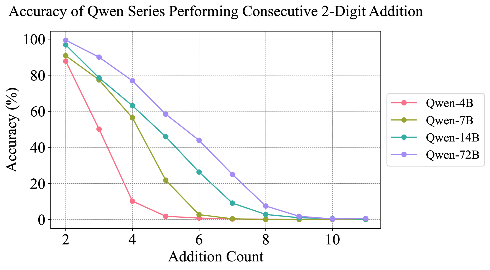

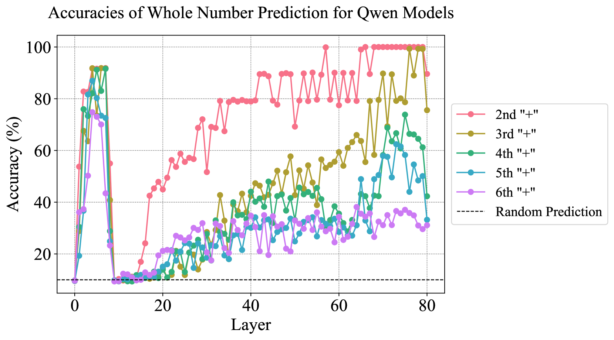

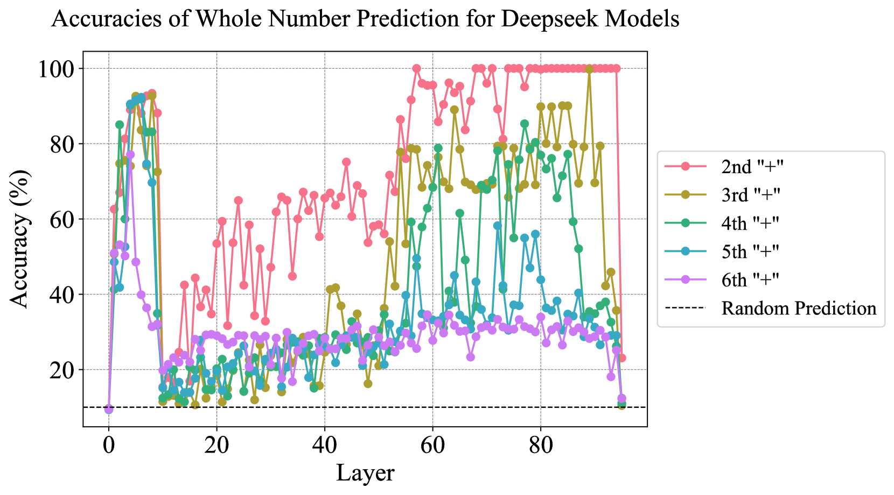

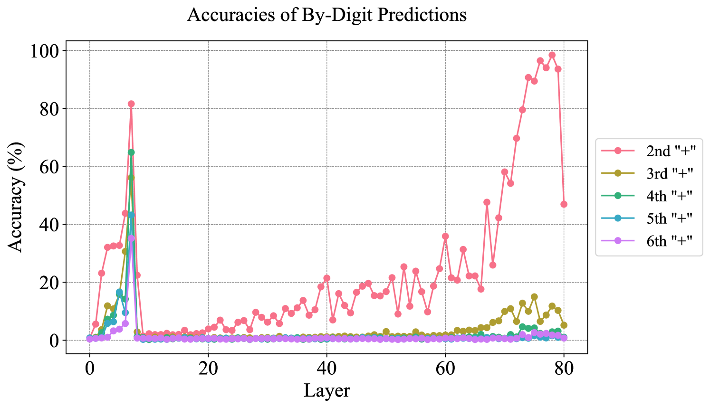

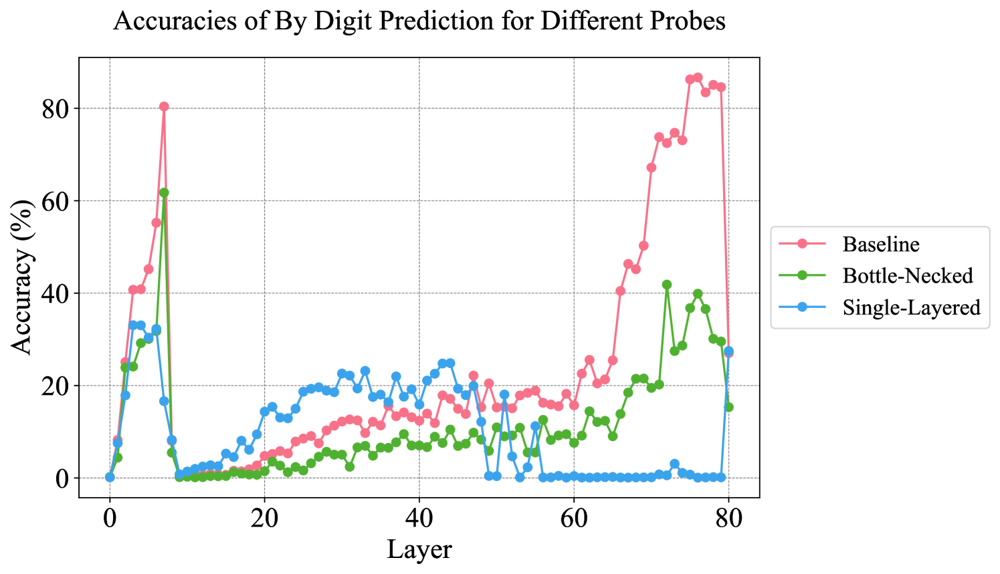

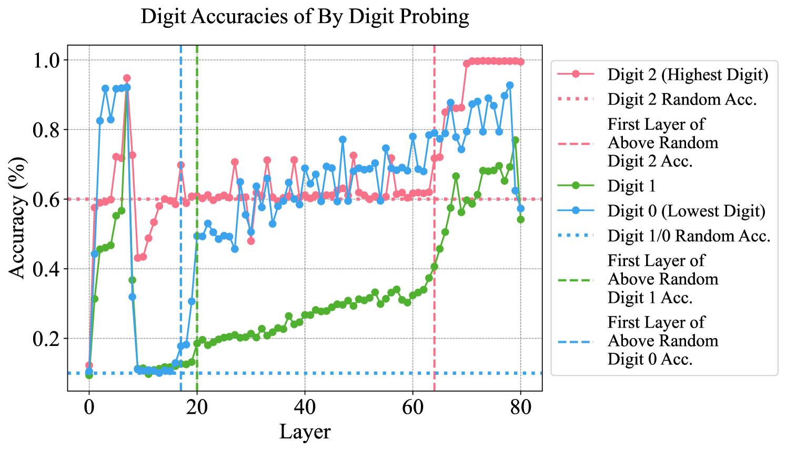

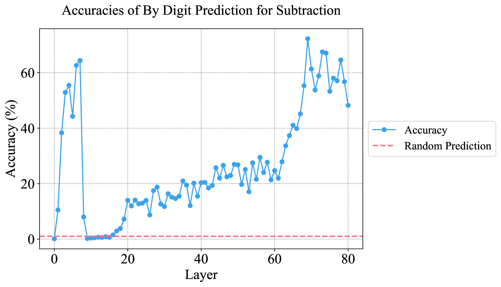

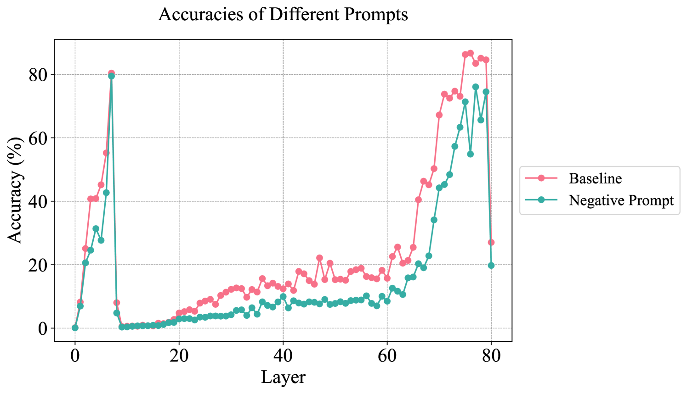

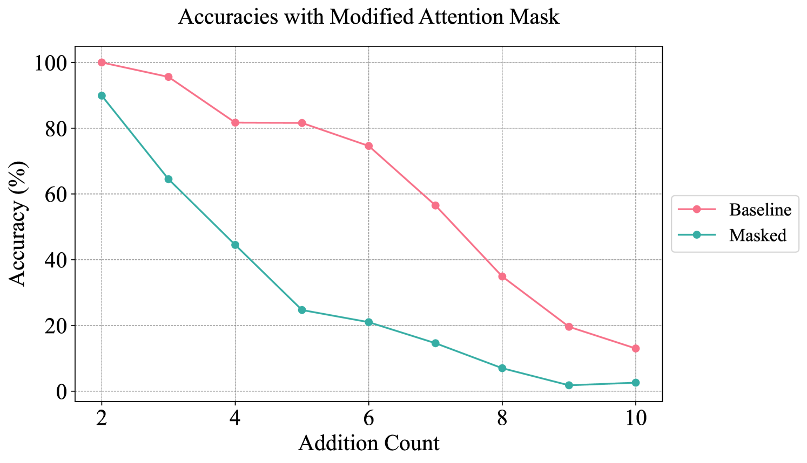

[Arxiv](https://arxiv.org/abs/2407.11421)