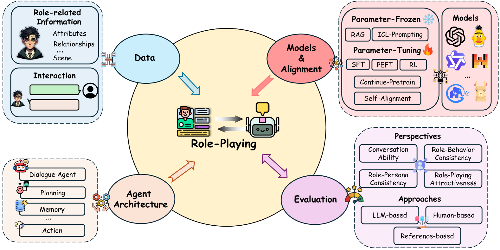
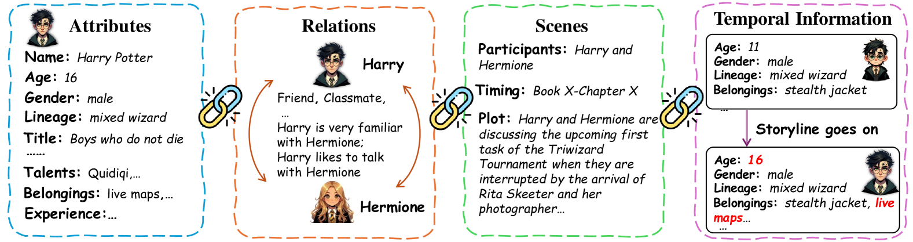
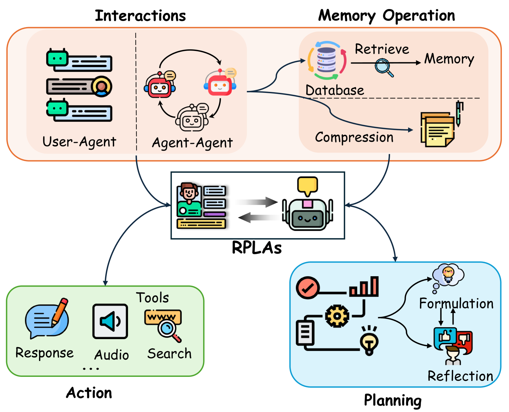

# AI 界的奥斯卡盛典：探索语言模型在角色扮演中的应用

发布时间：2024年07月16日

`LLM应用` `人工智能`

> The Oscars of AI Theater: A Survey on Role-Playing with Language Models

# 摘要

> 本调查深入探讨了语言模型在角色扮演领域的发展，从早期的简单人格模型演变为由大型语言模型 (LLM) 驱动的高级角色模拟。最初受限于模型能力，角色扮演仅追求基本的人格一致性，如今已进化至包含角色一致性、行为匹配及整体魅力的复杂描绘。我们详细分类了设计这些系统的关键要素，涵盖数据处理、模型构建、代理架构及评估方法。此次调查不仅总结了当前的技术路径与挑战，例如动态个人资料的管理和高水平人格一致性的实现，还为未来研究指明了方向，旨在增强角色扮演应用的深度与真实感。我们的目标是通过对现有方法的系统梳理，识别改进点，从而引领未来研究的发展。相关资料与论文已整理于 https://github.com/nuochenpku/Awesome-Role-Play-Papers。

> This survey explores the burgeoning field of role-playing with language models, focusing on their development from early persona-based models to advanced character-driven simulations facilitated by Large Language Models (LLMs). Initially confined to simple persona consistency due to limited model capabilities, role-playing tasks have now expanded to embrace complex character portrayals involving character consistency, behavioral alignment, and overall attractiveness. We provide a comprehensive taxonomy of the critical components in designing these systems, including data, models and alignment, agent architecture and evaluation. This survey not only outlines the current methodologies and challenges, such as managing dynamic personal profiles and achieving high-level persona consistency but also suggests avenues for future research in improving the depth and realism of role-playing applications. The goal is to guide future research by offering a structured overview of current methodologies and identifying potential areas for improvement. Related resources and papers are available at https://github.com/nuochenpku/Awesome-Role-Play-Papers.

[Arxiv](https://arxiv.org/abs/2407.11484)