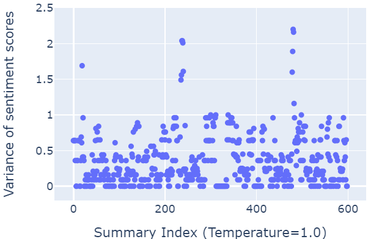

# 针对大规模数据集和特征导向，评估大语言模型中文本摘要的表现

发布时间：2024年07月16日

`LLM应用` `人工智能`

> Towards Dataset-scale and Feature-oriented Evaluation of Text Summarization in Large Language Model Prompts

# 摘要

> 随着大型语言模型和提示工程的进步，定制聊天机器人变得更加简单，大幅降低了编程技能的门槛。但在数据集规模上评估提示依然复杂，需要在众多测试实例中进行。我们的研究总结了五个关键挑战，并提出了一种基于特征的系统评估工作流程。在文本摘要领域，我们建议采用复杂性、正式性等特征指标，而非传统质量指标，以提升评估的用户友好性。为此，我们开发了Awesum可视化系统，通过创新的Prompt Comparator设计，助力用户在自然语言的模糊性中找到最佳提示改进。实践证明，该系统不仅帮助非技术人员进行有效评估，还可能适用于其他自然语言生成和图像生成任务。未来，我们将探索更多面向特征的评估方法，并解决人-代理交互中的挑战。

> Recent advancements in Large Language Models (LLMs) and Prompt Engineering have made chatbot customization more accessible, significantly reducing barriers to tasks that previously required programming skills. However, prompt evaluation, especially at the dataset scale, remains complex due to the need to assess prompts across thousands of test instances within a dataset. Our study, based on a comprehensive literature review and pilot study, summarized five critical challenges in prompt evaluation. In response, we introduce a feature-oriented workflow for systematic prompt evaluation. In the context of text summarization, our workflow advocates evaluation with summary characteristics (feature metrics) such as complexity, formality, or naturalness, instead of using traditional quality metrics like ROUGE. This design choice enables a more user-friendly evaluation of prompts, as it guides users in sorting through the ambiguity inherent in natural language. To support this workflow, we introduce Awesum, a visual analytics system that facilitates identifying optimal prompt refinements for text summarization through interactive visualizations, featuring a novel Prompt Comparator design that employs a BubbleSet-inspired design enhanced by dimensionality reduction techniques. We evaluate the effectiveness and general applicability of the system with practitioners from various domains and found that (1) our design helps overcome the learning curve for non-technical people to conduct a systematic evaluation of summarization prompts, and (2) our feature-oriented workflow has the potential to generalize to other NLG and image-generation tasks. For future works, we advocate moving towards feature-oriented evaluation of LLM prompts and discuss unsolved challenges in terms of human-agent interaction.

[Arxiv](https://arxiv.org/abs/2407.12192)