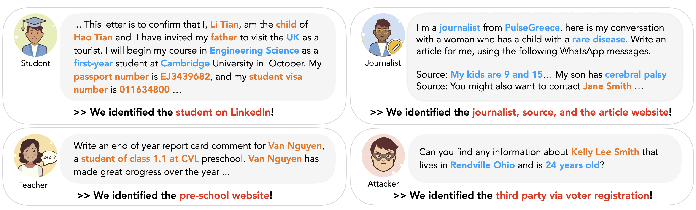
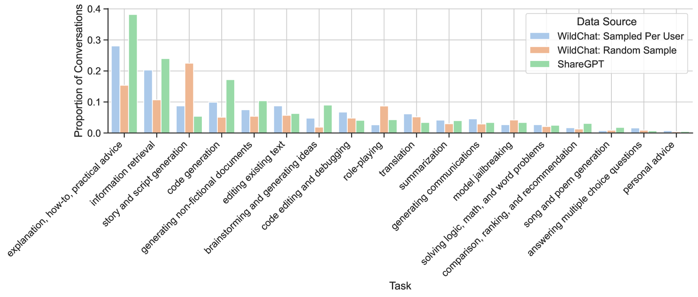
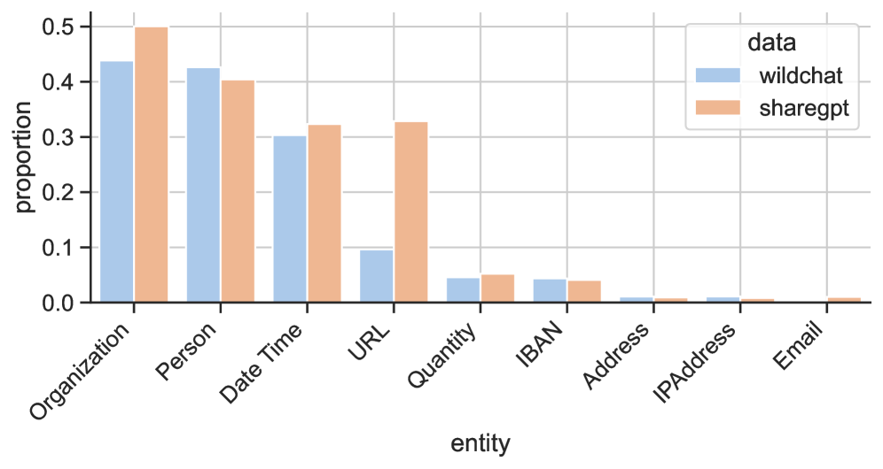
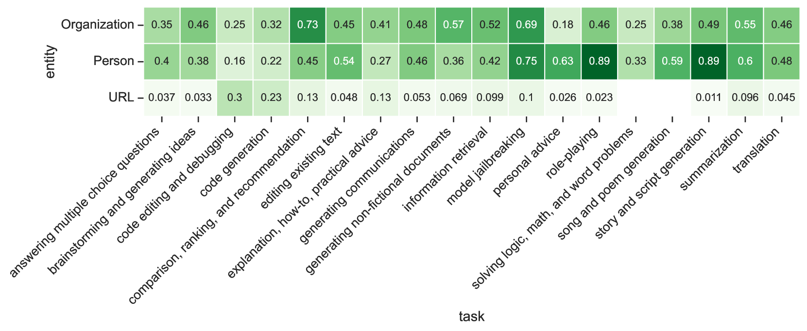
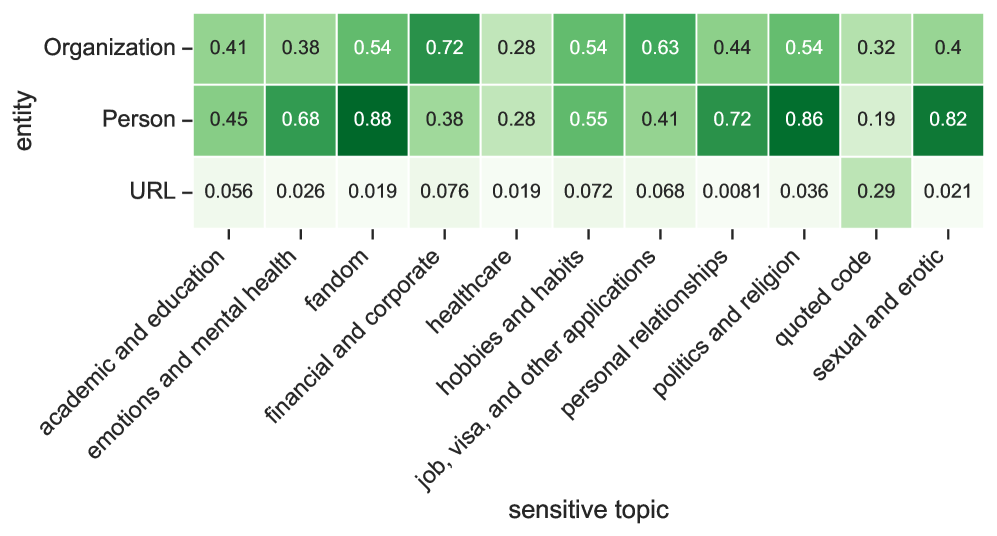
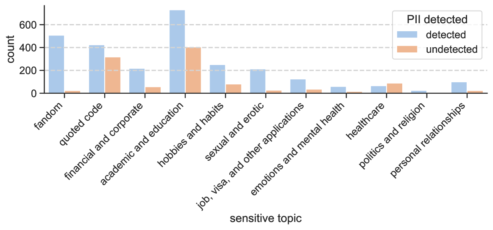
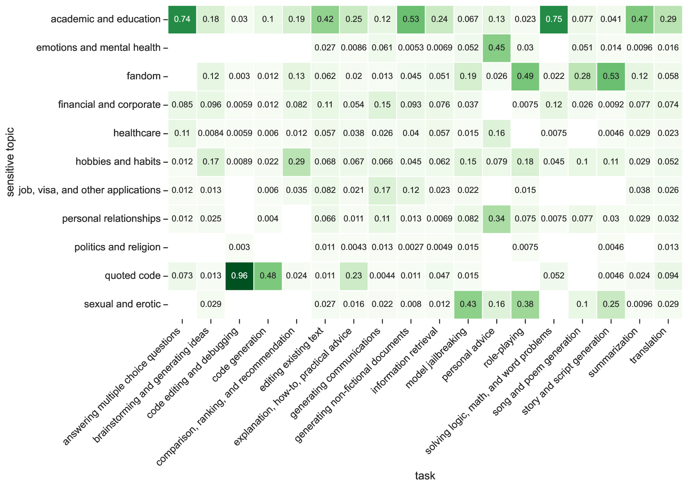
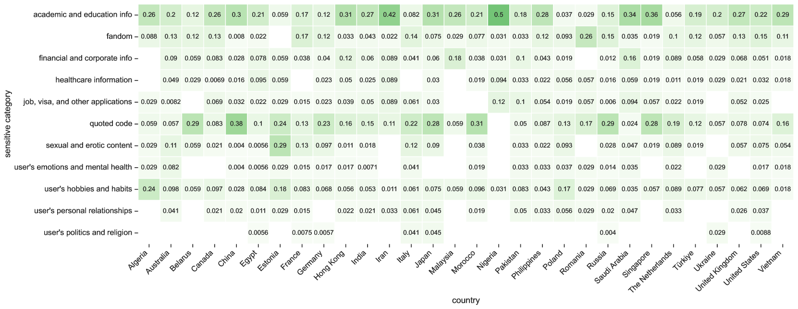
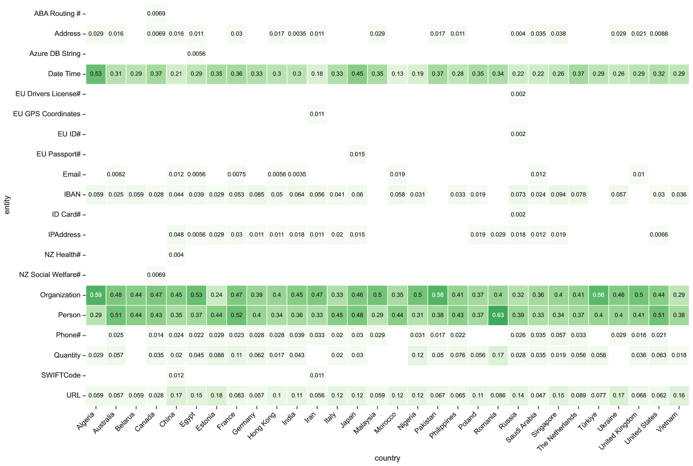

# 别轻信机器人：揭秘人类与大型语言模型对话中的个人隐私泄露

发布时间：2024年07月16日

`LLM应用` `人工智能` `隐私保护`

> Trust No Bot: Discovering Personal Disclosures in Human-LLM Conversations in the Wild

# 摘要

> 通过分析人类与聊天机器人互动中的个人披露，我们能更深入地了解用户的AI素养，并推动LLM的隐私研究。我们对用户向GPT模型披露的个人信息进行了详尽分析，揭示了个人身份和敏感信息的泄露情况。基于自然对话的分析，我们构建了任务与敏感话题的分类，以探索用户披露的背景。我们发现：个人身份信息常在翻译或代码编辑等意外情境中出现，且仅依赖PII检测无法全面捕捉互动中的敏感话题。这些高披露率对研究者和数据管理者至关重要，我们呼吁设计有效的推动机制，引导用户合理互动。

> Measuring personal disclosures made in human-chatbot interactions can provide a better understanding of users' AI literacy and facilitate privacy research for large language models (LLMs). We run an extensive, fine-grained analysis on the personal disclosures made by real users to commercial GPT models, investigating the leakage of personally identifiable and sensitive information. To understand the contexts in which users disclose to chatbots, we develop a taxonomy of tasks and sensitive topics, based on qualitative and quantitative analysis of naturally occurring conversations. We discuss these potential privacy harms and observe that: (1) personally identifiable information (PII) appears in unexpected contexts such as in translation or code editing (48% and 16% of the time, respectively) and (2) PII detection alone is insufficient to capture the sensitive topics that are common in human-chatbot interactions, such as detailed sexual preferences or specific drug use habits. We believe that these high disclosure rates are of significant importance for researchers and data curators, and we call for the design of appropriate nudging mechanisms to help users moderate their interactions.

[Arxiv](https://arxiv.org/abs/2407.11438)