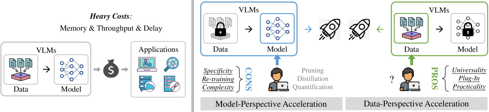
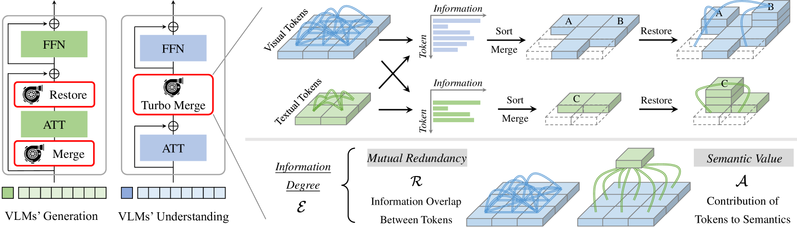
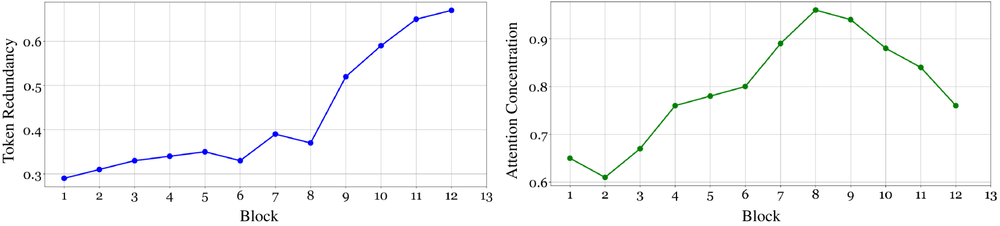
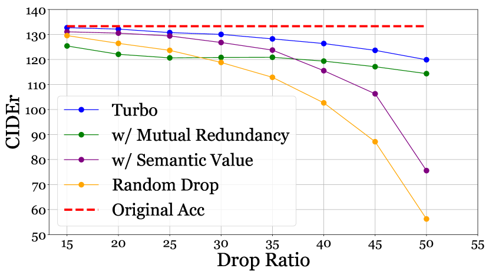
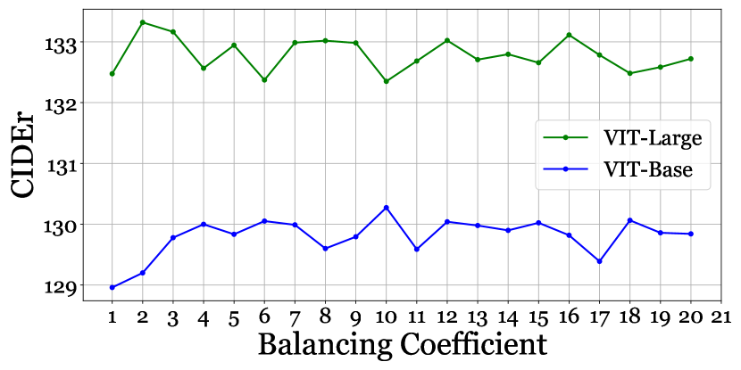

# Turbo：一款信息驱动型加速插件，专为视觉与语言大型模型设计

发布时间：2024年07月16日

`LLM应用` `人工智能` `计算机视觉`

> Turbo: Informativity-Driven Acceleration Plug-In for Vision-Language Large Models

# 摘要

> 视觉-语言大型模型（VLMs）因其卓越性能已成为AI领域的核心。然而，高昂的计算成本限制了其在实际应用中的广泛使用。现有加速方法多从模型层面入手，忽略了数据层面的冗余问题。本文首次深入探讨数据冗余，并设计了一款即插即用的Turbo模块，通过信息度指导，有效剔除视觉或文本数据中的低效令牌。信息度综合考虑了令牌间的冗余度和语义贡献，确保高信息度令牌既少冗余又富含语义。Turbo模块操作简便，无需重新训练，广泛适用于各类VLMs的理解与生成任务。实验表明，Turbo在保持性能几乎不变的同时，显著提升了VLMs的运行速度。

> Vision-Language Large Models (VLMs) recently become primary backbone of AI, due to the impressive performance. However, their expensive computation costs, i.e., throughput and delay, impede potentials in the real-world scenarios. To achieve acceleration for VLMs, most existing methods focus on the model perspective: pruning, distillation, quantization, but completely overlook the data-perspective redundancy. To fill the overlook, this paper pioneers the severity of data redundancy, and designs one plug-and-play Turbo module guided by information degree to prune inefficient tokens from visual or textual data. In pursuit of efficiency-performance trade-offs, information degree takes two crucial factors into consideration: mutual redundancy and semantic value. Concretely, the former evaluates data duplication between sequential tokens; while the latter evaluates each token by its contribution to the overall semantics. As a result, tokens with high information degree carry less redundancy and stronger semantics. For VLMs' calculation, Turbo works as a user-friendly plug-in that sorts data referring to information degree, utilizing only top-level ones to save costs. Its advantages are multifaceted, e.g., being generally compatible to various VLMs across understanding and generation, simple use without re-training and trivial engineering efforts. On multiple VLMs benchmarks, we fully experiment to demonstrate the good acceleration of Turbo, under negligible performance drop.

[Arxiv](https://arxiv.org/abs/2407.11717)