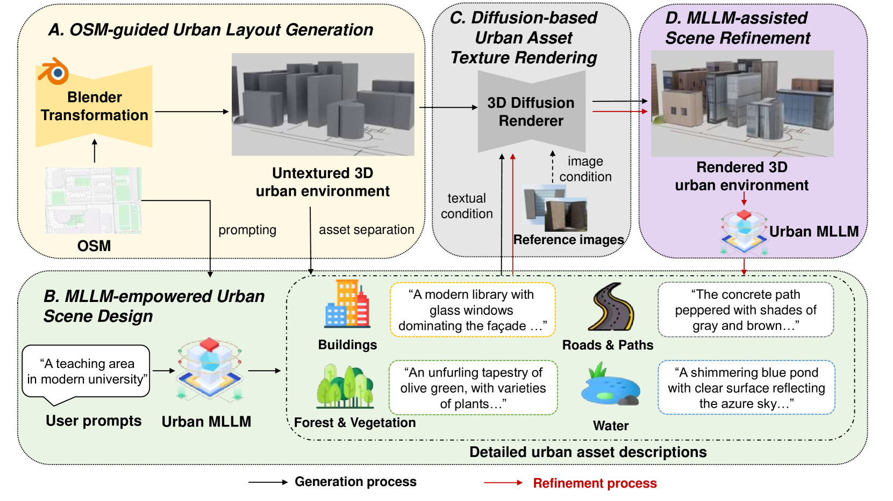
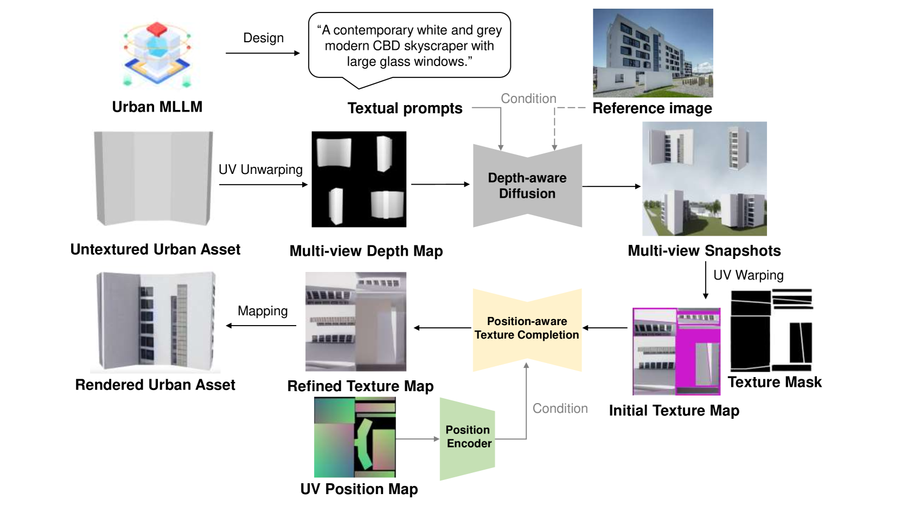
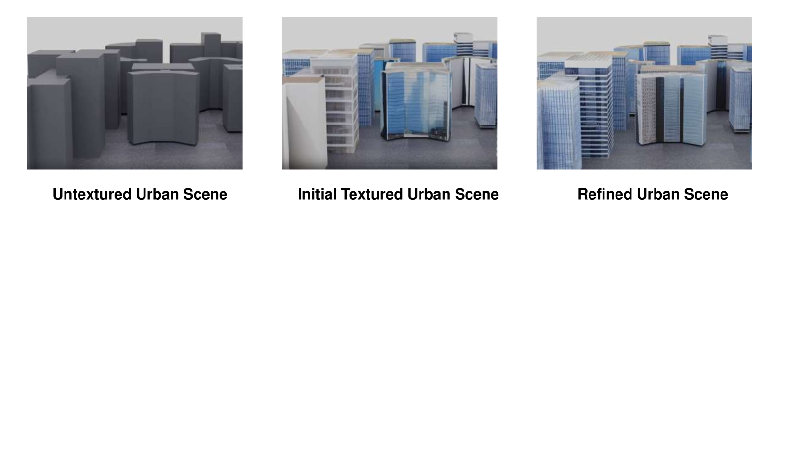
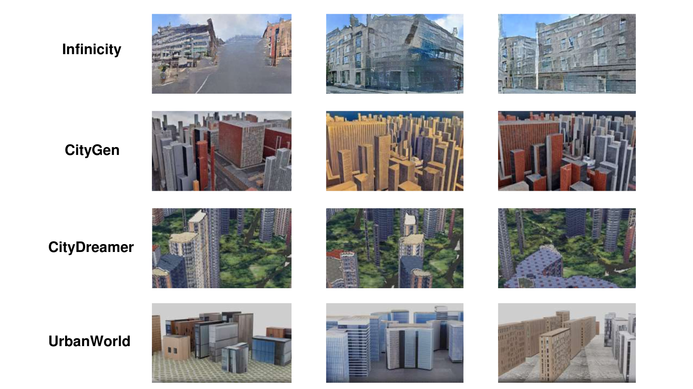

# UrbanWorld：开创性的3D城市生成模型，专为城市世界设计。

发布时间：2024年07月16日

`Agent` `城市规划` `人工智能`

> UrbanWorld: An Urban World Model for 3D City Generation

# 摘要

> 城市，人类生活的基石，汇聚了建筑、道路、植被等多元元素，交织成错综复杂的网络。打造逼真互动的3D城市环境，对于培养能在现实世界中如人般感知、决策、行动的AI代理至关重要。然而，高保真3D城市的构建往往依赖设计师的繁重手工，细节与真实性的追求成为一大难题。为此，我们创新推出UrbanWorld，首个能自动生成定制化、真实互动3D城市世界的模型。它通过四大自动化步骤：利用OSM数据生成3D布局，借助Urban MLLM进行城市规划设计，运用3D扩散技术渲染可控城市元素，以及MLLM辅助的场景精修，打造出高保真3D城市环境，为AI与机器感知系统在模拟中的真实交互提供可能。我们致力于将UrbanWorld打造成一个开源多功能的平台，助力AI在城市环境中的感知、决策与交互能力的提升。

> Cities, as the most fundamental environment of human life, encompass diverse physical elements such as buildings, roads and vegetation with complex interconnection. Crafting realistic, interactive 3D urban environments plays a crucial role in constructing AI agents capable of perceiving, decision-making, and acting like humans in real-world environments. However, creating high-fidelity 3D urban environments usually entails extensive manual labor from designers, involving intricate detailing and accurate representation of complex urban features. Therefore, how to accomplish this in an automatical way remains a longstanding challenge. Toward this problem, we propose UrbanWorld, the first generative urban world model that can automatically create a customized, realistic and interactive 3D urban world with flexible control conditions. UrbanWorld incorporates four key stages in the automatical crafting pipeline: 3D layout generation from openly accessible OSM data, urban scene planning and designing with a powerful urban multimodal large language model (Urban MLLM), controllable urban asset rendering with advanced 3D diffusion techniques, and finally the MLLM-assisted scene refinement. The crafted high-fidelity 3D urban environments enable realistic feedback and interactions for general AI and machine perceptual systems in simulations. We are working on contributing UrbanWorld as an open-source and versatile platform for evaluating and improving AI abilities in perception, decision-making, and interaction in realistic urban environments.

[Arxiv](https://arxiv.org/abs/2407.11965)