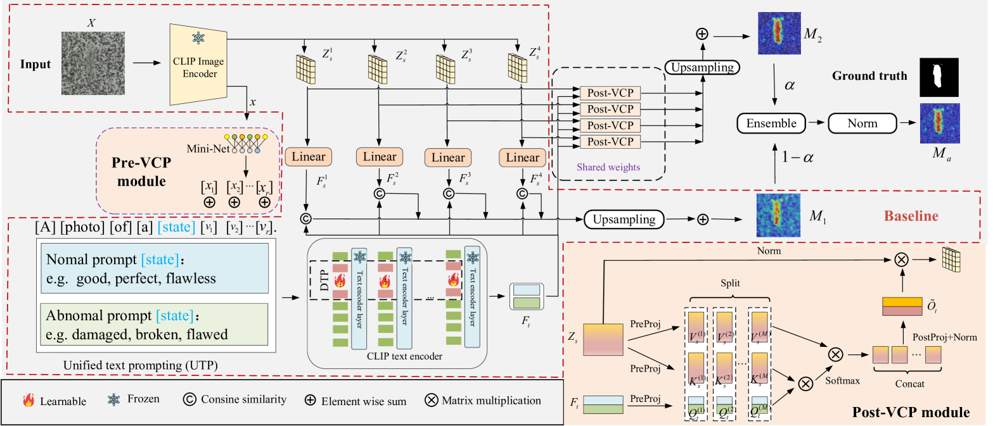

# VCP-CLIP：专为零-shot异常分割设计的视觉上下文提示模型

发布时间：2024年07月16日

`LLM应用` `制造业` `计算机视觉`

> VCP-CLIP: A visual context prompting model for zero-shot anomaly segmentation

# 摘要

> 近期，CLIP 等大规模视觉-语言模型在零-shot 异常分割任务中展现出巨大潜力，通过统一模型和精心设计的文本提示，直接检测未见产品的异常。但现有方法常假设产品类别已知，设置特定文本提示，这在数据隐私场景中难以实现。此外，同一产品因组件和生产过程差异，存在显著变化，对文本提示设计构成挑战。为此，我们提出基于 CLIP 的视觉上下文提示模型 VCP-CLIP，旨在通过视觉上下文提示激活 CLIP 的异常语义感知能力。具体而言，我们设计 Pre-VCP 模块，将全局视觉信息嵌入文本提示，消除特定产品提示需求；并提出 Post-VCP 模块，利用图像细粒度特征调整文本嵌入。在 10 个真实工业异常分割数据集上的实验表明，VCP-CLIP 在 ZSAS 任务中表现卓越。代码已公开，详见 https://github.com/xiaozhen228/VCP-CLIP。

> Recently, large-scale vision-language models such as CLIP have demonstrated immense potential in zero-shot anomaly segmentation (ZSAS) task, utilizing a unified model to directly detect anomalies on any unseen product with painstakingly crafted text prompts. However, existing methods often assume that the product category to be inspected is known, thus setting product-specific text prompts, which is difficult to achieve in the data privacy scenarios. Moreover, even the same type of product exhibits significant differences due to specific components and variations in the production process, posing significant challenges to the design of text prompts. In this end, we propose a visual context prompting model (VCP-CLIP) for ZSAS task based on CLIP. The insight behind VCP-CLIP is to employ visual context prompting to activate CLIP's anomalous semantic perception ability. In specific, we first design a Pre-VCP module to embed global visual information into the text prompt, thus eliminating the necessity for product-specific prompts. Then, we propose a novel Post-VCP module, that adjusts the text embeddings utilizing the fine-grained features of the images. In extensive experiments conducted on 10 real-world industrial anomaly segmentation datasets, VCP-CLIP achieved state-of-the-art performance in ZSAS task. The code is available at https://github.com/xiaozhen228/VCP-CLIP.

[Arxiv](https://arxiv.org/abs/2407.12276)