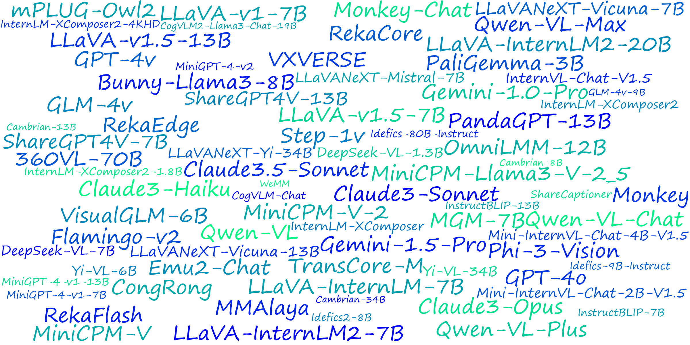
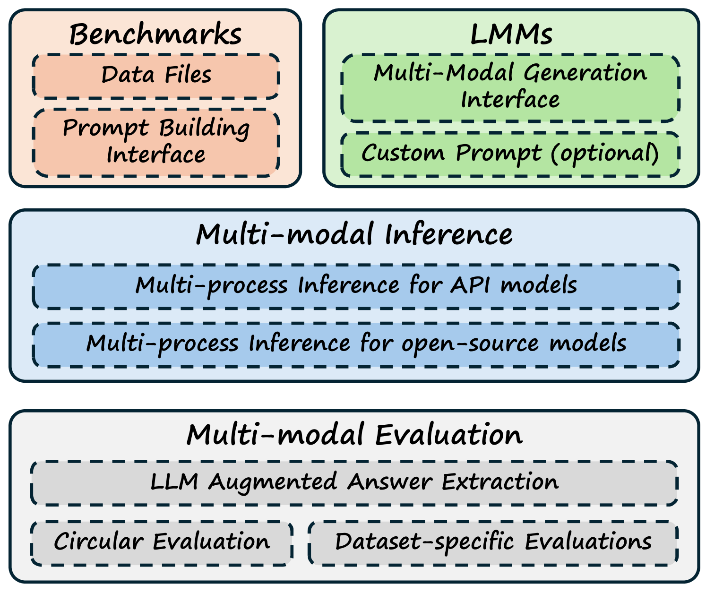

# VLMEvalKit：一款开源工具，专为评估大型多模态模型而设计。

发布时间：2024年07月16日

`LLM应用` `人工智能` `计算机视觉`

> VLMEvalKit: An Open-Source Toolkit for Evaluating Large Multi-Modality Models

# 摘要

> 我们发布了 VLMEvalKit，这是一个基于 PyTorch 的开源工具包，专门用于评估大型多模态模型。VLMEvalKit 旨在为研究者和开发者提供一个既友好又全面的框架，帮助他们评估现有模型并发布可靠的评估结果。该工具包内置了超过 70 种大型多模态模型，涵盖专有 API 和开源模型，并支持 20 多种多模态基准测试。通过统一的接口设计，新模型可以轻松集成，而工具包则自动处理数据准备、分布式推理、预测后处理和指标计算等繁琐工作。虽然目前主要用于视觉-语言模型的评估，但其灵活设计也支持未来扩展至音频、视频等其他模态。基于此工具包的评估结果，我们还推出了 OpenVLM Leaderboard，这是一个全面的排行榜，旨在追踪多模态学习领域的最新进展。VLMEvalKit 已在 GitHub 上发布，并持续得到维护。

> We present VLMEvalKit: an open-source toolkit for evaluating large multi-modality models based on PyTorch. The toolkit aims to provide a user-friendly and comprehensive framework for researchers and developers to evaluate existing multi-modality models and publish reproducible evaluation results. In VLMEvalKit, we implement over 70 different large multi-modality models, including both proprietary APIs and open-source models, as well as more than 20 different multi-modal benchmarks. By implementing a single interface, new models can be easily added to the toolkit, while the toolkit automatically handles the remaining workloads, including data preparation, distributed inference, prediction post-processing, and metric calculation. Although the toolkit is currently mainly used for evaluating large vision-language models, its design is compatible with future updates that incorporate additional modalities, such as audio and video. Based on the evaluation results obtained with the toolkit, we host OpenVLM Leaderboard, a comprehensive leaderboard to track the progress of multi-modality learning research. The toolkit is released at https://github.com/open-compass/VLMEvalKit and is actively maintained.

[Arxiv](https://arxiv.org/abs/2407.11691)