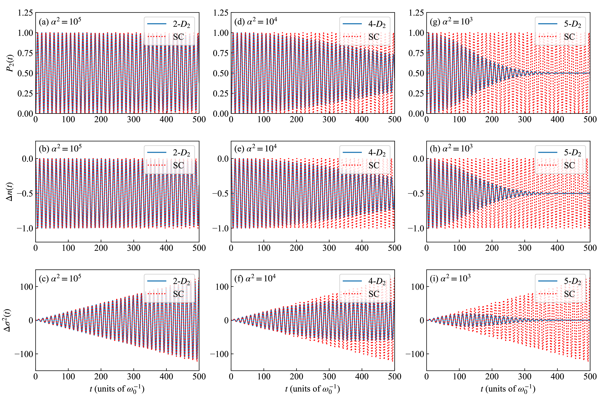
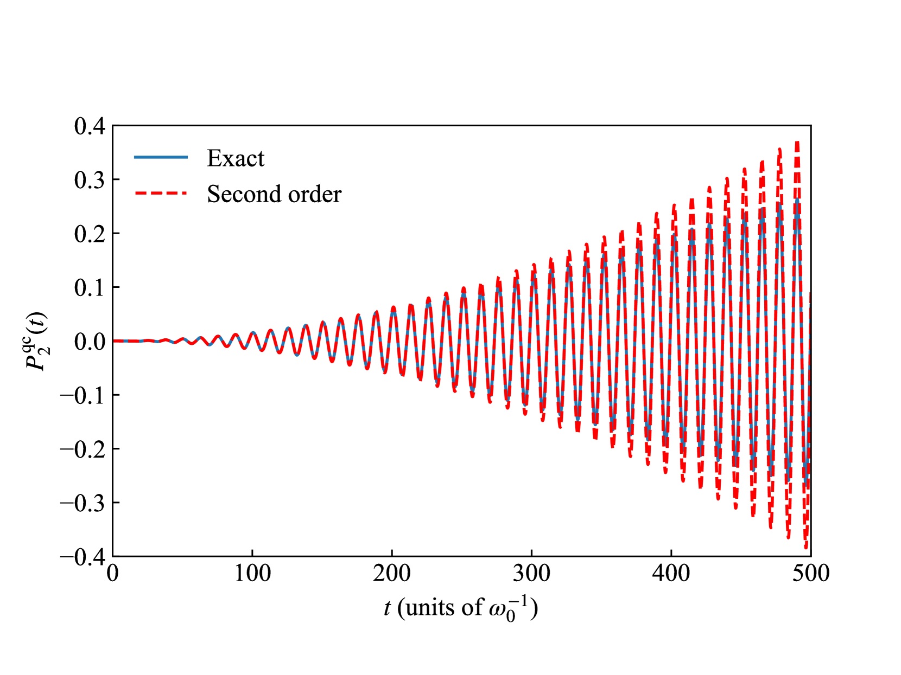
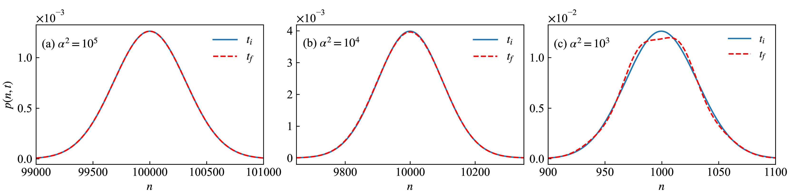
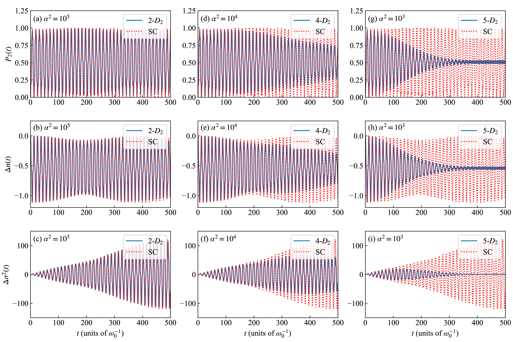
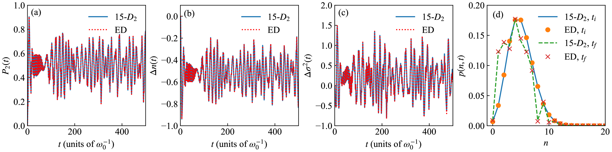
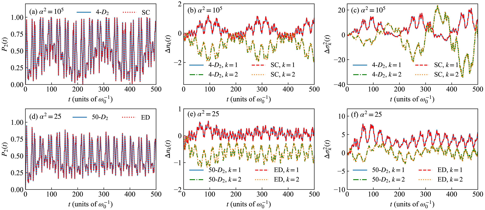
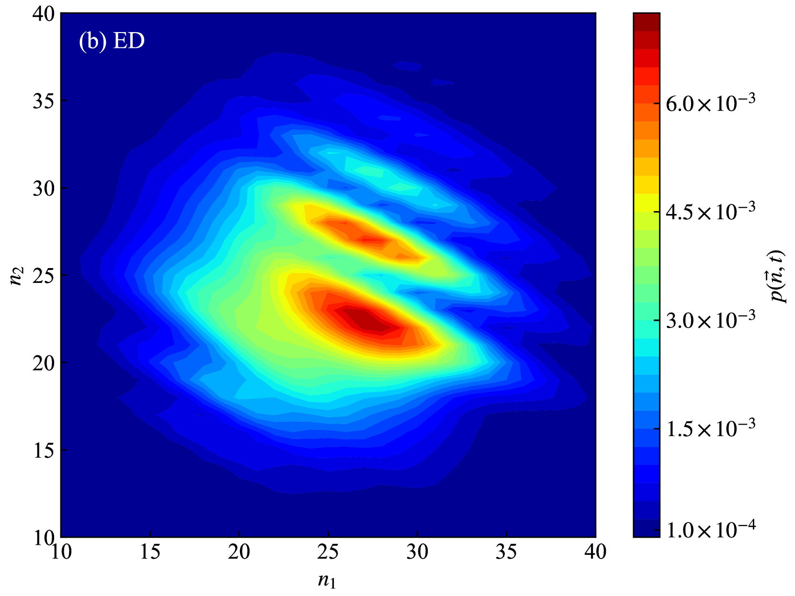
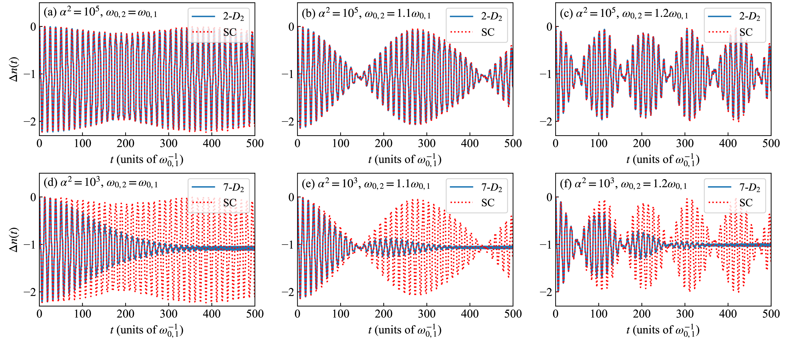

# 变分法巧妙地连接了光-物质相互作用的量子与半经典极限，为探索这一复杂领域提供了新的视角。

发布时间：2024年07月16日

`LLM理论` `光电子学` `量子计算`

> Variational approach to light-matter interaction: Bridging quantum and semiclassical limits

# 摘要

> 我们采用时间依赖的变分方法，结合多重 Davydov $D_2$ 试探态，模拟了光-物质系统在场处于任意有限平均光子数的相干态时的动力学。该方法不仅捕捉系统与场的动力学，还适用于多种量子模型，如 Jaynes-Cummings、Rabi 和 Dicke 模型，并能处理多模量子场。通过对比变分与半经典动力学，我们发现，只要平均光子数足够大，量子与半经典模型的动力学表现一致。此外，在量子与半经典极限的过渡区，量子修正导致动力学振荡的崩溃，这在半经典模型中未见。此变分方法为光-物质相互作用提供了一种从量子到半经典的统一处理方式。

> We present a time-dependent variational approach with the multiple Davydov $D_2$ trial state to simulate the dynamics of light-matter systems when the field is in a coherent state with an arbitrary finite mean photon number. The variational approach captures not only the system dynamics but also the field dynamics and is applicable to a variety of quantum models of light-matter interaction such as the Jaynes-Cummings model, Rabi model, and Dicke model, and is feasible to tackle the multimode quantized fields. By comparison of the variational and semiclassical dynamics of both the system and field, we illustrate that the variational dynamics from the quantum models agrees with those from the corresponding semiclassical models as long as the mean number of photons is sufficiently large. Moreover, we illustrate that in the crossover between the quantum and semiclassical limits, the quantum corrections lead to the collapse of the oscillations in dynamics, which is absent in the semiclassical models. The variational approach provides a unified treatment of light-matter interaction from the quantum to the semiclassical limit.

[Arxiv](https://arxiv.org/abs/2407.12228)