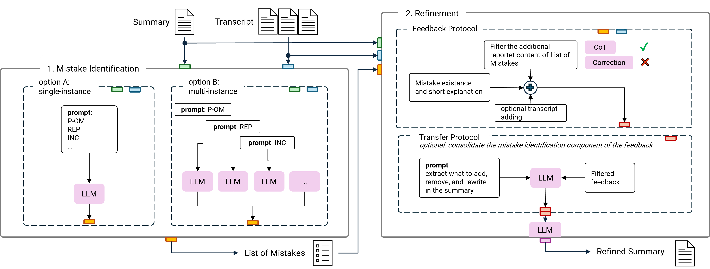
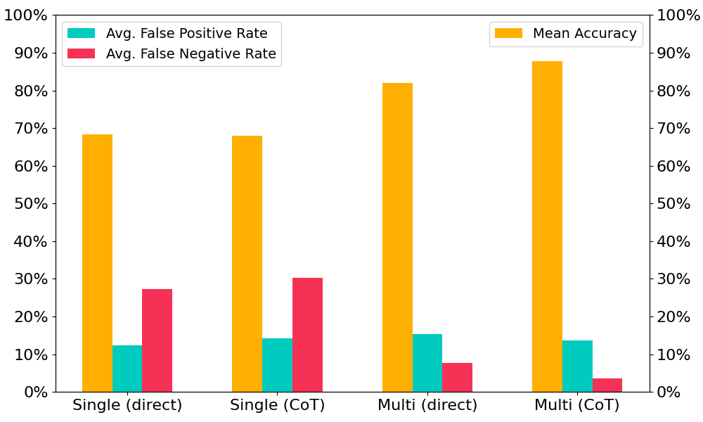
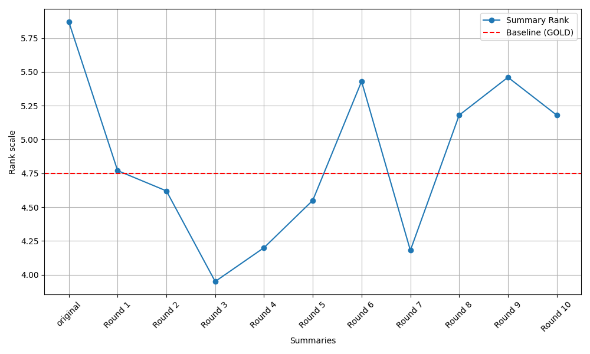

# 如何改进？借助 LLM 反馈精炼会议摘要

发布时间：2024年07月16日

`LLM应用` `文本生成`

> What's Wrong? Refining Meeting Summaries with LLM Feedback

# 摘要

> 随着数字会议的普及，会议摘要变得至关重要。大型语言模型（LLM）在摘要任务中展现出优于传统方法的连贯性和上下文理解能力，但仍需克服保持相关性和避免幻觉的挑战。为此，我们提出了一种模拟人类审查流程的两阶段多LLM校正方法：首先识别错误，然后精炼摘要。我们发布的QMSum Mistake数据集包含了200个由人工标注的自动生成摘要，涵盖九种错误类型。实验表明，LLM能高精度地识别这些错误。通过将识别的错误转化为具体反馈，我们提升了摘要的相关性、信息量、简洁性和连贯性。这种事后精炼方法通过多LLM协作验证输出质量，显著提高了摘要的整体质量。我们的方法不仅适用于会议摘要，还可能在需要高度鲁棒性和目标导向讨论的复杂文本生成任务中发挥潜力。

> Meeting summarization has become a critical task since digital encounters have become a common practice. Large language models (LLMs) show great potential in summarization, offering enhanced coherence and context understanding compared to traditional methods. However, they still struggle to maintain relevance and avoid hallucination. We introduce a multi-LLM correction approach for meeting summarization using a two-phase process that mimics the human review process: mistake identification and summary refinement. We release QMSum Mistake, a dataset of 200 automatically generated meeting summaries annotated by humans on nine error types, including structural, omission, and irrelevance errors. Our experiments show that these errors can be identified with high accuracy by an LLM. We transform identified mistakes into actionable feedback to improve the quality of a given summary measured by relevance, informativeness, conciseness, and coherence. This post-hoc refinement effectively improves summary quality by leveraging multiple LLMs to validate output quality. Our multi-LLM approach for meeting summarization shows potential for similar complex text generation tasks requiring robustness, action planning, and discussion towards a goal.

[Arxiv](https://arxiv.org/abs/2407.11919)