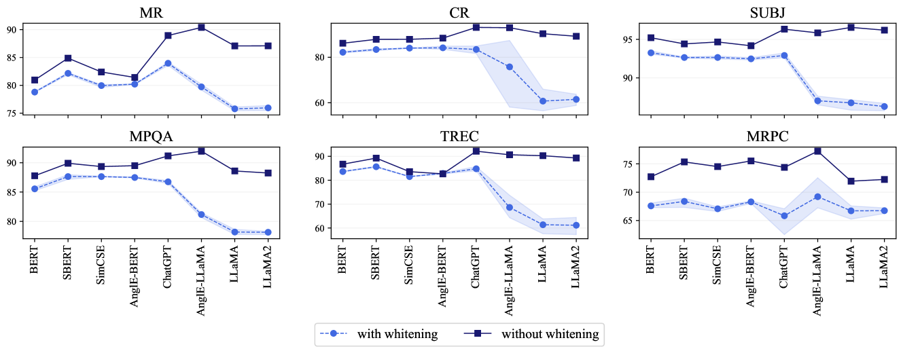
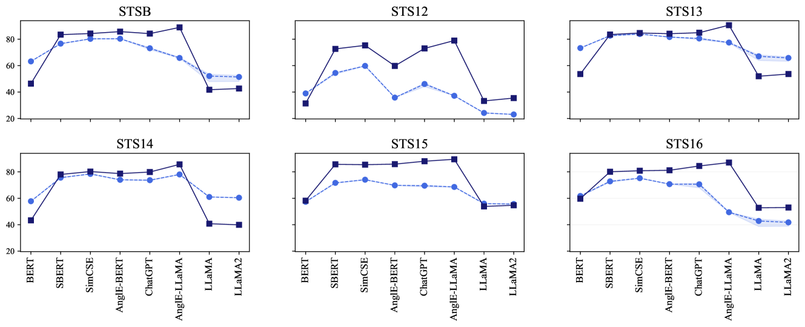
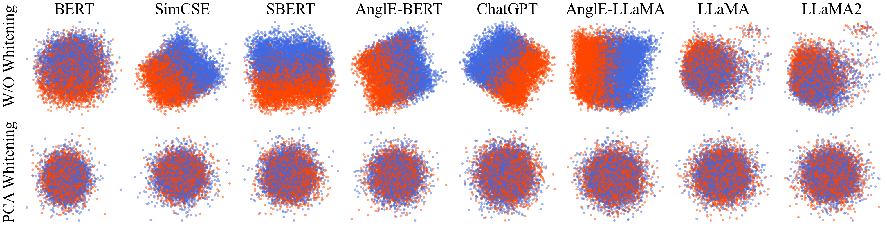
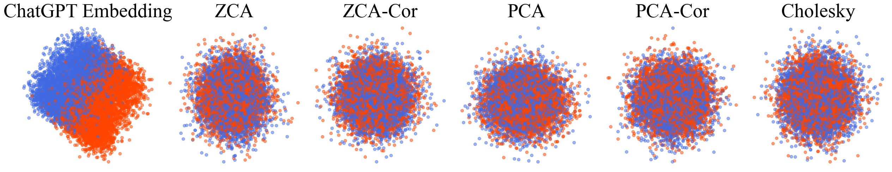
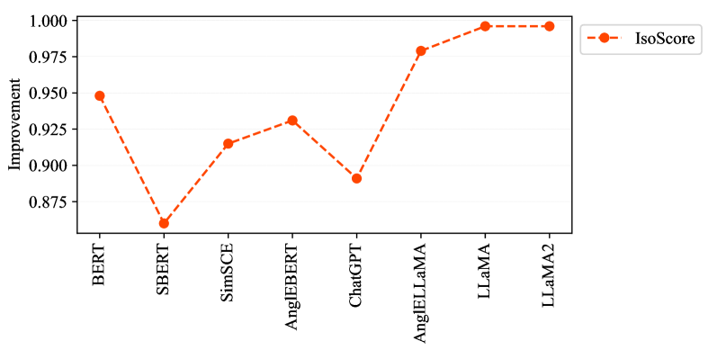

# 在 LLM 中，分类任务不宜采用白化处理。

发布时间：2024年07月16日

`LLM应用` `机器学习`

> Whitening Not Recommended for Classification Tasks in LLMs

# 摘要

> 句子嵌入作为 NLP 的核心，白化技术被认为能提升 LLM 嵌入质量。但研究发现，白化效果因模型和任务而异，尤其对分类任务的嵌入质量有负面影响。通过广泛实验验证，我们探索了多种白化方法，如 PCA、ZCA 等。此外，我们的研究还催生了一个名为 SentEval+ 的 LLM 嵌入评估平台。

> Sentence embedding is a cornerstone in NLP. Whitening has been claimed to be an effective operation to improve embedding quality obtained from Large Language Models (LLMs). However, we find that the efficacy of whitening is model-dependent and task-dependent. In particular, whitening degenerates embeddings for classification tasks. The conclusion is supported by extensive experiments. We also explored a variety of whitening operations, including PCA, ZCA, PCA-Cor, ZCA-Cor and Cholesky whitenings. A by-product of our research is embedding evaluation platform for LLMs called SentEval+.

[Arxiv](https://arxiv.org/abs/2407.12886)