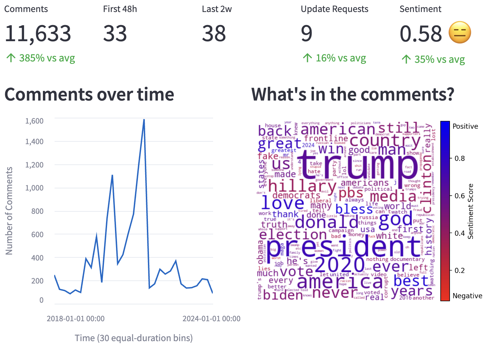
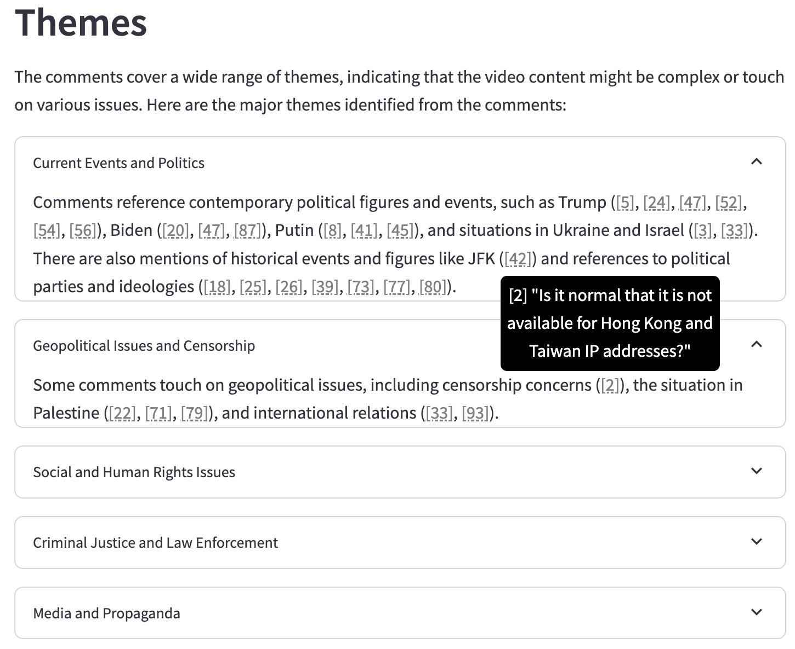
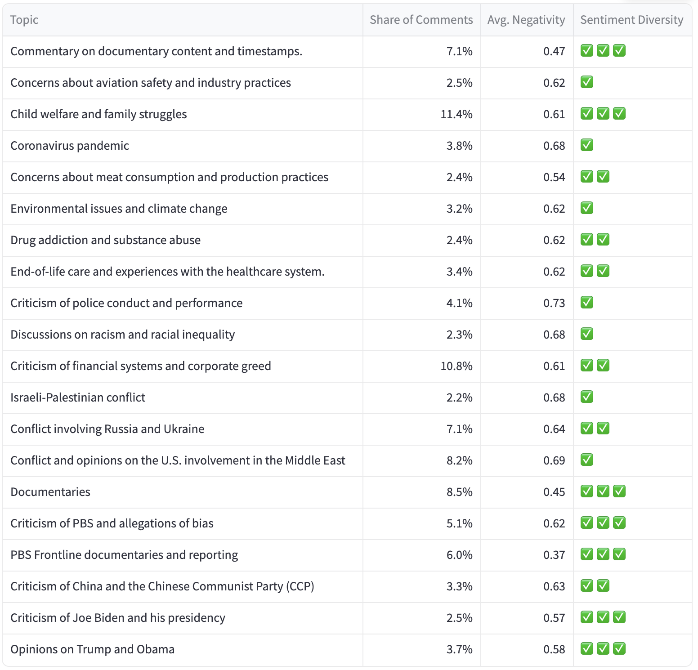

# AudienceView：借助AI技术，深入解读新闻观众反馈

发布时间：2024年07月17日

`LLM应用` `新闻传媒` `数据分析`

> AudienceView: AI-Assisted Interpretation of Audience Feedback in Journalism

# 摘要

> 记者面对海量在线评论时，理解和利用受众反馈变得尤为重要且困难。为此，我们推出了 AudienceView 这一在线工具，借助大型语言模型帮助记者高效分类和解读反馈。该工具不仅能识别评论中的主题和话题，还能将其与具体评论关联，提供情感和分布的可视化展示，助力记者构思后续报道。我们强调，这类工具虽有助于提升工作效率，但情境意识和人类判断仍不可或缺。

> Understanding and making use of audience feedback is important but difficult for journalists, who now face an impractically large volume of audience comments online. We introduce AudienceView, an online tool to help journalists categorize and interpret this feedback by leveraging large language models (LLMs). AudienceView identifies themes and topics, connects them back to specific comments, provides ways to visualize the sentiment and distribution of the comments, and helps users develop ideas for subsequent reporting projects. We consider how such tools can be useful in a journalist's workflow, and emphasize the importance of contextual awareness and human judgment.

[Arxiv](https://arxiv.org/abs/2407.12613)