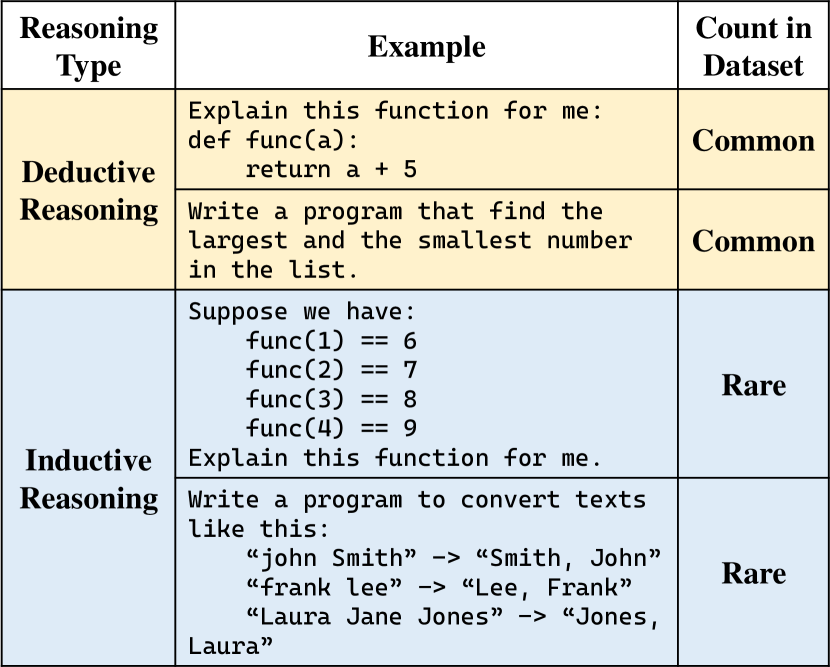
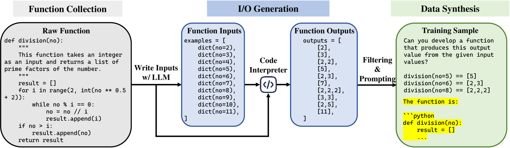
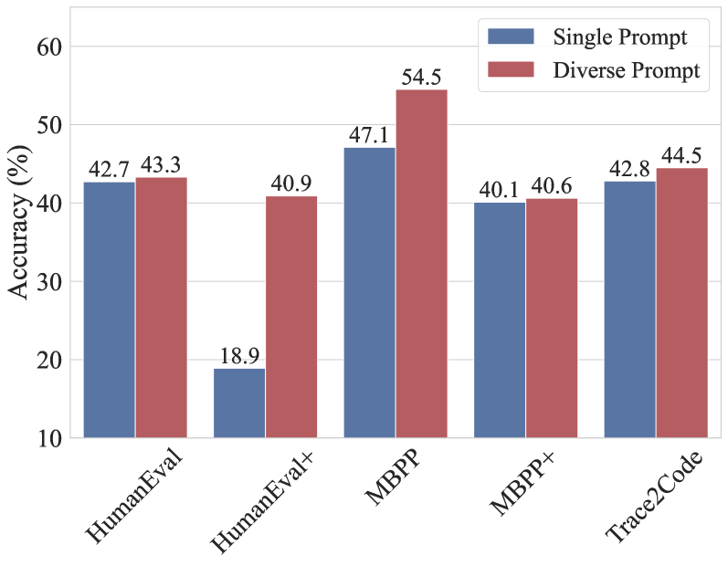
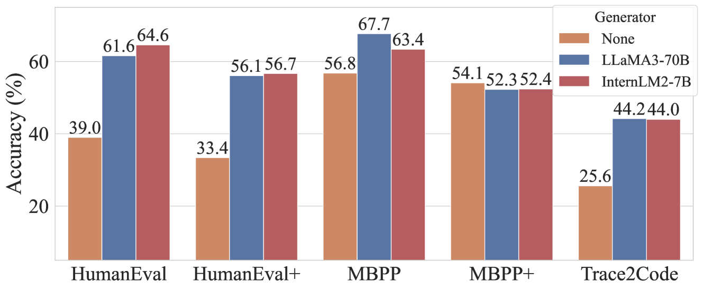

# Case2Code：借助合成数据掌握归纳推理技巧

发布时间：2024年07月17日

`LLM应用` `软件开发` `人工智能`

> Case2Code: Learning Inductive Reasoning with Synthetic Data

# 摘要

> 大语言模型（LLM）在复杂推理方面表现出色，尤其擅长演绎推理，如通过思维链或工具迭代解决难题。本文聚焦于评估和培养LLM的归纳推理能力，即通过观察实例推断规则。收集大规模多样化的归纳数据颇具挑战，因此我们转向代码领域，提出**Case2Code**任务，利用程序的表达性和准确性。我们收集多样程序，合成输入输出转换，并引导LLM推断代码实现。实验表明，Case-to-code归纳对LLM颇具挑战，但通过合成训练样本，LLM不仅提升了Case2Code性能，还增强了编码技能，凸显了合成数据在归纳推理学习中的潜力。

> Complex reasoning is an impressive ability shown by large language models (LLMs). Most LLMs are skilled in deductive reasoning, such as chain-of-thought prompting or iterative tool-using to solve challenging tasks step-by-step. In this paper, we hope to focus on evaluating and teaching LLMs to conduct inductive reasoning, that is, LLMs are supposed to infer underlying rules by observing examples or sequential transformations. However, collecting large-scale and diverse human-generated inductive data is challenging. We focus on data synthesis in the code domain and propose a \textbf{Case2Code} task by exploiting the expressiveness and correctness of programs. Specifically, we collect a diverse set of executable programs, synthesize input-output transformations for each program, and force LLMs to infer the underlying code implementations based on the synthetic I/O cases. We first evaluate representative LLMs on the synthesized Case2Code task and demonstrate that the Case-to-code induction is challenging for LLMs. Then, we synthesize large-scale Case2Code training samples to train LLMs to perform inductive reasoning. Experimental results show that such induction training benefits not only in distribution Case2Code performance but also enhances various coding abilities of trained LLMs, demonstrating the great potential of learning inductive reasoning via synthetic data.

[Arxiv](https://arxiv.org/abs/2407.12504)