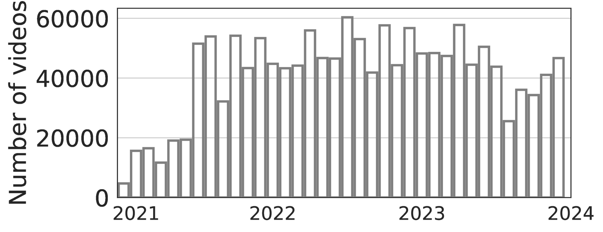
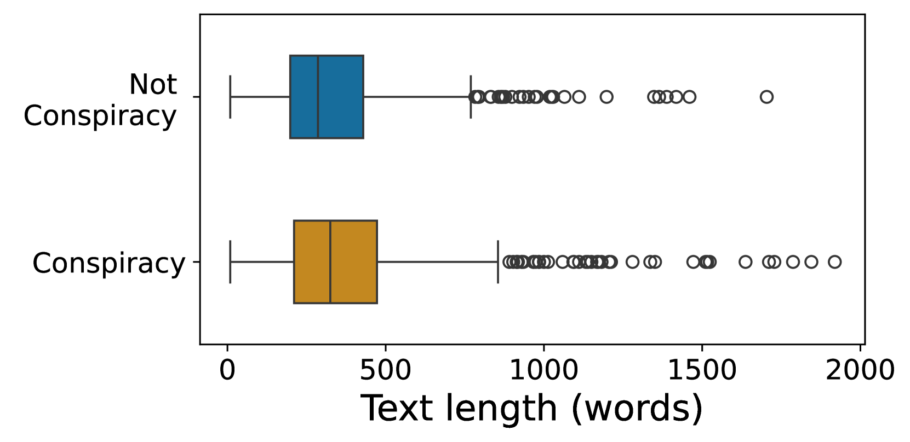

# 探秘阴谋论：TikTok 上的隐秘角落

发布时间：2024年07月17日

`LLM应用` `社交媒体` `内容管理`

> Conspiracy theories and where to find them on TikTok

# 摘要

> TikTok 凭借其病毒式趋势和社会挑战，在年轻群体中迅速走红。然而，其推广和放大有害内容的潜力引发了担忧。通过分析三年间美国分享的 150 万视频，我们的研究发现，约 0.1% 的视频涉及阴谋论，并探讨了新创作者计划对这类内容的影响。我们发现，最先进的大型语言模型能高精度识别有害内容，但性能与传统微调模型相当。这些发现对制定 TikTok 等平台的内容管理策略至关重要，有助于遏制有害内容的传播。

> TikTok has skyrocketed in popularity over recent years, especially among younger audiences, thanks to its viral trends and social challenges. However, concerns have been raised about the potential of this platform to promote and amplify online harmful and dangerous content. Leveraging the official TikTok Research API and collecting a longitudinal dataset of 1.5M videos shared in the US over a period of 3 years, our study analyzes the presence of videos promoting conspiracy theories, providing a lower-bound estimate of their prevalence (approximately 0.1% of all videos) and assessing the effects of the new Creator Program, which provides new ways for creators to monetize, on the supply of conspiratorial content. We evaluate the capabilities of state-of-the-art open Large Language Models to identify conspiracy theories after extracting audio transcriptions of videos, finding that they can detect harmful content with high precision but with overall performance comparable to fine-tuned traditional language models such as RoBERTa. Our findings are instrumental for content moderation strategies that aim to understand and mitigate the spread of harmful content on rapidly evolving social media platforms like TikTok.

[Arxiv](https://arxiv.org/abs/2407.12545)