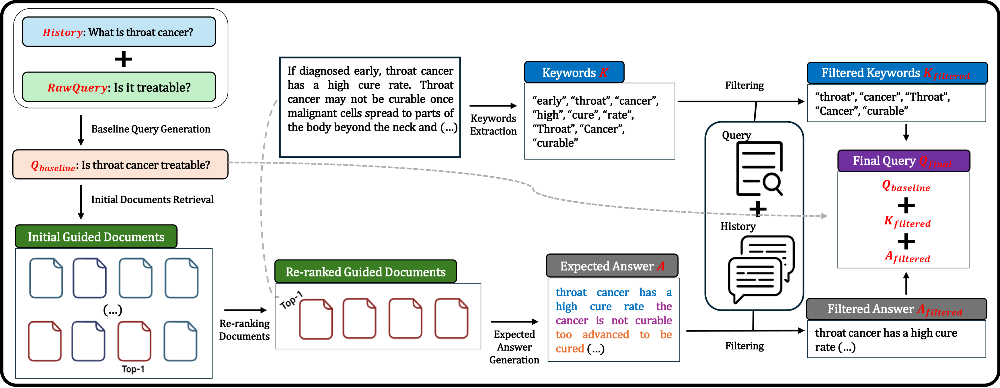
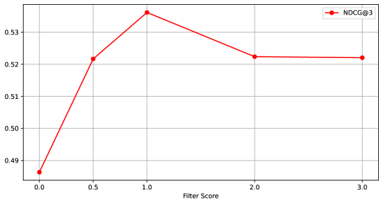

# 借助检索文档的指引，优化对话查询

发布时间：2024年07月17日

`LLM应用` `问答系统` `搜索引擎`

> Conversational Query Reformulation with the Guidance of Retrieved Documents

# 摘要

> 对话搜索旨在为对话问答（ConvQA）中的问题检索相关段落，但面临省略和指代等难题。为此，对话查询重构（CQR）应运而生，将查询转换为去上下文形式。然而，现有CQR方法虽重写人类友好查询，却未必总能产生最佳搜索结果。为此，我们推出GuideCQR框架，利用引导文档优化查询，确保其对检索器最优。具体操作包括增强关键词、从重排文档中生成预期答案，并结合过滤过程。实验表明，引导文档增强的查询性能更佳，尤其在不同设置下，GuideCQR超越了LLM提示驱动方法，凸显了引导文档在制定检索器友好查询中的关键作用。

> Conversational search seeks to retrieve relevant passages for the given questions in Conversational QA (ConvQA). Questions in ConvQA face challenges such as omissions and coreferences, making it difficult to obtain desired search results. Conversational Query Reformulation (CQR) transforms these current queries into de-contextualized forms to resolve these issues. However, existing CQR methods focus on rewriting human-friendly queries, which may not always yield optimal search results for the retriever. To overcome this challenge, we introduce GuideCQR, a framework that utilizes guided documents to refine queries, ensuring that they are optimal for retrievers. Specifically, we augment keywords, generate expected answers from the re-ranked documents, and unify them with the filtering process. Experimental results show that queries enhanced by guided documents outperform previous CQR methods. Especially, GuideCQR surpasses the performance of Large Language Model (LLM) prompt-powered approaches and demonstrates the importance of the guided documents in formulating retriever-friendly queries across diverse setups.

[Arxiv](https://arxiv.org/abs/2407.12363)