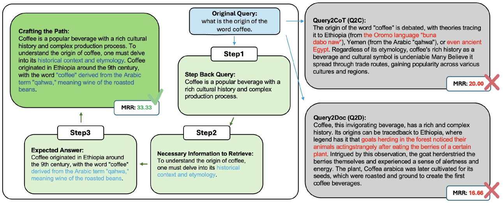

# 精雕细琢路径：强化信息检索中的查询重写能力

发布时间：2024年07月17日

`LLM应用` `信息检索` `搜索引擎`

> Crafting the Path: Robust Query Rewriting for Information Retrieval

# 摘要

> 查询重写的目标是生成一个新查询，以补充原始查询，从而提升信息检索系统的性能。近期研究如Q2D、Q2E和Q2C，依赖于大型语言模型的内部知识来生成相关段落，以丰富查询内容。然而，当所需知识未被模型固有参数包含时，这些方法的效果可能大打折扣。为此，我们提出了一种名为“定制路径”的新型结构化查询重写方法，专为检索系统量身打造。该方法通过三步流程，逐步构建查询相关信息，以精准定位搜索段落。具体步骤包括：查询概念理解、查询类型识别和预期答案提取。实验表明，我们的方法在LLM不太熟悉的领域表现尤为出色，且对模型内部参数的依赖性较低，生成的查询错误更少。此外，与基线方法相比，“定制路径”的延迟更低。

> Query rewriting aims to generate a new query that can complement the original query to improve the information retrieval system. Recent studies on query rewriting, such as query2doc (Q2D), query2expand (Q2E) and querey2cot (Q2C), rely on the internal knowledge of Large Language Models (LLMs) to generate a relevant passage to add information to the query. Nevertheless, the efficacy of these methodologies may markedly decline in instances where the requisite knowledge is not encapsulated within the model's intrinsic parameters. In this paper, we propose a novel structured query rewriting method called Crafting the Path tailored for retrieval systems. Crafting the Path involves a three-step process that crafts query-related information necessary for finding the passages to be searched in each step. Specifically, the Crafting the Path begins with Query Concept Comprehension, proceeds to Query Type Identification, and finally conducts Expected Answer Extraction. Experimental results show that our method outperforms previous rewriting methods, especially in less familiar domains for LLMs. We demonstrate that our method is less dependent on the internal parameter knowledge of the model and generates queries with fewer factual inaccuracies. Furthermore, we observe that Crafting the Path has less latency compared to the baselines.

[Arxiv](https://arxiv.org/abs/2407.12529)