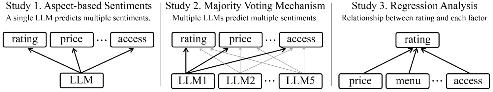

# 本研究采用多数投票机制，利用本地大型语言模型进行动态情感分析，旨在探讨影响餐厅评价的关键因素。

发布时间：2024年07月17日

`LLM应用`

> Dynamic Sentiment Analysis with Local Large Language Models using Majority Voting: A Study on Factors Affecting Restaurant Evaluation

# 摘要

> 在线平台上的用户生成内容（UGCs）为营销研究提供了洞察消费者偏好的窗口。随着大型语言模型（LLMs）的发展，一些研究开始利用这些模型进行标注和情感分析。然而，LLMs的准确性与超参数之间的关系仍待深入探讨，且其结果的可变性和可重复性问题在现有文献中鲜有涉及。本研究借鉴人工标注中的多数投票机制，将其引入基于本地LLMs的情感分析模型。通过分析餐厅评价的在线评论，我们发现，采用中型模型进行多次尝试的多数投票方法，其结果比大型模型的单次尝试更为稳健。此外，我们还深入探讨了各因素对整体评价的影响。

> User-generated contents (UGCs) on online platforms allow marketing researchers to understand consumer preferences for products and services. With the advance of large language models (LLMs), some studies utilized the models for annotation and sentiment analysis. However, the relationship between the accuracy and the hyper-parameters of LLMs is yet to be thoroughly examined. In addition, the issues of variability and reproducibility of results from each trial of LLMs have rarely been considered in existing literature. Since actual human annotation uses majority voting to resolve disagreements among annotators, this study introduces a majority voting mechanism to a sentiment analysis model using local LLMs. By a series of three analyses of online reviews on restaurant evaluations, we demonstrate that majority voting with multiple attempts using a medium-sized model produces more robust results than using a large model with a single attempt. Furthermore, we conducted further analysis to investigate the effect of each aspect on the overall evaluation.

[Arxiv](https://arxiv.org/abs/2407.13069)