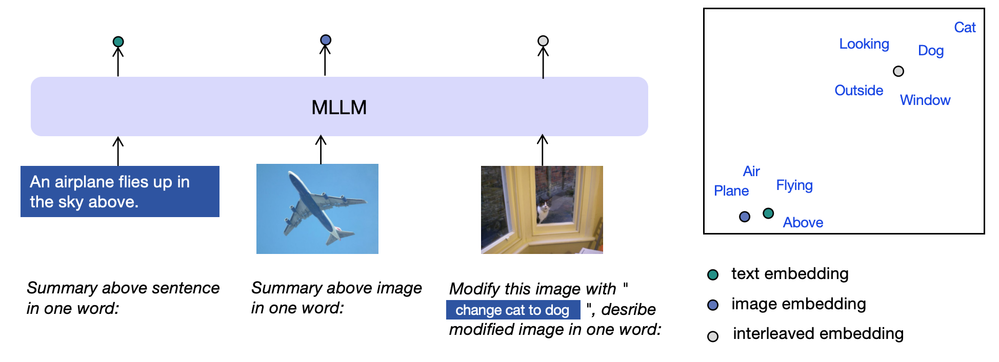
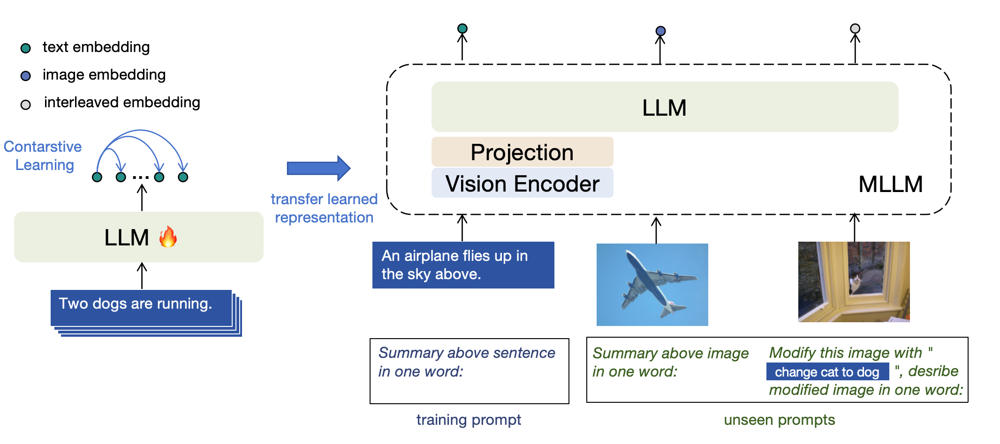
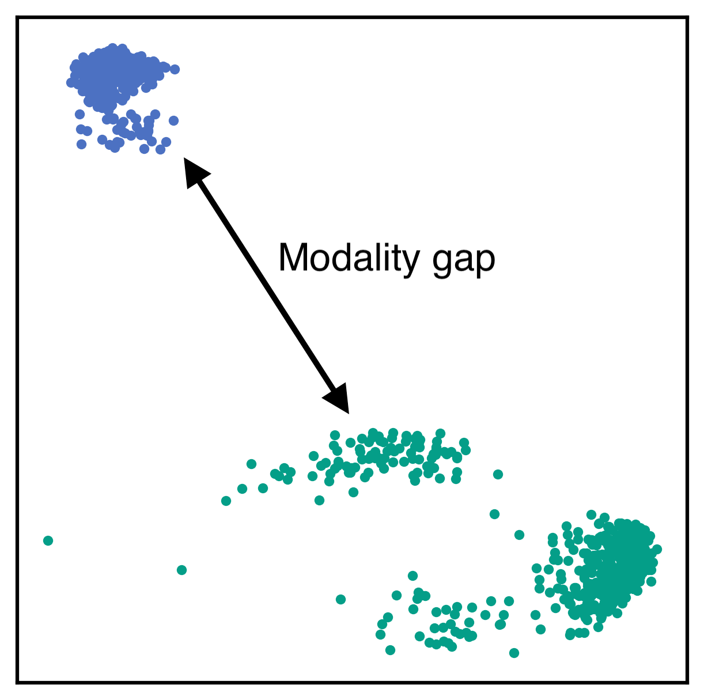
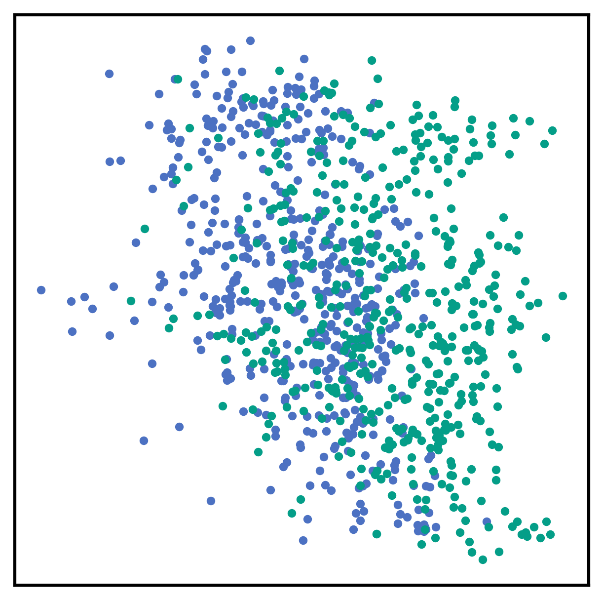
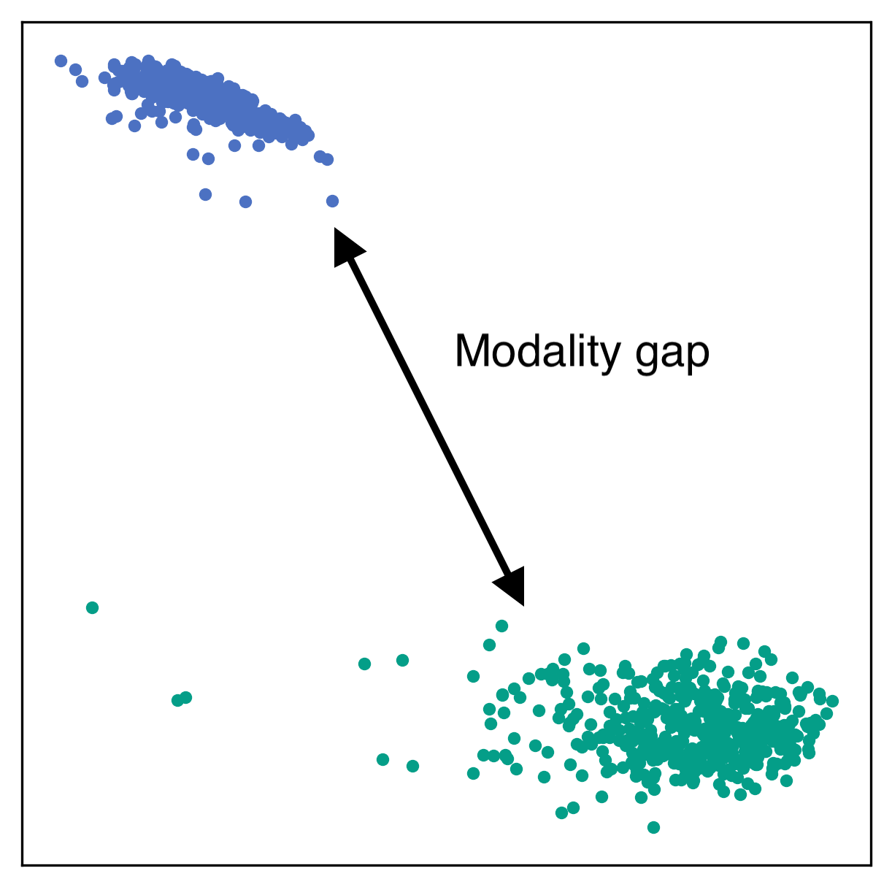

# E5-V：借助多模态大型语言模型实现通用嵌入

发布时间：2024年07月17日

`LLM应用` `人工智能` `计算机视觉`

> E5-V: Universal Embeddings with Multimodal Large Language Models

# 摘要

> 多模态大型语言模型 (MLLMs) 在视觉和语言理解方面取得了显著进展，但如何有效表示多模态信息仍待深入研究。为此，我们推出了新框架 E5-V，专门设计用于优化 MLLMs 以实现通用多模态嵌入。研究表明，MLLMs 在处理多模态输入方面潜力巨大，通过结合提示，E5-V 成功缩小了不同输入间的模态差异，展现出卓越的多模态嵌入能力，无需额外微调。我们采用单一模态训练策略，仅使用文本对进行模型训练，不仅大幅提升了性能，还节省了约 95% 的训练成本，并免除了复杂的多模态数据收集。跨多种任务的实验充分验证了 E5-V 的高效性，使其在众多领域不仅达到甚至超越了顶尖水平，即便仅基于单一模态训练。

> Multimodal large language models (MLLMs) have shown promising advancements in general visual and language understanding. However, the representation of multimodal information using MLLMs remains largely unexplored. In this work, we introduce a new framework, E5-V, designed to adapt MLLMs for achieving universal multimodal embeddings. Our findings highlight the significant potential of MLLMs in representing multimodal inputs compared to previous approaches. By leveraging MLLMs with prompts, E5-V effectively bridges the modality gap between different types of inputs, demonstrating strong performance in multimodal embeddings even without fine-tuning. We propose a single modality training approach for E5-V, where the model is trained exclusively on text pairs. This method demonstrates significant improvements over traditional multimodal training on image-text pairs, while reducing training costs by approximately 95%. Additionally, this approach eliminates the need for costly multimodal training data collection. Extensive experiments across four types of tasks demonstrate the effectiveness of E5-V. As a universal multimodal model, E5-V not only achieves but often surpasses state-of-the-art performance in each task, despite being trained on a single modality.

[Arxiv](https://arxiv.org/abs/2407.12580)