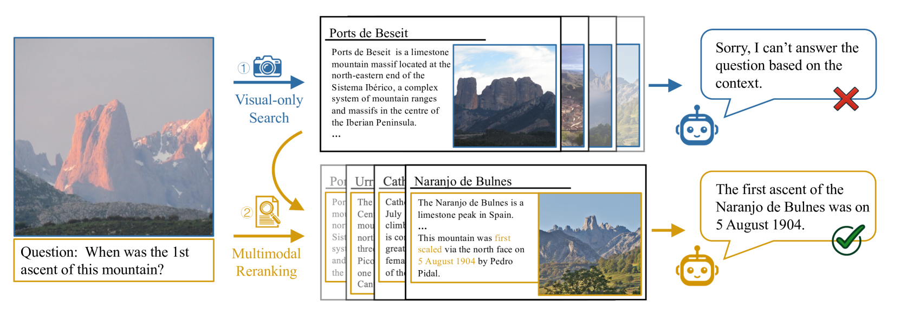
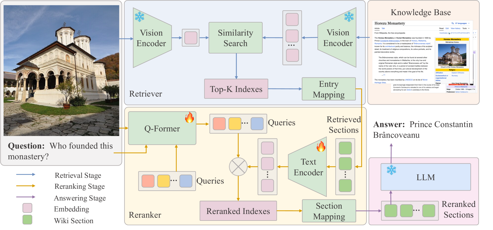

# EchoSight：借助维基知识，推动视觉-语言模型的发展

发布时间：2024年07月17日

`LLM应用` `视觉问答` `百科全书`

> EchoSight: Advancing Visual-Language Models with Wiki Knowledge

# 摘要

> KVQA任务要求利用丰富背景知识解答图像相关问题，尽管技术进步显著，但生成模型因外部知识整合不足而常感力不从心。本文推出的EchoSight框架，通过多模态检索增强生成技术，助力大型语言模型精准应对需细致百科知识的视觉问答。EchoSight先以视觉信息搜寻维基文章，再依文本-图像综合查询相关性重排候选文章，大幅提升多模态知识融合，检索效率与VQA准确性双双跃升。实验显示，EchoSight在百科全书VQA与InfoSeek数据集上刷新纪录，分别取得41.8%与31.3%的优异准确率。

> Knowledge-based Visual Question Answering (KVQA) tasks require answering questions about images using extensive background knowledge. Despite significant advancements, generative models often struggle with these tasks due to the limited integration of external knowledge. In this paper, we introduce EchoSight, a novel multimodal Retrieval-Augmented Generation (RAG) framework that enables large language models (LLMs) to answer visual questions requiring fine-grained encyclopedic knowledge. To strive for high-performing retrieval, EchoSight first searches wiki articles by using visual-only information, subsequently, these candidate articles are further reranked according to their relevance to the combined text-image query. This approach significantly improves the integration of multimodal knowledge, leading to enhanced retrieval outcomes and more accurate VQA responses. Our experimental results on the Encyclopedic VQA and InfoSeek datasets demonstrate that EchoSight establishes new state-of-the-art results in knowledge-based VQA, achieving an accuracy of 41.8% on Encyclopedic VQA and 31.3% on InfoSeek.

[Arxiv](https://arxiv.org/abs/2407.12735)