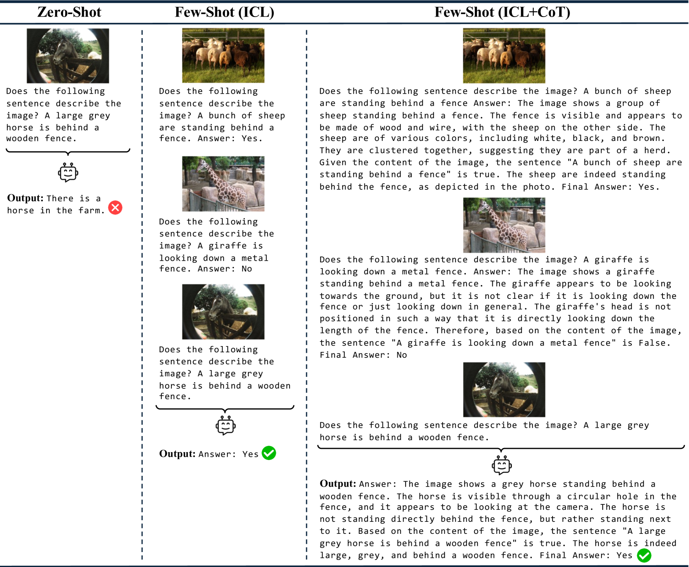
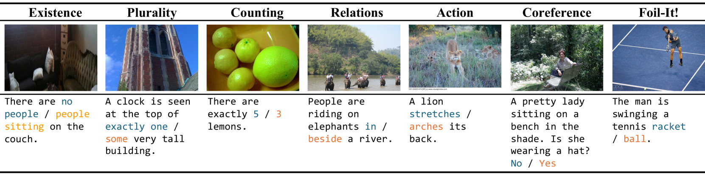
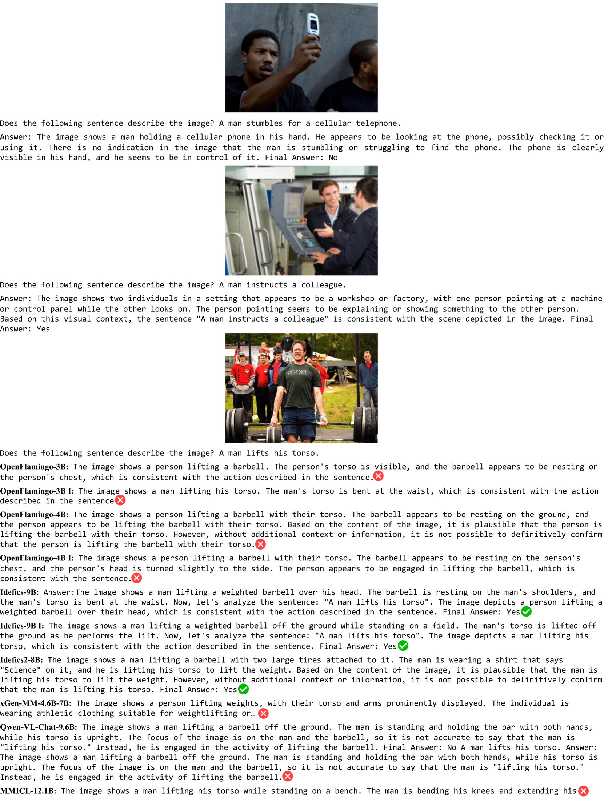

# 从少样本学习的角度审视多模态LLM的语言能力

发布时间：2024年07月17日

`LLM应用` `人工智能` `计算机视觉`

> Evaluating Linguistic Capabilities of Multimodal LLMs in the Lens of Few-Shot Learning

# 摘要

> 多模态大型语言模型（MLLMs）的语言能力对其广泛应用至关重要。本研究评估了 MLLMs 在 VALSE 基准上的表现，特别关注少样本 In-Context Learning（ICL）和 Chain-of-Thought（CoT）提示的效果。我们全面评估了不同大小和预训练数据集的先进 MLLMs。实验表明，ICL 和 CoT 提示显著提升模型性能，尤其是在复杂推理和上下文理解任务中。预训练于字幕数据集的模型零-shot 性能优异，而基于交错图像-文本数据的模型则受益于少样本学习。研究结果揭示了优化 MLLMs 以增强视觉上下文中的语言定位的重要性，强调了预训练数据组合的关键作用及少样本学习策略在提升 MLLMs 推理能力方面的潜力。

> The linguistic capabilities of Multimodal Large Language Models (MLLMs) are critical for their effective application across diverse tasks. This study aims to evaluate the performance of MLLMs on the VALSE benchmark, focusing on the efficacy of few-shot In-Context Learning (ICL), and Chain-of-Thought (CoT) prompting. We conducted a comprehensive assessment of state-of-the-art MLLMs, varying in model size and pretraining datasets. The experimental results reveal that ICL and CoT prompting significantly boost model performance, particularly in tasks requiring complex reasoning and contextual understanding. Models pretrained on captioning datasets show superior zero-shot performance, while those trained on interleaved image-text data benefit from few-shot learning. Our findings provide valuable insights into optimizing MLLMs for better grounding of language in visual contexts, highlighting the importance of the composition of pretraining data and the potential of few-shot learning strategies to improve the reasoning abilities of MLLMs.

[Arxiv](https://arxiv.org/abs/2407.12498)