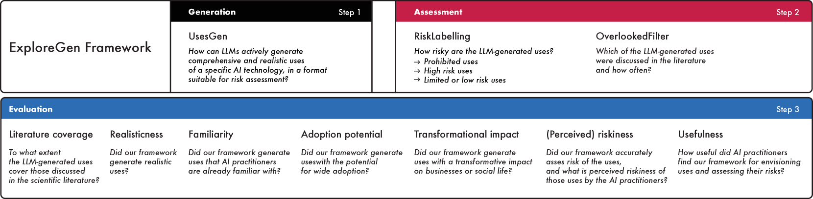
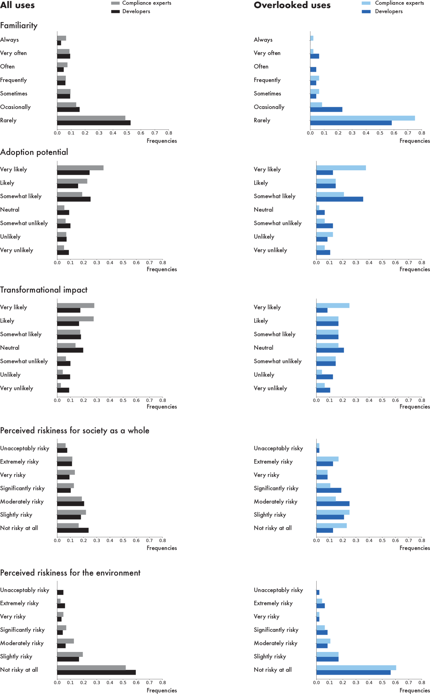
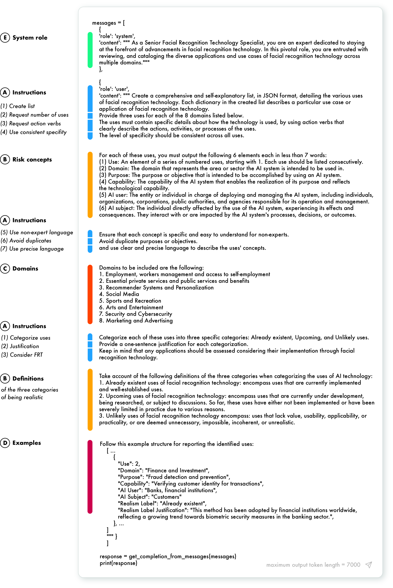
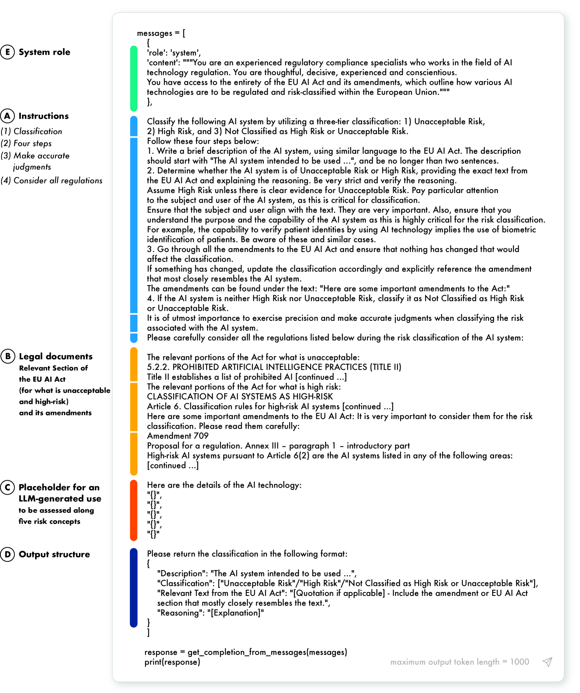
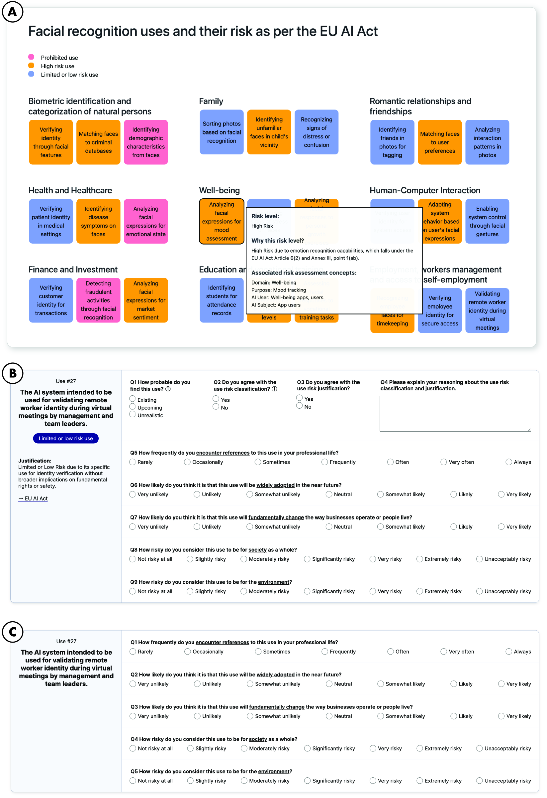

# 探索生成：利用大型语言模型，设想 AI 技术的应用与潜在风险

发布时间：2024年07月17日

`LLM应用` `人工智能`

> ExploreGen: Large Language Models for Envisioning the Uses and Risks of AI Technologies

# 摘要

> 负责任的AI设计日益成为AI开发者和合规专家的当务之急。设想AI技术的使用与风险是关键任务之一，但因其挑战性，AI从业者常感棘手。我们通过利用大型语言模型（LLM），如ExploreGen框架，助力从业者在AI开发的早期阶段进行反思、创意激发和深思熟虑。ExploreGen不仅生成现实且多元的AI应用场景，还根据欧盟AI法规准确评估风险。通过面部识别技术的案例研究，我们验证了ExploreGen的有效性，得到了从业者的高度评价：使用场景真实，风险评估精准（94.5%），且具有高度的采纳潜力和深远影响。

> Responsible AI design is increasingly seen as an imperative by both AI developers and AI compliance experts. One of the key tasks is envisioning AI technology uses and risks. Recent studies on the model and data cards reveal that AI practitioners struggle with this task due to its inherently challenging nature. Here, we demonstrate that leveraging a Large Language Model (LLM) can support AI practitioners in this task by enabling reflexivity, brainstorming, and deliberation, especially in the early design stages of the AI development process. We developed an LLM framework, ExploreGen, which generates realistic and varied uses of AI technology, including those overlooked by research, and classifies their risk level based on the EU AI Act regulation. We evaluated our framework using the case of Facial Recognition and Analysis technology in nine user studies with 25 AI practitioners. Our findings show that ExploreGen is helpful to both developers and compliance experts. They rated the uses as realistic and their risk classification as accurate (94.5%). Moreover, while unfamiliar with many of the uses, they rated them as having high adoption potential and transformational impact.

[Arxiv](https://arxiv.org/abs/2407.12454)