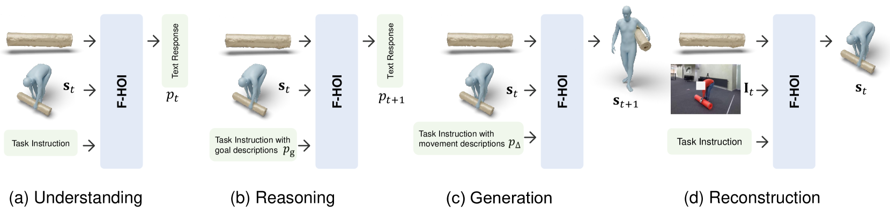

# F-HOI：致力于实现细粒度语义对齐的3D人-物交互研究

发布时间：2024年07月17日

`LLM应用` `计算机视觉` `人工智能`

> F-HOI: Toward Fine-grained Semantic-Aligned 3D Human-Object Interactions

# 摘要

> 当前的3D人体物体交互（HOI）数据集和模型仅简单地将全局描述与长HOI序列对齐，忽视了中间状态及其转换的细节。本文提出，采用状态级描述的细粒度语义对齐是一种有前景的学习方法，能丰富HOI的语义表示。为此，我们创建了Semantic-HOI数据集，包含超过20,000对HOI状态，每个状态都有详尽描述及状态间身体运动的细节。基于此，我们设计了三个任务，专注于HOI序列内的细粒度语义对齐。同时，我们提出了F-HOI模型，该模型能整合多模态指令，增强多模态大型语言模型处理HOI任务的能力。F-HOI的优势包括：支持多样多模态输入、在不同空间保持HOI一致性、通过细粒度文本监督直接优化，避免复杂状态建模。实验证明，F-HOI在HOI状态与语义描述的对齐上表现出色，能有效应对理解、推理、生成和重建等多种任务。

> Existing 3D human object interaction (HOI) datasets and models simply align global descriptions with the long HOI sequence, while lacking a detailed understanding of intermediate states and the transitions between states. In this paper, we argue that fine-grained semantic alignment, which utilizes state-level descriptions, offers a promising paradigm for learning semantically rich HOI representations. To achieve this, we introduce Semantic-HOI, a new dataset comprising over 20K paired HOI states with fine-grained descriptions for each HOI state and the body movements that happen between two consecutive states. Leveraging the proposed dataset, we design three state-level HOI tasks to accomplish fine-grained semantic alignment within the HOI sequence. Additionally, we propose a unified model called F-HOI, designed to leverage multimodal instructions and empower the Multi-modal Large Language Model to efficiently handle diverse HOI tasks. F-HOI offers multiple advantages: (1) It employs a unified task formulation that supports the use of versatile multimodal inputs. (2) It maintains consistency in HOI across 2D, 3D, and linguistic spaces. (3) It utilizes fine-grained textual supervision for direct optimization, avoiding intricate modeling of HOI states. Extensive experiments reveal that F-HOI effectively aligns HOI states with fine-grained semantic descriptions, adeptly tackling understanding, reasoning, generation, and reconstruction tasks.

[Arxiv](https://arxiv.org/abs/2407.12435)