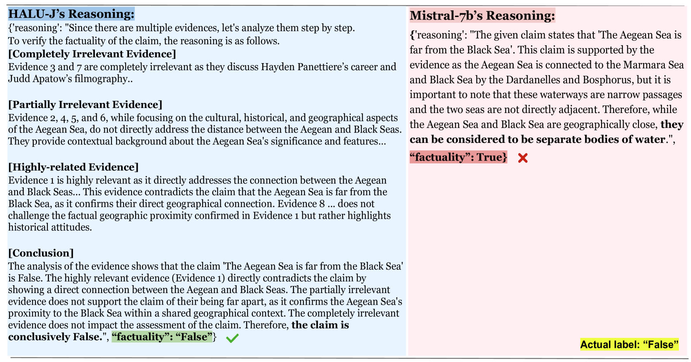

# Halu-J：一款基于批评的幻觉评判工具

发布时间：2024年07月17日

`LLM应用` `人工智能`

> Halu-J: Critique-Based Hallucination Judge

# 摘要

> 大型语言模型常产生非事实内容，即幻觉。现有基于检索的幻觉检测方法多将其视为分类任务，依据幻觉与检索证据的一致性进行评估，但往往缺乏详细解释且不评估解释的可靠性。检索系统的不足还可能导致检索到无关或部分相关的证据，影响检测准确性。现实中，幻觉检测需综合多条证据，而现有系统对此处理不够精细。为此，我们推出了 Halu-J，一款拥有 70 亿参数的基于批评的幻觉判断器，它能精选相关证据并提供详尽批评，从而提升检测效果。实验显示，Halu-J 在多证据幻觉检测上超越 GPT-4o，并在批评生成与证据选择上与之匹敌。同时，我们发布了新数据集 ME-FEVER，专为多证据幻觉检测设计。相关代码与数据集已公开于 https://github.com/GAIR-NLP/factool。

> Large language models (LLMs) frequently generate non-factual content, known as hallucinations. Existing retrieval-augmented-based hallucination detection approaches typically address this by framing it as a classification task, evaluating hallucinations based on their consistency with retrieved evidence. However, this approach usually lacks detailed explanations for these evaluations and does not assess the reliability of these explanations. Furthermore, deficiencies in retrieval systems can lead to irrelevant or partially relevant evidence retrieval, impairing the detection process. Moreover, while real-world hallucination detection requires analyzing multiple pieces of evidence, current systems usually treat all evidence uniformly without considering its relevance to the content. To address these challenges, we introduce Halu-J, a critique-based hallucination judge with 7 billion parameters. Halu-J enhances hallucination detection by selecting pertinent evidence and providing detailed critiques. Our experiments indicate that Halu-J outperforms GPT-4o in multiple-evidence hallucination detection and matches its capability in critique generation and evidence selection. We also introduce ME-FEVER, a new dataset designed for multiple-evidence hallucination detection. Our code and dataset can be found in https://github.com/GAIR-NLP/factool .

[Arxiv](https://arxiv.org/abs/2407.12943)