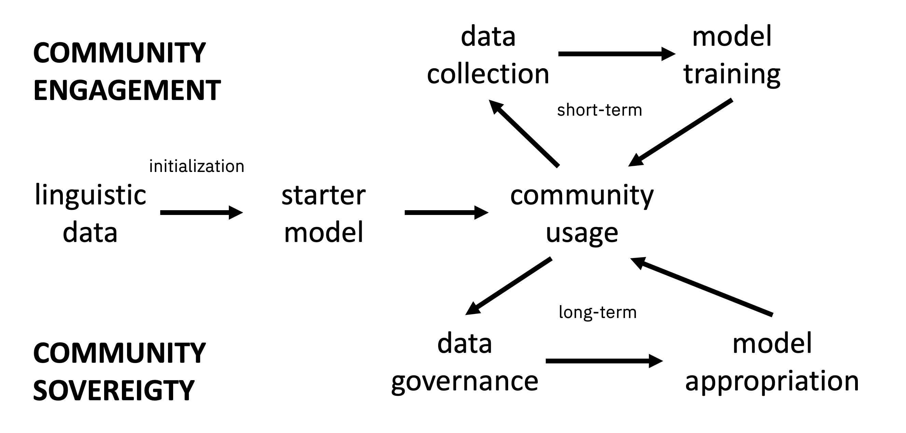
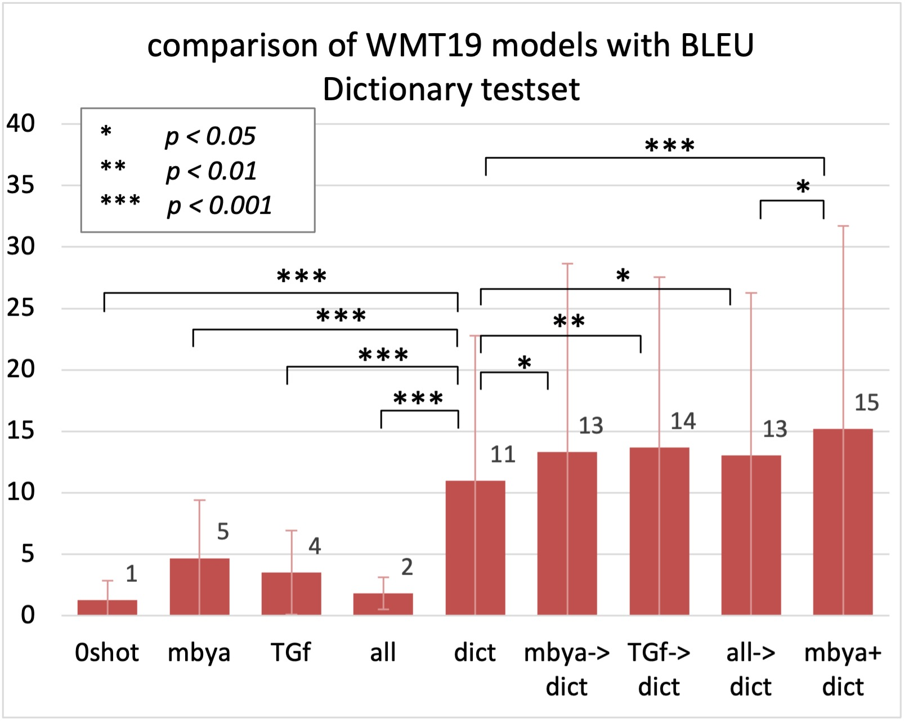

# 借助人工智能之力，振兴濒危土著语言：探索技术与实践

发布时间：2024年07月17日

`LLM应用` `语言保护` `人工智能`

> Harnessing the Power of Artificial Intelligence to Vitalize Endangered Indigenous Languages: Technologies and Experiences

# 摘要

> 自2022年起，我们致力于探索AI与NLP技术，特别是LLM，如何助力濒危土著语言的保护与记录。我们首先探讨了全球语言多样性的减少，以及与土著语言合作带来的独特伦理挑战。为此，我们提出了一种以社区为中心的AI发展新模式。接着，我们分享了通过微调SOTA翻译器，仅用少量数据就成功开发出高质量土著语言翻译器的经验，并提供了避免常见问题的策略。此外，我们还介绍了与巴西土著社区合作的项目中开发的原型，旨在提升写作便利性，并探讨了ILM作为创建拼写检查和词预测工具的可行途径。最终，我们展望了一个未来，濒危语言将以交互式语言模型的形式得到保存，为语言记录开辟新篇章。

> Since 2022 we have been exploring application areas and technologies in which Artificial Intelligence (AI) and modern Natural Language Processing (NLP), such as Large Language Models (LLMs), can be employed to foster the usage and facilitate the documentation of Indigenous languages which are in danger of disappearing. We start by discussing the decreasing diversity of languages in the world and how working with Indigenous languages poses unique ethical challenges for AI and NLP. To address those challenges, we propose an alternative development AI cycle based on community engagement and usage. Then, we report encouraging results in the development of high-quality machine learning translators for Indigenous languages by fine-tuning state-of-the-art (SOTA) translators with tiny amounts of data and discuss how to avoid some common pitfalls in the process. We also present prototypes we have built in projects done in 2023 and 2024 with Indigenous communities in Brazil, aimed at facilitating writing, and discuss the development of Indigenous Language Models (ILMs) as a replicable and scalable way to create spell-checkers, next-word predictors, and similar tools. Finally, we discuss how we envision a future for language documentation where dying languages are preserved as interactive language models.

[Arxiv](https://arxiv.org/abs/2407.12620)