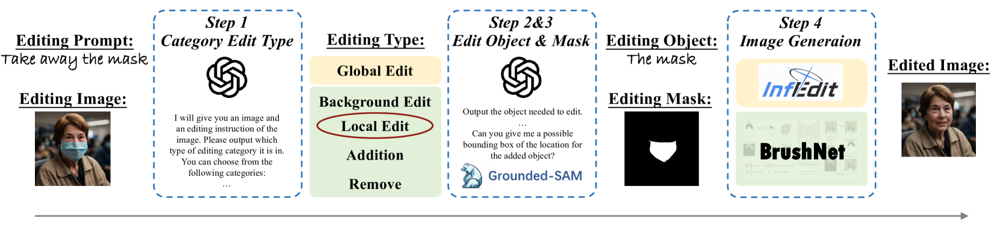

# 图像修复模型，作为指导图像编辑的得力工具，其效能显著。

发布时间：2024年07月17日

`LLM应用` `图像编辑`

> Image Inpainting Models are Effective Tools for Instruction-guided Image Editing

# 摘要

> 本报告介绍了CVPR2024 GenAI媒体生成挑战研讨会中指令引导图像编辑轨道的获胜方案。近年来，这一领域已取得显著进展，如SmartEdit和MGIE等方法通过联合训练结合大型语言模型与扩散模型。然而，我们实验发现，通过掩码等中间指导而非联合微调连接这两类模型，能显著提升编辑效果和成功率。我们采用的4步流程IIIIE包括：分类编辑类别、识别主要对象、获取编辑掩码和进行图像修复。实验结果表明，合理组合语言模型与图像修复模型，我们的方法不仅成功率高，且视觉效果出色。

> This is the technique report for the winning solution of the CVPR2024 GenAI Media Generation Challenge Workshop's Instruction-guided Image Editing track. Instruction-guided image editing has been largely studied in recent years. The most advanced methods, such as SmartEdit and MGIE, usually combine large language models with diffusion models through joint training, where the former provides text understanding ability, and the latter provides image generation ability. However, in our experiments, we find that simply connecting large language models and image generation models through intermediary guidance such as masks instead of joint fine-tuning leads to a better editing performance and success rate. We use a 4-step process IIIE (Inpainting-based Instruction-guided Image Editing): editing category classification, main editing object identification, editing mask acquisition, and image inpainting. Results show that through proper combinations of language models and image inpainting models, our pipeline can reach a high success rate with satisfying visual quality.

[Arxiv](https://arxiv.org/abs/2407.13139)