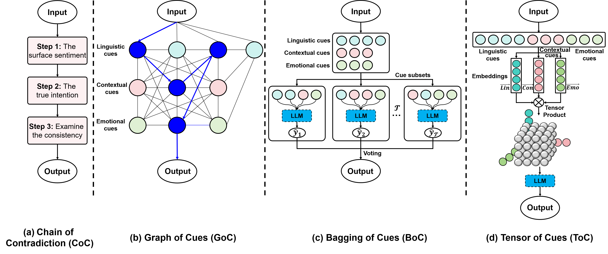

# 大语言模型中的讽刺检测是否遵循一个逐步推理的过程？

发布时间：2024年07月17日

`LLM应用` `人工智能`

> Is Sarcasm Detection A Step-by-Step Reasoning Process in Large Language Models?

# 摘要

> 通过详细展示一系列推理步骤，大型语言模型 (LLM) 解决复杂问题的能力得到显著提升。然而，人类的讽刺理解被视为一种直观的整体认知过程，涉及语言、上下文和情感线索的综合，以洞察说话者的真实意图，这一过程被认为超越了线性推理。为验证这一观点，我们设计了 SarcasmCue 框架，包含四种创新提示策略：矛盾链 (CoC)、线索图 (GoC)、线索包 (BoC) 和线索张量 (ToC)，旨在通过顺序与非顺序方法激发 LLM 识别讽刺。实证研究表明，这些方法在四个基准数据集上显著超越传统提示技术，且非顺序方法表现更佳。

> Elaborating a series of intermediate reasoning steps significantly improves the ability of large language models (LLMs) to solve complex problems, as such steps would evoke LLMs to think sequentially. However, human sarcasm understanding is often considered an intuitive and holistic cognitive process, in which various linguistic, contextual, and emotional cues are integrated to form a comprehensive understanding of the speaker's true intention, which is argued not be limited to a step-by-step reasoning process. To verify this argument, we introduce a new prompting framework called SarcasmCue, which contains four prompting strategies, $viz.$ chain of contradiction (CoC), graph of cues (GoC), bagging of cues (BoC) and tensor of cues (ToC), which elicits LLMs to detect human sarcasm by considering sequential and non-sequential prompting methods. Through a comprehensive empirical comparison on four benchmarking datasets, we show that the proposed four prompting methods outperforms standard IO prompting, CoT and ToT with a considerable margin, and non-sequential prompting generally outperforms sequential prompting.

[Arxiv](https://arxiv.org/abs/2407.12725)